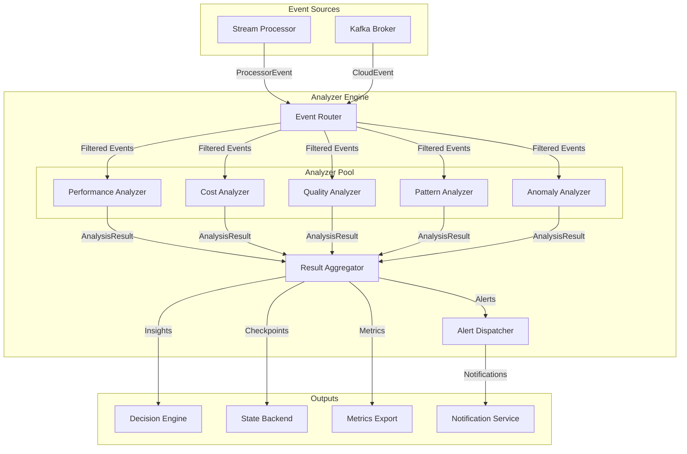

# Analyzer Engine Architecture

**Version:** 1.0
**Status:** Design Specification
**Last Updated:** 2025-11-10

## Table of Contents

1. [Executive Summary](#executive-summary)
2. [System Architecture](#system-architecture)
3. [Core Traits and Interfaces](#core-traits-and-interfaces)
4. [Analyzer Framework Design](#analyzer-framework-design)
5. [Data Structures](#data-structures)
6. [Individual Analyzer Designs](#individual-analyzer-designs)
7. [Concurrency and Performance](#concurrency-and-performance)
8. [Integration Points](#integration-points)
9. [Technology Stack](#technology-stack)
10. [Implementation Roadmap](#implementation-roadmap)

---

## Executive Summary

The Analyzer Engine is a real-time, distributed analytics system designed to process streaming LLM optimization metrics with low latency and high throughput. It coordinates five specialized analyzers (Performance, Cost, Quality, Pattern, and Anomaly) that run concurrently, processing events from the stream processor and generating actionable insights for the decision engine.

**Key Design Principles:**

- **Concurrent Processing:** Lock-free data structures and async execution for maximum throughput
- **Modular Architecture:** Plugin-based analyzer framework for extensibility
- **Statistical Rigor:** Industry-standard algorithms (HDR Histogram, Z-score, EWMA)
- **Event-Driven:** Reactive processing of streaming events with backpressure handling
- **State Management:** Distributed state backend integration for fault tolerance

**Performance Targets:**

- Sub-100ms p99 latency per event
- 10,000+ events/sec throughput per analyzer
- Memory-bounded operation (configurable limits)
- Zero-copy event routing where possible

---

## System Architecture

### 1.1 Component Diagram

```
┌─────────────────────────────────────────────────────────────────┐
│                        Analyzer Engine                           │
│  ┌───────────────────────────────────────────────────────────┐  │
│  │           Event Router & Distribution Layer                │  │
│  │  ┌──────────┐  ┌──────────┐  ┌──────────┐                │  │
│  │  │  Filter  │  │  Route   │  │ Fanout   │                │  │
│  │  └──────────┘  └──────────┘  └──────────┘                │  │
│  └───────────────────────────────────────────────────────────┘  │
│                              │                                   │
│          ┌──────────────────┼──────────────────┐               │
│          │                  │                  │               │
│  ┌───────▼────┐    ┌────────▼──────┐   ┌──────▼──────┐       │
│  │Performance │    │     Cost      │   │   Quality   │       │
│  │  Analyzer  │    │   Analyzer    │   │   Analyzer  │       │
│  └───────┬────┘    └────────┬──────┘   └──────┬──────┘       │
│          │                  │                  │               │
│  ┌───────▼────┐    ┌────────▼──────┐                          │
│  │  Pattern   │    │   Anomaly     │                          │
│  │  Analyzer  │    │   Analyzer    │                          │
│  └───────┬────┘    └────────┬──────┘                          │
│          │                  │                                   │
│          └──────────────────┼──────────────────┐               │
│                             │                  │               │
│  ┌──────────────────────────▼──────────────────▼────────────┐ │
│  │           Result Aggregation & Alert Dispatch            │ │
│  └──────────────────────────┬────────────────────────────────┘ │
└─────────────────────────────┼──────────────────────────────────┘
                              │
                 ┌────────────▼────────────┐
                 │   Decision Engine       │
                 │   State Backend         │
                 │   Metrics Export        │
                 └─────────────────────────┘
```

### 1.2 Data Flow Architecture



### 1.3 Analyzer Lifecycle Management

Each analyzer follows a managed lifecycle:

```
┌─────────────┐
│ Initialized │ ◄───── Configuration loaded
└──────┬──────┘
       │
       ▼
┌─────────────┐
│   Starting  │ ◄───── Resources allocated, state restored
└──────┬──────┘
       │
       ▼
┌─────────────┐
│   Running   │ ◄───── Processing events
└──────┬──────┘
       │
       ▼
┌─────────────┐
│  Draining   │ ◄───── No new events, completing in-flight
└──────┬──────┘
       │
       ▼
┌─────────────┐
│  Stopped    │ ◄───── State persisted, resources released
└─────────────┘
```

**Lifecycle Implementation:**

```rust
#[derive(Debug, Clone, Copy, PartialEq, Eq)]
pub enum AnalyzerState {
    Initialized,
    Starting,
    Running,
    Draining,
    Stopped,
    Failed,
}

pub struct AnalyzerLifecycle {
    state: Arc<RwLock<AnalyzerState>>,
    health_check: Arc<dyn Fn() -> bool + Send + Sync>,
}

impl AnalyzerLifecycle {
    pub async fn transition(&self, to: AnalyzerState) -> Result<(), AnalyzerError> {
        let mut state = self.state.write().await;

        match (*state, to) {
            (AnalyzerState::Initialized, AnalyzerState::Starting) => {
                *state = to;
                Ok(())
            }
            (AnalyzerState::Starting, AnalyzerState::Running) => {
                *state = to;
                Ok(())
            }
            (AnalyzerState::Running, AnalyzerState::Draining) => {
                *state = to;
                Ok(())
            }
            (AnalyzerState::Draining, AnalyzerState::Stopped) => {
                *state = to;
                Ok(())
            }
            (_, AnalyzerState::Failed) => {
                *state = to;
                Ok(())
            }
            _ => Err(AnalyzerError::InvalidStateTransition {
                from: *state,
                to,
            }),
        }
    }

    pub async fn current_state(&self) -> AnalyzerState {
        *self.state.read().await
    }
}
```

### 1.4 State Management Strategy

The Analyzer Engine uses a hybrid state management approach:

**1. In-Memory State (Hot Path):**
- `DashMap` for concurrent access to analyzer state
- Lock-free sliding windows using circular buffers
- HDR histograms for percentile tracking

**2. Distributed State (Warm Path):**
- State backend integration for checkpointing
- Periodic snapshots (configurable interval)
- Recovery on failure

**3. Cold Storage (Archive):**
- Historical analysis results
- Long-term trend data
- Audit trail

```rust
pub struct StateManager<B: StateBackend> {
    // Hot: In-memory concurrent state
    analyzer_state: DashMap<AnalyzerId, AnalyzerInternalState>,

    // Warm: State backend for checkpointing
    backend: Arc<B>,

    // Configuration
    checkpoint_interval: Duration,
    retention_policy: RetentionPolicy,
}

impl<B: StateBackend> StateManager<B> {
    pub async fn checkpoint(&self, analyzer_id: &AnalyzerId) -> Result<(), AnalyzerError> {
        let state = self.analyzer_state
            .get(analyzer_id)
            .ok_or(AnalyzerError::StateNotFound)?;

        let snapshot = state.value().create_snapshot();

        self.backend
            .put(
                format!("analyzer:{}:state", analyzer_id),
                bincode::serialize(&snapshot)?,
            )
            .await?;

        Ok(())
    }

    pub async fn restore(&self, analyzer_id: &AnalyzerId) -> Result<(), AnalyzerError> {
        let data = self.backend
            .get(&format!("analyzer:{}:state", analyzer_id))
            .await?
            .ok_or(AnalyzerError::StateNotFound)?;

        let snapshot: StateSnapshot = bincode::deserialize(&data)?;

        self.analyzer_state.insert(
            analyzer_id.clone(),
            AnalyzerInternalState::from_snapshot(snapshot),
        );

        Ok(())
    }
}
```

### 1.5 Concurrency Model

The Analyzer Engine employs a **task-per-analyzer** concurrency model with shared-nothing architecture:

```rust
pub struct AnalyzerEngine<B: StateBackend> {
    // Each analyzer runs in its own task
    analyzers: DashMap<AnalyzerId, Arc<dyn Analyzer>>,

    // Task handles for lifecycle management
    tasks: DashMap<AnalyzerId, JoinHandle<()>>,

    // Event distribution channels
    event_senders: DashMap<AnalyzerId, mpsc::Sender<AnalyzerEvent>>,

    // Result aggregation
    result_receiver: mpsc::Receiver<AnalysisResult>,

    // State management
    state_manager: Arc<StateManager<B>>,

    // Metrics
    metrics: Arc<EngineMetrics>,
}

impl<B: StateBackend> AnalyzerEngine<B> {
    pub async fn start(&mut self) -> Result<(), AnalyzerError> {
        for (id, analyzer) in self.analyzers.iter() {
            let (tx, rx) = mpsc::channel(1024); // Bounded channel for backpressure

            let analyzer_clone = analyzer.clone();
            let result_tx = self.result_sender.clone();
            let metrics = self.metrics.clone();

            // Spawn analyzer task
            let handle = tokio::spawn(async move {
                Self::run_analyzer(analyzer_clone, rx, result_tx, metrics).await;
            });

            self.event_senders.insert(id.clone(), tx);
            self.tasks.insert(id.clone(), handle);
        }

        Ok(())
    }

    async fn run_analyzer(
        analyzer: Arc<dyn Analyzer>,
        mut event_rx: mpsc::Receiver<AnalyzerEvent>,
        result_tx: mpsc::Sender<AnalysisResult>,
        metrics: Arc<EngineMetrics>,
    ) {
        while let Some(event) = event_rx.recv().await {
            let start = Instant::now();

            match analyzer.analyze(event).await {
                Ok(result) => {
                    metrics.record_analysis_success(&analyzer.id(), start.elapsed());
                    let _ = result_tx.send(result).await;
                }
                Err(e) => {
                    metrics.record_analysis_error(&analyzer.id());
                    tracing::error!("Analyzer {} failed: {}", analyzer.id(), e);
                }
            }
        }
    }
}
```

---

## Core Traits and Interfaces

### 2.1 Analyzer Trait

The core abstraction for all analyzers:

```rust
use async_trait::async_trait;
use chrono::{DateTime, Utc};
use std::sync::Arc;

/// Core trait that all analyzers must implement
#[async_trait]
pub trait Analyzer: Send + Sync {
    /// Unique identifier for this analyzer
    fn id(&self) -> &AnalyzerId;

    /// Analyze a single event and produce results
    async fn analyze(&self, event: AnalyzerEvent) -> Result<AnalysisResult, AnalyzerError>;

    /// Generate a comprehensive report of current state
    async fn report(&self) -> Result<AnalysisReport, AnalyzerError>;

    /// Get analyzer configuration
    fn config(&self) -> &AnalyzerConfig;

    /// Get current statistics
    fn stats(&self) -> AnalyzerStats;

    /// Health check
    fn is_healthy(&self) -> bool {
        true
    }

    /// Initialize analyzer (called once at startup)
    async fn initialize(&mut self) -> Result<(), AnalyzerError> {
        Ok(())
    }

    /// Shutdown analyzer (called once at shutdown)
    async fn shutdown(&mut self) -> Result<(), AnalyzerError> {
        Ok(())
    }

    /// Reset analyzer state
    async fn reset(&mut self) -> Result<(), AnalyzerError>;

    /// Export internal state for checkpointing
    async fn export_state(&self) -> Result<Vec<u8>, AnalyzerError>;

    /// Import state from checkpoint
    async fn import_state(&mut self, state: Vec<u8>) -> Result<(), AnalyzerError>;
}

/// Unique identifier for analyzers
#[derive(Debug, Clone, PartialEq, Eq, Hash, Serialize, Deserialize)]
pub struct AnalyzerId(String);

impl AnalyzerId {
    pub fn new(id: impl Into<String>) -> Self {
        Self(id.into())
    }

    pub fn as_str(&self) -> &str {
        &self.0
    }
}

impl std::fmt::Display for AnalyzerId {
    fn fmt(&self, f: &mut std::fmt::Formatter<'_>) -> std::fmt::Result {
        write!(f, "{}", self.0)
    }
}
```

### 2.2 Analyzer Configuration

```rust
/// Configuration for an analyzer instance
#[derive(Debug, Clone, Serialize, Deserialize)]
pub struct AnalyzerConfig {
    /// Analyzer identifier
    pub id: AnalyzerId,

    /// Event filter predicates
    pub event_filter: EventFilter,

    /// Window configuration
    pub window: WindowConfig,

    /// Sampling configuration
    pub sampling: SamplingConfig,

    /// Alert thresholds
    pub thresholds: ThresholdConfig,

    /// Resource limits
    pub limits: ResourceLimits,

    /// Checkpoint interval
    pub checkpoint_interval: Duration,
}

#[derive(Debug, Clone, Serialize, Deserialize)]
pub struct EventFilter {
    /// Event types to process
    pub event_types: Vec<String>,

    /// Metadata filters (key-value pairs)
    pub metadata_filters: HashMap<String, String>,

    /// Custom filter predicate (serialized expression)
    pub custom_filter: Option<String>,
}

#[derive(Debug, Clone, Serialize, Deserialize)]
pub struct WindowConfig {
    /// Window size (duration)
    pub size: Duration,

    /// Slide interval (for sliding windows)
    pub slide: Option<Duration>,

    /// Maximum events per window
    pub max_events: usize,

    /// Out-of-order tolerance
    pub allowed_lateness: Duration,
}

#[derive(Debug, Clone, Serialize, Deserialize)]
pub struct SamplingConfig {
    /// Sampling rate (0.0 to 1.0)
    pub rate: f64,

    /// Sampling strategy
    pub strategy: SamplingStrategy,
}

#[derive(Debug, Clone, Serialize, Deserialize)]
pub enum SamplingStrategy {
    /// Sample every Nth event
    Uniform(u64),

    /// Reservoir sampling
    Reservoir(usize),

    /// Adaptive sampling based on load
    Adaptive { min_rate: f64, max_rate: f64 },
}

#[derive(Debug, Clone, Serialize, Deserialize)]
pub struct ResourceLimits {
    /// Maximum memory usage (bytes)
    pub max_memory: usize,

    /// Maximum events in flight
    pub max_inflight_events: usize,

    /// Processing timeout per event
    pub event_timeout: Duration,
}
```

### 2.3 Analyzer Statistics

```rust
/// Runtime statistics for an analyzer
#[derive(Debug, Clone, Serialize, Deserialize)]
pub struct AnalyzerStats {
    /// Total events processed
    pub events_processed: u64,

    /// Events processed per second (current rate)
    pub events_per_second: f64,

    /// Total processing time
    pub total_processing_time: Duration,

    /// Average processing time per event
    pub avg_processing_time: Duration,

    /// P50, P95, P99 processing latencies
    pub latency_percentiles: LatencyPercentiles,

    /// Error count
    pub error_count: u64,

    /// Last error timestamp
    pub last_error_time: Option<DateTime<Utc>>,

    /// Current memory usage (bytes)
    pub memory_usage: usize,

    /// Insights generated
    pub insights_generated: u64,

    /// Alerts triggered
    pub alerts_triggered: u64,

    /// Last analysis timestamp
    pub last_analysis_time: DateTime<Utc>,
}

#[derive(Debug, Clone, Serialize, Deserialize)]
pub struct LatencyPercentiles {
    pub p50: Duration,
    pub p95: Duration,
    pub p99: Duration,
    pub p999: Duration,
}
```

---

## Analyzer Framework Design

### 3.1 AnalyzerEngine Coordinator

The `AnalyzerEngine` coordinates all analyzers and manages event distribution:

```rust
pub struct AnalyzerEngine<B: StateBackend> {
    config: EngineConfig,
    analyzers: DashMap<AnalyzerId, Arc<dyn Analyzer>>,
    event_router: Arc<EventRouter>,
    result_aggregator: Arc<ResultAggregator>,
    state_manager: Arc<StateManager<B>>,
    metrics: Arc<EngineMetrics>,
    alert_dispatcher: Arc<AlertDispatcher>,
}

impl<B: StateBackend> AnalyzerEngine<B> {
    pub fn new(config: EngineConfig, backend: Arc<B>) -> Self {
        Self {
            config,
            analyzers: DashMap::new(),
            event_router: Arc::new(EventRouter::new()),
            result_aggregator: Arc::new(ResultAggregator::new()),
            state_manager: Arc::new(StateManager::new(backend)),
            metrics: Arc::new(EngineMetrics::new()),
            alert_dispatcher: Arc::new(AlertDispatcher::new()),
        }
    }

    /// Register an analyzer with the engine
    pub fn register_analyzer(&self, analyzer: Arc<dyn Analyzer>) -> Result<(), AnalyzerError> {
        let id = analyzer.id().clone();

        if self.analyzers.contains_key(&id) {
            return Err(AnalyzerError::DuplicateAnalyzer(id));
        }

        // Register event filter with router
        self.event_router.register_filter(
            id.clone(),
            analyzer.config().event_filter.clone(),
        );

        self.analyzers.insert(id, analyzer);

        Ok(())
    }

    /// Process an incoming event
    pub async fn process_event(&self, event: AnalyzerEvent) -> Result<(), AnalyzerError> {
        // Route event to matching analyzers
        let matched_analyzers = self.event_router.route(&event);

        if matched_analyzers.is_empty() {
            self.metrics.record_unrouted_event();
            return Ok(());
        }

        // Fan out to all matched analyzers (parallel)
        let futures: Vec<_> = matched_analyzers
            .into_iter()
            .filter_map(|id| self.analyzers.get(&id))
            .map(|analyzer| {
                let event = event.clone();
                let analyzer = analyzer.clone();
                let metrics = self.metrics.clone();

                async move {
                    let start = Instant::now();

                    match analyzer.analyze(event).await {
                        Ok(result) => {
                            metrics.record_analysis_success(analyzer.id(), start.elapsed());
                            Some(result)
                        }
                        Err(e) => {
                            metrics.record_analysis_error(analyzer.id());
                            tracing::error!("Analyzer {} error: {}", analyzer.id(), e);
                            None
                        }
                    }
                }
            })
            .collect();

        // Wait for all analyzers to complete
        let results = futures::future::join_all(futures).await;

        // Aggregate results
        for result in results.into_iter().flatten() {
            self.result_aggregator.aggregate(result).await;
        }

        Ok(())
    }

    /// Generate comprehensive report from all analyzers
    pub async fn generate_report(&self) -> Result<EngineReport, AnalyzerError> {
        let mut reports = Vec::new();

        for analyzer in self.analyzers.iter() {
            let report = analyzer.report().await?;
            reports.push(report);
        }

        Ok(EngineReport {
            timestamp: Utc::now(),
            analyzer_reports: reports,
            engine_stats: self.metrics.snapshot(),
        })
    }
}
```

### 3.2 Event Routing and Filtering

```rust
pub struct EventRouter {
    filters: DashMap<AnalyzerId, EventFilter>,
}

impl EventRouter {
    pub fn new() -> Self {
        Self {
            filters: DashMap::new(),
        }
    }

    pub fn register_filter(&self, id: AnalyzerId, filter: EventFilter) {
        self.filters.insert(id, filter);
    }

    /// Route event to matching analyzers
    pub fn route(&self, event: &AnalyzerEvent) -> Vec<AnalyzerId> {
        self.filters
            .iter()
            .filter_map(|entry| {
                let (id, filter) = entry.pair();
                if self.matches_filter(event, filter) {
                    Some(id.clone())
                } else {
                    None
                }
            })
            .collect()
    }

    fn matches_filter(&self, event: &AnalyzerEvent, filter: &EventFilter) -> bool {
        // Check event type
        if !filter.event_types.is_empty() {
            let event_type = event.event_type();
            if !filter.event_types.contains(&event_type) {
                return false;
            }
        }

        // Check metadata filters
        for (key, expected_value) in &filter.metadata_filters {
            match event.metadata().get(key) {
                Some(actual_value) if actual_value == expected_value => continue,
                _ => return false,
            }
        }

        // Apply custom filter if present
        if let Some(custom) = &filter.custom_filter {
            // TODO: Implement expression evaluation
            // For now, assume it matches
        }

        true
    }
}
```

### 3.3 Result Aggregation

```rust
pub struct ResultAggregator {
    results: DashMap<AnalyzerId, Vec<AnalysisResult>>,
    insights_buffer: Arc<RwLock<Vec<Insight>>>,
    alerts_buffer: Arc<RwLock<Vec<Alert>>>,
}

impl ResultAggregator {
    pub fn new() -> Self {
        Self {
            results: DashMap::new(),
            insights_buffer: Arc::new(RwLock::new(Vec::new())),
            alerts_buffer: Arc::new(RwLock::new(Vec::new())),
        }
    }

    pub async fn aggregate(&self, result: AnalysisResult) {
        // Store result
        self.results
            .entry(result.analyzer_id.clone())
            .or_insert_with(Vec::new)
            .push(result.clone());

        // Extract insights
        if !result.insights.is_empty() {
            let mut insights = self.insights_buffer.write().await;
            insights.extend(result.insights);
        }

        // Extract alerts
        if !result.alerts.is_empty() {
            let mut alerts = self.alerts_buffer.write().await;
            alerts.extend(result.alerts);
        }
    }

    pub async fn drain_insights(&self) -> Vec<Insight> {
        let mut insights = self.insights_buffer.write().await;
        std::mem::take(&mut *insights)
    }

    pub async fn drain_alerts(&self) -> Vec<Alert> {
        let mut alerts = self.alerts_buffer.write().await;
        std::mem::take(&mut *alerts)
    }
}
```

### 3.4 Error Handling Strategy

The Analyzer Engine implements a comprehensive error handling strategy:

```rust
#[derive(Debug, thiserror::Error)]
pub enum AnalyzerError {
    #[error("Configuration error: {0}")]
    Configuration(String),

    #[error("Event processing error: {0}")]
    Processing(String),

    #[error("State management error: {0}")]
    State(String),

    #[error("Invalid state transition from {from:?} to {to:?}")]
    InvalidStateTransition {
        from: AnalyzerState,
        to: AnalyzerState,
    },

    #[error("Analyzer {0} already registered")]
    DuplicateAnalyzer(AnalyzerId),

    #[error("State not found")]
    StateNotFound,

    #[error("Timeout error: {0}")]
    Timeout(String),

    #[error("Resource limit exceeded: {0}")]
    ResourceLimit(String),

    #[error("Serialization error: {0}")]
    Serialization(#[from] bincode::Error),

    #[error("IO error: {0}")]
    Io(#[from] std::io::Error),
}

// Error recovery strategies
pub enum ErrorRecoveryStrategy {
    /// Retry with exponential backoff
    Retry { max_attempts: u32, backoff: Duration },

    /// Skip the event and continue
    Skip,

    /// Send to dead letter queue
    DeadLetter,

    /// Fail fast and propagate error
    FailFast,

    /// Reset analyzer state and continue
    Reset,
}
```

### 3.5 Resource Management

```rust
pub struct ResourceManager {
    memory_tracker: Arc<MemoryTracker>,
    event_limiter: Arc<Semaphore>,
}

impl ResourceManager {
    pub fn new(limits: ResourceLimits) -> Self {
        Self {
            memory_tracker: Arc::new(MemoryTracker::new(limits.max_memory)),
            event_limiter: Arc::new(Semaphore::new(limits.max_inflight_events)),
        }
    }

    pub async fn acquire_slot(&self) -> Result<SemaphorePermit, AnalyzerError> {
        self.event_limiter
            .acquire()
            .await
            .map_err(|e| AnalyzerError::ResourceLimit(e.to_string()))
    }

    pub fn check_memory(&self) -> Result<(), AnalyzerError> {
        if self.memory_tracker.current_usage() > self.memory_tracker.limit() {
            return Err(AnalyzerError::ResourceLimit(
                "Memory limit exceeded".to_string()
            ));
        }
        Ok(())
    }
}

pub struct MemoryTracker {
    current: AtomicUsize,
    limit: usize,
}

impl MemoryTracker {
    pub fn new(limit: usize) -> Self {
        Self {
            current: AtomicUsize::new(0),
            limit,
        }
    }

    pub fn allocate(&self, size: usize) -> bool {
        let current = self.current.fetch_add(size, Ordering::SeqCst);
        current + size <= self.limit
    }

    pub fn deallocate(&self, size: usize) {
        self.current.fetch_sub(size, Ordering::SeqCst);
    }

    pub fn current_usage(&self) -> usize {
        self.current.load(Ordering::SeqCst)
    }

    pub fn limit(&self) -> usize {
        self.limit
    }
}
```

---

## Data Structures

### 4.1 AnalyzerEvent Enum

Events flowing into analyzers:

```rust
/// Events that can be analyzed
#[derive(Debug, Clone, Serialize, Deserialize)]
#[serde(tag = "type", rename_all = "snake_case")]
pub enum AnalyzerEvent {
    /// Metric event (performance, cost, quality)
    Metric {
        name: String,
        value: f64,
        unit: String,
        timestamp: DateTime<Utc>,
        tags: HashMap<String, String>,
        metadata: HashMap<String, String>,
    },

    /// Feedback event from users
    Feedback {
        id: Uuid,
        rating: f64,
        comment: Option<String>,
        timestamp: DateTime<Utc>,
        metadata: HashMap<String, String>,
    },

    /// LLM request event
    Request {
        id: Uuid,
        model: String,
        prompt_tokens: u64,
        timestamp: DateTime<Utc>,
        metadata: HashMap<String, String>,
    },

    /// LLM response event
    Response {
        request_id: Uuid,
        completion_tokens: u64,
        latency_ms: f64,
        success: bool,
        timestamp: DateTime<Utc>,
        metadata: HashMap<String, String>,
    },

    /// Alert event from other systems
    Alert {
        severity: AlertSeverity,
        message: String,
        timestamp: DateTime<Utc>,
        metadata: HashMap<String, String>,
    },

    /// Custom event
    Custom {
        event_type: String,
        data: serde_json::Value,
        timestamp: DateTime<Utc>,
        metadata: HashMap<String, String>,
    },
}

impl AnalyzerEvent {
    pub fn timestamp(&self) -> DateTime<Utc> {
        match self {
            Self::Metric { timestamp, .. } => *timestamp,
            Self::Feedback { timestamp, .. } => *timestamp,
            Self::Request { timestamp, .. } => *timestamp,
            Self::Response { timestamp, .. } => *timestamp,
            Self::Alert { timestamp, .. } => *timestamp,
            Self::Custom { timestamp, .. } => *timestamp,
        }
    }

    pub fn metadata(&self) -> &HashMap<String, String> {
        match self {
            Self::Metric { metadata, .. } => metadata,
            Self::Feedback { metadata, .. } => metadata,
            Self::Request { metadata, .. } => metadata,
            Self::Response { metadata, .. } => metadata,
            Self::Alert { metadata, .. } => metadata,
            Self::Custom { metadata, .. } => metadata,
        }
    }

    pub fn event_type(&self) -> String {
        match self {
            Self::Metric { .. } => "metric".to_string(),
            Self::Feedback { .. } => "feedback".to_string(),
            Self::Request { .. } => "request".to_string(),
            Self::Response { .. } => "response".to_string(),
            Self::Alert { .. } => "alert".to_string(),
            Self::Custom { event_type, .. } => event_type.clone(),
        }
    }
}
```

### 4.2 AnalysisResult Struct

```rust
/// Result produced by an analyzer
#[derive(Debug, Clone, Serialize, Deserialize)]
pub struct AnalysisResult {
    /// Analyzer that produced this result
    pub analyzer_id: AnalyzerId,

    /// Timestamp of analysis
    pub timestamp: DateTime<Utc>,

    /// Event that triggered this analysis
    pub event_id: Option<String>,

    /// Insights discovered
    pub insights: Vec<Insight>,

    /// Recommendations generated
    pub recommendations: Vec<Recommendation>,

    /// Alerts triggered
    pub alerts: Vec<Alert>,

    /// Additional metadata
    pub metadata: HashMap<String, String>,
}
```

### 4.3 Insight Struct

```rust
/// An insight discovered during analysis
#[derive(Debug, Clone, Serialize, Deserialize)]
pub struct Insight {
    /// Unique identifier
    pub id: Uuid,

    /// Insight type
    pub insight_type: InsightType,

    /// Severity level
    pub severity: InsightSeverity,

    /// Confidence score (0.0 to 1.0)
    pub confidence: f64,

    /// Human-readable description
    pub description: String,

    /// Supporting evidence (metrics, statistics)
    pub evidence: HashMap<String, serde_json::Value>,

    /// Timestamp when insight was generated
    pub timestamp: DateTime<Utc>,

    /// Time window for this insight
    pub window: TimeWindow,
}

#[derive(Debug, Clone, Serialize, Deserialize)]
#[serde(rename_all = "snake_case")]
pub enum InsightType {
    /// Performance-related insight
    Performance,

    /// Cost-related insight
    Cost,

    /// Quality-related insight
    Quality,

    /// Pattern detected
    Pattern,

    /// Anomaly detected
    Anomaly,

    /// Correlation found
    Correlation,

    /// Trend identified
    Trend,
}

#[derive(Debug, Clone, Copy, Serialize, Deserialize, PartialEq, Eq, PartialOrd, Ord)]
#[serde(rename_all = "lowercase")]
pub enum InsightSeverity {
    Low,
    Medium,
    High,
    Critical,
}

#[derive(Debug, Clone, Serialize, Deserialize)]
pub struct TimeWindow {
    pub start: DateTime<Utc>,
    pub end: DateTime<Utc>,
}
```

### 4.4 Recommendation Struct

```rust
/// Actionable recommendation from analysis
#[derive(Debug, Clone, Serialize, Deserialize)]
pub struct Recommendation {
    /// Unique identifier
    pub id: Uuid,

    /// Recommendation type
    pub recommendation_type: RecommendationType,

    /// Priority level
    pub priority: Priority,

    /// Confidence score (0.0 to 1.0)
    pub confidence: f64,

    /// Description of what to do
    pub description: String,

    /// Expected impact
    pub expected_impact: ExpectedImpact,

    /// Actions to take
    pub actions: Vec<Action>,

    /// Timestamp
    pub timestamp: DateTime<Utc>,
}

#[derive(Debug, Clone, Serialize, Deserialize)]
#[serde(rename_all = "snake_case")]
pub enum RecommendationType {
    /// Optimize parameter
    ParameterOptimization,

    /// Switch model
    ModelSwitch,

    /// Adjust budget
    BudgetAdjustment,

    /// Scale resources
    ResourceScaling,

    /// Improve prompt
    PromptImprovement,
}

#[derive(Debug, Clone, Copy, Serialize, Deserialize, PartialEq, Eq, PartialOrd, Ord)]
#[serde(rename_all = "lowercase")]
pub enum Priority {
    Low,
    Medium,
    High,
    Urgent,
}

#[derive(Debug, Clone, Serialize, Deserialize)]
pub struct ExpectedImpact {
    /// Expected cost savings
    pub cost_reduction: Option<f64>,

    /// Expected latency improvement
    pub latency_improvement: Option<f64>,

    /// Expected quality improvement
    pub quality_improvement: Option<f64>,
}

#[derive(Debug, Clone, Serialize, Deserialize)]
pub struct Action {
    /// Action type
    pub action_type: String,

    /// Parameters for the action
    pub parameters: HashMap<String, serde_json::Value>,
}
```

### 4.5 Alert Struct

```rust
/// Alert triggered by threshold violation
#[derive(Debug, Clone, Serialize, Deserialize)]
pub struct Alert {
    /// Unique identifier
    pub id: Uuid,

    /// Alert type
    pub alert_type: AlertType,

    /// Severity
    pub severity: AlertSeverity,

    /// Message
    pub message: String,

    /// Metric that triggered the alert
    pub metric: String,

    /// Current value
    pub current_value: f64,

    /// Threshold value
    pub threshold: f64,

    /// Timestamp
    pub timestamp: DateTime<Utc>,

    /// Additional context
    pub context: HashMap<String, String>,
}

#[derive(Debug, Clone, Serialize, Deserialize)]
#[serde(rename_all = "snake_case")]
pub enum AlertType {
    PerformanceThreshold,
    CostThreshold,
    QualityThreshold,
    AnomalyDetected,
    PatternBroken,
}

#[derive(Debug, Clone, Copy, Serialize, Deserialize, PartialEq, Eq, PartialOrd, Ord)]
#[serde(rename_all = "lowercase")]
pub enum AlertSeverity {
    Info,
    Warning,
    Error,
    Critical,
}
```

### 4.6 AnalysisReport Struct

```rust
/// Comprehensive analysis report
#[derive(Debug, Clone, Serialize, Deserialize)]
pub struct AnalysisReport {
    /// Analyzer identifier
    pub analyzer_id: AnalyzerId,

    /// Report timestamp
    pub timestamp: DateTime<Utc>,

    /// Time period covered
    pub period: TimeWindow,

    /// Summary statistics
    pub summary: ReportSummary,

    /// All insights in this period
    pub insights: Vec<Insight>,

    /// All recommendations
    pub recommendations: Vec<Recommendation>,

    /// All alerts
    pub alerts: Vec<Alert>,

    /// Analyzer-specific data
    pub analyzer_data: serde_json::Value,
}

#[derive(Debug, Clone, Serialize, Deserialize)]
pub struct ReportSummary {
    /// Total events processed
    pub events_processed: u64,

    /// Insights generated
    pub insights_generated: u64,

    /// Alerts triggered
    pub alerts_triggered: u64,

    /// Key metrics
    pub key_metrics: HashMap<String, f64>,
}
```

---

## Individual Analyzer Designs

### 5.1 Performance Analyzer

**Objective:** Track latency, throughput, and detect performance regressions.

#### State Structures

```rust
pub struct PerformanceAnalyzer {
    id: AnalyzerId,
    config: AnalyzerConfig,
    state: Arc<RwLock<PerformanceState>>,
    metrics: Arc<PerformanceMetrics>,
}

struct PerformanceState {
    /// HDR Histogram for percentile tracking
    latency_histogram: HdrHistogram<u64>,

    /// Exponential moving average of latency
    ema_latency: ExponentialMovingAverage,

    /// Sliding window of recent latencies
    latency_window: CircularBuffer<f64>,

    /// Request rate tracker
    rate_tracker: RateTracker,

    /// Baseline for regression detection
    baseline: PerformanceBaseline,

    /// Last window timestamp
    last_window_flush: DateTime<Utc>,
}

#[derive(Debug, Clone)]
struct PerformanceBaseline {
    p50: f64,
    p95: f64,
    p99: f64,
    mean: f64,
    std_dev: f64,
    last_updated: DateTime<Utc>,
}
```

#### Analysis Algorithms

**1. Percentile Tracking with HDR Histogram:**

```rust
use hdrhistogram::Histogram;

impl PerformanceAnalyzer {
    async fn update_latency(&self, latency_ms: f64) -> Result<(), AnalyzerError> {
        let mut state = self.state.write().await;

        // Convert to microseconds for HDR histogram
        let latency_us = (latency_ms * 1000.0) as u64;

        // Record in histogram (supports values up to 1 hour)
        state.latency_histogram
            .record(latency_us)
            .map_err(|e| AnalyzerError::Processing(e.to_string()))?;

        // Update EMA
        state.ema_latency.update(latency_ms);

        // Add to sliding window
        state.latency_window.push(latency_ms);

        Ok(())
    }

    fn calculate_percentiles(&self, histogram: &Histogram<u64>) -> LatencyPercentiles {
        LatencyPercentiles {
            p50: Duration::from_micros(histogram.value_at_percentile(50.0)),
            p95: Duration::from_micros(histogram.value_at_percentile(95.0)),
            p99: Duration::from_micros(histogram.value_at_percentile(99.0)),
            p999: Duration::from_micros(histogram.value_at_percentile(99.9)),
        }
    }
}
```

**2. Exponential Moving Average (EMA):**

```rust
struct ExponentialMovingAverage {
    alpha: f64,  // Smoothing factor (0 < alpha < 1)
    current: f64,
}

impl ExponentialMovingAverage {
    fn new(alpha: f64) -> Self {
        Self {
            alpha: alpha.clamp(0.01, 1.0),
            current: 0.0,
        }
    }

    fn update(&mut self, value: f64) {
        if self.current == 0.0 {
            self.current = value;
        } else {
            self.current = self.alpha * value + (1.0 - self.alpha) * self.current;
        }
    }

    fn value(&self) -> f64 {
        self.current
    }
}
```

**3. Regression Detection:**

```rust
impl PerformanceAnalyzer {
    async fn detect_regression(&self) -> Option<Insight> {
        let state = self.state.read().await;

        // Get current percentiles
        let current_p95 = state.latency_histogram.value_at_percentile(95.0) as f64 / 1000.0;
        let baseline_p95 = state.baseline.p95;

        // Calculate percentage change
        let change_pct = ((current_p95 - baseline_p95) / baseline_p95) * 100.0;

        // Threshold: 20% increase is a regression
        if change_pct > 20.0 {
            Some(Insight {
                id: Uuid::new_v4(),
                insight_type: InsightType::Performance,
                severity: if change_pct > 50.0 {
                    InsightSeverity::Critical
                } else if change_pct > 30.0 {
                    InsightSeverity::High
                } else {
                    InsightSeverity::Medium
                },
                confidence: 0.9,
                description: format!(
                    "Performance regression detected: P95 latency increased by {:.1}% ({:.2}ms → {:.2}ms)",
                    change_pct, baseline_p95, current_p95
                ),
                evidence: hashmap! {
                    "baseline_p95".to_string() => json!(baseline_p95),
                    "current_p95".to_string() => json!(current_p95),
                    "change_percent".to_string() => json!(change_pct),
                },
                timestamp: Utc::now(),
                window: TimeWindow {
                    start: state.last_window_flush,
                    end: Utc::now(),
                },
            })
        } else {
            None
        }
    }
}
```

#### Sliding Window Configuration

```rust
const WINDOW_SIZE: Duration = Duration::from_secs(300); // 5 minutes
const SLIDE_INTERVAL: Duration = Duration::from_secs(60); // 1 minute
const MAX_EVENTS_PER_WINDOW: usize = 10_000;
```

#### Output Format

```rust
#[derive(Debug, Clone, Serialize, Deserialize)]
struct PerformanceReport {
    percentiles: LatencyPercentiles,
    mean_latency: f64,
    std_dev: f64,
    throughput_rps: f64,
    total_requests: u64,
    error_rate: f64,
    regressions: Vec<Regression>,
}

#[derive(Debug, Clone, Serialize, Deserialize)]
struct Regression {
    metric: String,
    baseline_value: f64,
    current_value: f64,
    change_percent: f64,
    detected_at: DateTime<Utc>,
}
```

### 5.2 Cost Analyzer

**Objective:** Track spending, predict costs, and identify optimization opportunities.

#### State Structures

```rust
pub struct CostAnalyzer {
    id: AnalyzerId,
    config: AnalyzerConfig,
    state: Arc<RwLock<CostState>>,
}

struct CostState {
    /// Running cost totals by model
    model_costs: HashMap<String, f64>,

    /// Cost time series for prediction
    cost_history: VecDeque<CostDataPoint>,

    /// Budget tracker
    budget: BudgetTracker,

    /// Token usage
    token_usage: TokenUsageTracker,

    /// Cost prediction model
    predictor: LinearPredictor,
}

#[derive(Debug, Clone)]
struct CostDataPoint {
    timestamp: DateTime<Utc>,
    cost: f64,
    tokens: u64,
    requests: u64,
}

struct BudgetTracker {
    daily_budget: f64,
    monthly_budget: f64,
    current_daily_spend: f64,
    current_monthly_spend: f64,
    last_reset: DateTime<Utc>,
}

struct TokenUsageTracker {
    prompt_tokens: u64,
    completion_tokens: u64,
    total_cost: f64,
}
```

#### Analysis Algorithms

**1. Running Cost Totals:**

```rust
impl CostAnalyzer {
    async fn record_cost(
        &self,
        model: String,
        prompt_tokens: u64,
        completion_tokens: u64,
    ) -> Result<(), AnalyzerError> {
        let mut state = self.state.write().await;

        // Calculate cost based on model pricing
        let cost = self.calculate_cost(&model, prompt_tokens, completion_tokens);

        // Update model-specific cost
        *state.model_costs.entry(model.clone()).or_insert(0.0) += cost;

        // Update budget tracker
        state.budget.current_daily_spend += cost;
        state.budget.current_monthly_spend += cost;

        // Update token usage
        state.token_usage.prompt_tokens += prompt_tokens;
        state.token_usage.completion_tokens += completion_tokens;
        state.token_usage.total_cost += cost;

        // Add to history
        state.cost_history.push_back(CostDataPoint {
            timestamp: Utc::now(),
            cost,
            tokens: prompt_tokens + completion_tokens,
            requests: 1,
        });

        // Keep only last 30 days
        let cutoff = Utc::now() - chrono::Duration::days(30);
        while let Some(point) = state.cost_history.front() {
            if point.timestamp < cutoff {
                state.cost_history.pop_front();
            } else {
                break;
            }
        }

        Ok(())
    }

    fn calculate_cost(
        &self,
        model: &str,
        prompt_tokens: u64,
        completion_tokens: u64,
    ) -> f64 {
        // Pricing per 1M tokens (example rates)
        let (prompt_price, completion_price) = match model {
            "claude-3-opus" => (15.0, 75.0),
            "claude-3-sonnet" => (3.0, 15.0),
            "claude-3-haiku" => (0.25, 1.25),
            "gpt-4" => (30.0, 60.0),
            "gpt-3.5-turbo" => (0.5, 1.5),
            _ => (1.0, 2.0), // Default
        };

        let prompt_cost = (prompt_tokens as f64 / 1_000_000.0) * prompt_price;
        let completion_cost = (completion_tokens as f64 / 1_000_000.0) * completion_price;

        prompt_cost + completion_cost
    }
}
```

**2. Budget Tracking:**

```rust
impl CostAnalyzer {
    async fn check_budget(&self) -> Vec<Alert> {
        let state = self.state.read().await;
        let mut alerts = Vec::new();

        // Check daily budget
        if state.budget.current_daily_spend > state.budget.daily_budget * 0.8 {
            let severity = if state.budget.current_daily_spend > state.budget.daily_budget {
                AlertSeverity::Critical
            } else {
                AlertSeverity::Warning
            };

            alerts.push(Alert {
                id: Uuid::new_v4(),
                alert_type: AlertType::CostThreshold,
                severity,
                message: format!(
                    "Daily budget: ${:.2} / ${:.2} ({:.1}%)",
                    state.budget.current_daily_spend,
                    state.budget.daily_budget,
                    (state.budget.current_daily_spend / state.budget.daily_budget) * 100.0
                ),
                metric: "daily_cost".to_string(),
                current_value: state.budget.current_daily_spend,
                threshold: state.budget.daily_budget,
                timestamp: Utc::now(),
                context: HashMap::new(),
            });
        }

        // Check monthly budget
        if state.budget.current_monthly_spend > state.budget.monthly_budget * 0.8 {
            let severity = if state.budget.current_monthly_spend > state.budget.monthly_budget {
                AlertSeverity::Critical
            } else {
                AlertSeverity::Warning
            };

            alerts.push(Alert {
                id: Uuid::new_v4(),
                alert_type: AlertType::CostThreshold,
                severity,
                message: format!(
                    "Monthly budget: ${:.2} / ${:.2} ({:.1}%)",
                    state.budget.current_monthly_spend,
                    state.budget.monthly_budget,
                    (state.budget.current_monthly_spend / state.budget.monthly_budget) * 100.0
                ),
                metric: "monthly_cost".to_string(),
                current_value: state.budget.current_monthly_spend,
                threshold: state.budget.monthly_budget,
                timestamp: Utc::now(),
                context: HashMap::new(),
            });
        }

        alerts
    }
}
```

**3. Cost Prediction (Linear Regression):**

```rust
struct LinearPredictor {
    slope: f64,
    intercept: f64,
}

impl LinearPredictor {
    fn fit(&mut self, data: &VecDeque<CostDataPoint>) {
        if data.len() < 2 {
            return;
        }

        // Simple linear regression: y = mx + b
        let n = data.len() as f64;
        let mut sum_x = 0.0;
        let mut sum_y = 0.0;
        let mut sum_xy = 0.0;
        let mut sum_x2 = 0.0;

        let base_time = data.front().unwrap().timestamp.timestamp() as f64;

        for (i, point) in data.iter().enumerate() {
            let x = i as f64;
            let y = point.cost;

            sum_x += x;
            sum_y += y;
            sum_xy += x * y;
            sum_x2 += x * x;
        }

        self.slope = (n * sum_xy - sum_x * sum_y) / (n * sum_x2 - sum_x * sum_x);
        self.intercept = (sum_y - self.slope * sum_x) / n;
    }

    fn predict(&self, hours_ahead: f64) -> f64 {
        self.slope * hours_ahead + self.intercept
    }
}

impl CostAnalyzer {
    async fn predict_costs(&self, hours_ahead: f64) -> f64 {
        let mut state = self.state.write().await;

        // Fit predictor to recent data
        state.predictor.fit(&state.cost_history);

        // Predict
        state.predictor.predict(hours_ahead)
    }
}
```

#### Output Format

```rust
#[derive(Debug, Clone, Serialize, Deserialize)]
struct CostReport {
    total_cost: f64,
    model_breakdown: HashMap<String, f64>,
    budget_status: BudgetStatus,
    cost_trends: CostTrends,
    predictions: CostPredictions,
}

#[derive(Debug, Clone, Serialize, Deserialize)]
struct BudgetStatus {
    daily_spent: f64,
    daily_budget: f64,
    daily_remaining: f64,
    monthly_spent: f64,
    monthly_budget: f64,
    monthly_remaining: f64,
}

#[derive(Debug, Clone, Serialize, Deserialize)]
struct CostTrends {
    hourly_rate: f64,
    daily_rate: f64,
    trend_direction: TrendDirection,
}

#[derive(Debug, Clone, Serialize, Deserialize)]
enum TrendDirection {
    Increasing,
    Stable,
    Decreasing,
}

#[derive(Debug, Clone, Serialize, Deserialize)]
struct CostPredictions {
    next_hour: f64,
    next_day: f64,
    next_week: f64,
}
```

### 5.3 Quality Analyzer

**Objective:** Monitor response quality, success rates, and user satisfaction.

#### State Structures

```rust
pub struct QualityAnalyzer {
    id: AnalyzerId,
    config: AnalyzerConfig,
    state: Arc<RwLock<QualityState>>,
}

struct QualityState {
    /// Success/failure counters
    success_count: u64,
    failure_count: u64,

    /// Error classification
    error_types: HashMap<String, u64>,

    /// User feedback scores
    feedback_scores: CircularBuffer<f64>,

    /// Quality metrics
    quality_metrics: QualityMetrics,

    /// Sliding window
    window_start: DateTime<Utc>,
}

#[derive(Debug, Clone)]
struct QualityMetrics {
    /// Average user rating (1-5)
    avg_rating: f64,

    /// Response coherence score
    coherence_score: f64,

    /// Relevance score
    relevance_score: f64,

    /// Hallucination rate
    hallucination_rate: f64,

    /// Overall quality score (0-100)
    overall_score: f64,
}
```

#### Analysis Algorithms

**1. Success Rate Calculation:**

```rust
impl QualityAnalyzer {
    async fn calculate_success_rate(&self) -> f64 {
        let state = self.state.read().await;
        let total = state.success_count + state.failure_count;

        if total == 0 {
            return 100.0;
        }

        (state.success_count as f64 / total as f64) * 100.0
    }

    async fn record_outcome(&self, success: bool, error_type: Option<String>) {
        let mut state = self.state.write().await;

        if success {
            state.success_count += 1;
        } else {
            state.failure_count += 1;

            if let Some(err_type) = error_type {
                *state.error_types.entry(err_type).or_insert(0) += 1;
            }
        }
    }
}
```

**2. Error Classification:**

```rust
impl QualityAnalyzer {
    fn classify_error(&self, error_message: &str) -> String {
        if error_message.contains("timeout") || error_message.contains("timed out") {
            "timeout".to_string()
        } else if error_message.contains("rate limit") || error_message.contains("429") {
            "rate_limit".to_string()
        } else if error_message.contains("context length") || error_message.contains("too long") {
            "context_overflow".to_string()
        } else if error_message.contains("invalid") {
            "invalid_request".to_string()
        } else if error_message.contains("500") || error_message.contains("503") {
            "server_error".to_string()
        } else {
            "unknown".to_string()
        }
    }

    async fn get_error_distribution(&self) -> HashMap<String, f64> {
        let state = self.state.read().await;
        let total_errors: u64 = state.error_types.values().sum();

        if total_errors == 0 {
            return HashMap::new();
        }

        state.error_types
            .iter()
            .map(|(k, v)| {
                let percentage = (*v as f64 / total_errors as f64) * 100.0;
                (k.clone(), percentage)
            })
            .collect()
    }
}
```

**3. Quality Score Computation:**

```rust
impl QualityAnalyzer {
    async fn calculate_quality_score(&self) -> f64 {
        let state = self.state.read().await;

        // Weighted composite score
        let weights = QualityWeights {
            success_rate: 0.3,
            user_rating: 0.3,
            coherence: 0.2,
            relevance: 0.2,
        };

        let success_rate = self.calculate_success_rate().await;
        let avg_rating = if state.feedback_scores.is_empty() {
            5.0 // Default to max if no feedback
        } else {
            state.feedback_scores.iter().sum::<f64>() / state.feedback_scores.len() as f64
        };

        // Normalize all scores to 0-100 scale
        let success_component = success_rate * weights.success_rate;
        let rating_component = (avg_rating / 5.0) * 100.0 * weights.user_rating;
        let coherence_component = state.quality_metrics.coherence_score * weights.coherence;
        let relevance_component = state.quality_metrics.relevance_score * weights.relevance;

        success_component + rating_component + coherence_component + relevance_component
    }
}

struct QualityWeights {
    success_rate: f64,
    user_rating: f64,
    coherence: f64,
    relevance: f64,
}
```

#### Output Format

```rust
#[derive(Debug, Clone, Serialize, Deserialize)]
struct QualityReport {
    success_rate: f64,
    error_distribution: HashMap<String, f64>,
    avg_user_rating: f64,
    quality_score: f64,
    quality_metrics: QualityMetrics,
    total_requests: u64,
    total_failures: u64,
}
```

### 5.4 Pattern Analyzer

**Objective:** Identify recurring patterns, trends, and seasonal behavior.

#### State Structures

```rust
pub struct PatternAnalyzer {
    id: AnalyzerId,
    config: AnalyzerConfig,
    state: Arc<RwLock<PatternState>>,
}

struct PatternState {
    /// Time series data for pattern detection
    time_series: VecDeque<TimeSeriesPoint>,

    /// Detected patterns
    patterns: Vec<Pattern>,

    /// Seasonal decomposition components
    decomposition: Option<SeasonalDecomposition>,

    /// Clustering state
    clusters: Vec<Cluster>,
}

#[derive(Debug, Clone)]
struct TimeSeriesPoint {
    timestamp: DateTime<Utc>,
    value: f64,
    metadata: HashMap<String, String>,
}

#[derive(Debug, Clone)]
struct Pattern {
    pattern_type: PatternType,
    confidence: f64,
    description: String,
    detected_at: DateTime<Utc>,
}

#[derive(Debug, Clone)]
enum PatternType {
    Trend(TrendDirection),
    Seasonality { period: Duration },
    Spike,
    Drop,
    Cycle,
}

#[derive(Debug, Clone)]
struct SeasonalDecomposition {
    trend: Vec<f64>,
    seasonal: Vec<f64>,
    residual: Vec<f64>,
}

#[derive(Debug, Clone)]
struct Cluster {
    centroid: Vec<f64>,
    points: Vec<usize>,
    size: usize,
}
```

#### Analysis Algorithms

**1. Time Series Decomposition (STL: Seasonal-Trend decomposition using Loess):**

```rust
impl PatternAnalyzer {
    async fn decompose_time_series(&self) -> Result<SeasonalDecomposition, AnalyzerError> {
        let state = self.state.read().await;

        if state.time_series.len() < 24 {
            return Err(AnalyzerError::Processing(
                "Insufficient data for decomposition".to_string()
            ));
        }

        let values: Vec<f64> = state.time_series
            .iter()
            .map(|p| p.value)
            .collect();

        // Simple moving average for trend
        let window_size = 12;
        let trend = self.calculate_moving_average(&values, window_size);

        // Detrend
        let detrended: Vec<f64> = values.iter()
            .zip(&trend)
            .map(|(v, t)| v - t)
            .collect();

        // Extract seasonal component (simple averaging by period)
        let period = 24; // Hourly pattern
        let seasonal = self.extract_seasonal(&detrended, period);

        // Residual
        let residual: Vec<f64> = values.iter()
            .zip(&trend)
            .zip(&seasonal)
            .map(|((v, t), s)| v - t - s)
            .collect();

        Ok(SeasonalDecomposition {
            trend,
            seasonal,
            residual,
        })
    }

    fn calculate_moving_average(&self, data: &[f64], window: usize) -> Vec<f64> {
        let mut result = Vec::with_capacity(data.len());

        for i in 0..data.len() {
            let start = i.saturating_sub(window / 2);
            let end = (i + window / 2 + 1).min(data.len());

            let sum: f64 = data[start..end].iter().sum();
            let avg = sum / (end - start) as f64;
            result.push(avg);
        }

        result
    }

    fn extract_seasonal(&self, data: &[f64], period: usize) -> Vec<f64> {
        let mut seasonal_avg = vec![0.0; period];
        let mut counts = vec![0; period];

        for (i, &value) in data.iter().enumerate() {
            let idx = i % period;
            seasonal_avg[idx] += value;
            counts[idx] += 1;
        }

        for i in 0..period {
            if counts[i] > 0 {
                seasonal_avg[i] /= counts[i] as f64;
            }
        }

        // Replicate to match data length
        data.iter()
            .enumerate()
            .map(|(i, _)| seasonal_avg[i % period])
            .collect()
    }
}
```

**2. K-Means Clustering for Pattern Recognition:**

```rust
impl PatternAnalyzer {
    async fn cluster_patterns(&self, k: usize) -> Result<Vec<Cluster>, AnalyzerError> {
        let state = self.state.read().await;

        // Extract features from time series
        let features: Vec<Vec<f64>> = state.time_series
            .windows(24)
            .map(|window| {
                vec![
                    window.iter().map(|p| p.value).sum::<f64>() / 24.0, // Mean
                    self.std_dev(&window.iter().map(|p| p.value).collect::<Vec<_>>()), // Std dev
                    window.iter().map(|p| p.value).max_by(|a, b| a.partial_cmp(b).unwrap()).unwrap(), // Max
                    window.iter().map(|p| p.value).min_by(|a, b| a.partial_cmp(b).unwrap()).unwrap(), // Min
                ]
            })
            .collect();

        if features.is_empty() {
            return Ok(Vec::new());
        }

        // Simple K-means
        let mut clusters = self.kmeans(&features, k, 100)?;

        Ok(clusters)
    }

    fn kmeans(&self, data: &[Vec<f64>], k: usize, max_iters: usize) -> Result<Vec<Cluster>, AnalyzerError> {
        use rand::seq::SliceRandom;

        let mut rng = rand::thread_rng();

        // Initialize centroids randomly
        let mut centroids: Vec<Vec<f64>> = data
            .choose_multiple(&mut rng, k)
            .cloned()
            .collect();

        for _ in 0..max_iters {
            // Assign points to clusters
            let mut assignments = vec![0; data.len()];
            for (i, point) in data.iter().enumerate() {
                let cluster = self.nearest_centroid(point, &centroids);
                assignments[i] = cluster;
            }

            // Update centroids
            let mut new_centroids = vec![vec![0.0; data[0].len()]; k];
            let mut counts = vec![0; k];

            for (point, &cluster) in data.iter().zip(&assignments) {
                for (i, &val) in point.iter().enumerate() {
                    new_centroids[cluster][i] += val;
                }
                counts[cluster] += 1;
            }

            for (centroid, count) in new_centroids.iter_mut().zip(&counts) {
                if *count > 0 {
                    for val in centroid.iter_mut() {
                        *val /= *count as f64;
                    }
                }
            }

            // Check convergence
            if self.centroids_converged(&centroids, &new_centroids) {
                break;
            }

            centroids = new_centroids;
        }

        // Build clusters
        let mut clusters = Vec::new();
        for (i, centroid) in centroids.iter().enumerate() {
            let points: Vec<usize> = (0..data.len())
                .filter(|&j| self.nearest_centroid(&data[j], &centroids) == i)
                .collect();

            clusters.push(Cluster {
                centroid: centroid.clone(),
                size: points.len(),
                points,
            });
        }

        Ok(clusters)
    }

    fn nearest_centroid(&self, point: &[f64], centroids: &[Vec<f64>]) -> usize {
        centroids
            .iter()
            .enumerate()
            .map(|(i, centroid)| (i, self.euclidean_distance(point, centroid)))
            .min_by(|(_, d1), (_, d2)| d1.partial_cmp(d2).unwrap())
            .map(|(i, _)| i)
            .unwrap()
    }

    fn euclidean_distance(&self, a: &[f64], b: &[f64]) -> f64 {
        a.iter()
            .zip(b)
            .map(|(x, y)| (x - y).powi(2))
            .sum::<f64>()
            .sqrt()
    }

    fn centroids_converged(&self, old: &[Vec<f64>], new: &[Vec<f64>]) -> bool {
        const EPSILON: f64 = 1e-6;

        old.iter()
            .zip(new)
            .all(|(o, n)| self.euclidean_distance(o, n) < EPSILON)
    }

    fn std_dev(&self, data: &[f64]) -> f64 {
        let mean = data.iter().sum::<f64>() / data.len() as f64;
        let variance = data.iter()
            .map(|x| (x - mean).powi(2))
            .sum::<f64>() / data.len() as f64;
        variance.sqrt()
    }
}
```

#### Output Format

```rust
#[derive(Debug, Clone, Serialize, Deserialize)]
struct PatternReport {
    patterns_detected: Vec<Pattern>,
    trend_direction: TrendDirection,
    seasonal_periods: Vec<Duration>,
    clusters: Vec<ClusterSummary>,
}

#[derive(Debug, Clone, Serialize, Deserialize)]
struct ClusterSummary {
    cluster_id: usize,
    size: usize,
    centroid: Vec<f64>,
    characteristics: String,
}
```

### 5.5 Anomaly Analyzer

**Objective:** Detect outliers and unusual behavior in real-time.

#### State Structures

```rust
pub struct AnomalyAnalyzer {
    id: AnalyzerId,
    config: AnalyzerConfig,
    state: Arc<RwLock<AnomalyState>>,
}

struct AnomalyState {
    /// Historical data for baseline
    baseline_data: CircularBuffer<f64>,

    /// Z-score detector
    zscore_detector: ZScoreDetector,

    /// IQR detector
    iqr_detector: IQRDetector,

    /// EWMA detector
    ewma_detector: EWMADetector,

    /// Detected anomalies
    anomalies: VecDeque<Anomaly>,
}

#[derive(Debug, Clone)]
struct Anomaly {
    timestamp: DateTime<Utc>,
    value: f64,
    expected: f64,
    deviation: f64,
    method: AnomalyMethod,
    severity: InsightSeverity,
}

#[derive(Debug, Clone)]
enum AnomalyMethod {
    ZScore,
    IQR,
    EWMA,
}
```

#### Analysis Algorithms

**1. Z-Score Based Detection:**

```rust
struct ZScoreDetector {
    threshold: f64, // Typically 3.0 for 99.7% confidence
}

impl ZScoreDetector {
    fn detect(&self, value: f64, data: &[f64]) -> Option<f64> {
        if data.len() < 2 {
            return None;
        }

        let mean = data.iter().sum::<f64>() / data.len() as f64;
        let std_dev = {
            let variance = data.iter()
                .map(|x| (x - mean).powi(2))
                .sum::<f64>() / data.len() as f64;
            variance.sqrt()
        };

        if std_dev == 0.0 {
            return None;
        }

        let z_score = (value - mean) / std_dev;

        if z_score.abs() > self.threshold {
            Some(z_score)
        } else {
            None
        }
    }
}
```

**2. IQR (Interquartile Range) Method:**

```rust
struct IQRDetector {
    multiplier: f64, // Typically 1.5
}

impl IQRDetector {
    fn detect(&self, value: f64, data: &[f64]) -> Option<(f64, f64)> {
        if data.len() < 4 {
            return None;
        }

        let mut sorted = data.to_vec();
        sorted.sort_by(|a, b| a.partial_cmp(b).unwrap());

        let q1 = self.percentile(&sorted, 25.0);
        let q3 = self.percentile(&sorted, 75.0);
        let iqr = q3 - q1;

        let lower_bound = q1 - self.multiplier * iqr;
        let upper_bound = q3 + self.multiplier * iqr;

        if value < lower_bound || value > upper_bound {
            Some((lower_bound, upper_bound))
        } else {
            None
        }
    }

    fn percentile(&self, sorted_data: &[f64], p: f64) -> f64 {
        let idx = (p / 100.0 * (sorted_data.len() - 1) as f64).round() as usize;
        sorted_data[idx]
    }
}
```

**3. EWMA (Exponentially Weighted Moving Average):**

```rust
struct EWMADetector {
    alpha: f64,      // Smoothing factor (0 < alpha < 1)
    threshold: f64,  // Number of standard deviations
    ewma: f64,
    variance: f64,
}

impl EWMADetector {
    fn new(alpha: f64, threshold: f64) -> Self {
        Self {
            alpha: alpha.clamp(0.01, 1.0),
            threshold,
            ewma: 0.0,
            variance: 0.0,
        }
    }

    fn update(&mut self, value: f64) -> Option<f64> {
        if self.ewma == 0.0 {
            self.ewma = value;
            return None;
        }

        // Update EWMA
        let prev_ewma = self.ewma;
        self.ewma = self.alpha * value + (1.0 - self.alpha) * self.ewma;

        // Update variance estimate
        let squared_error = (value - prev_ewma).powi(2);
        self.variance = self.alpha * squared_error + (1.0 - self.alpha) * self.variance;

        // Calculate control limits
        let std_dev = self.variance.sqrt();
        let upper_limit = self.ewma + self.threshold * std_dev;
        let lower_limit = self.ewma - self.threshold * std_dev;

        // Detect anomaly
        if value > upper_limit || value < lower_limit {
            Some((value - self.ewma).abs() / std_dev)
        } else {
            None
        }
    }
}
```

**4. Multi-Method Ensemble:**

```rust
impl AnomalyAnalyzer {
    async fn detect_anomaly(&self, value: f64) -> Option<Insight> {
        let mut state = self.state.write().await;

        let data: Vec<f64> = state.baseline_data.iter().copied().collect();

        let mut detections = Vec::new();

        // Z-score detection
        if let Some(z_score) = state.zscore_detector.detect(value, &data) {
            detections.push((AnomalyMethod::ZScore, z_score.abs()));
        }

        // IQR detection
        if let Some((lower, upper)) = state.iqr_detector.detect(value, &data) {
            let deviation = if value < lower {
                (lower - value) / lower
            } else {
                (value - upper) / upper
            };
            detections.push((AnomalyMethod::IQR, deviation));
        }

        // EWMA detection
        if let Some(deviation) = state.ewma_detector.update(value) {
            detections.push((AnomalyMethod::EWMA, deviation));
        }

        // Require at least 2 methods to agree for high confidence
        if detections.len() >= 2 {
            let max_deviation = detections.iter()
                .map(|(_, d)| d)
                .max_by(|a, b| a.partial_cmp(b).unwrap())
                .unwrap();

            let severity = if *max_deviation > 5.0 {
                InsightSeverity::Critical
            } else if *max_deviation > 3.0 {
                InsightSeverity::High
            } else {
                InsightSeverity::Medium
            };

            let mean = data.iter().sum::<f64>() / data.len() as f64;

            let anomaly = Anomaly {
                timestamp: Utc::now(),
                value,
                expected: mean,
                deviation: *max_deviation,
                method: detections[0].0.clone(),
                severity,
            };

            state.anomalies.push_back(anomaly.clone());

            Some(Insight {
                id: Uuid::new_v4(),
                insight_type: InsightType::Anomaly,
                severity,
                confidence: (detections.len() as f64 / 3.0).min(1.0),
                description: format!(
                    "Anomaly detected: value {:.2} deviates from expected {:.2} by {:.2} standard deviations (detected by {} methods)",
                    value, mean, max_deviation, detections.len()
                ),
                evidence: hashmap! {
                    "value".to_string() => json!(value),
                    "expected".to_string() => json!(mean),
                    "deviation".to_string() => json!(max_deviation),
                    "methods".to_string() => json!(detections.len()),
                },
                timestamp: Utc::now(),
                window: TimeWindow {
                    start: Utc::now() - chrono::Duration::minutes(5),
                    end: Utc::now(),
                },
            })
        } else {
            None
        }
    }
}
```

#### Output Format

```rust
#[derive(Debug, Clone, Serialize, Deserialize)]
struct AnomalyReport {
    anomalies_detected: u64,
    recent_anomalies: Vec<AnomalySummary>,
    anomaly_rate: f64,
    baseline_stats: BaselineStats,
}

#[derive(Debug, Clone, Serialize, Deserialize)]
struct AnomalySummary {
    timestamp: DateTime<Utc>,
    value: f64,
    expected: f64,
    deviation: f64,
    severity: InsightSeverity,
}

#[derive(Debug, Clone, Serialize, Deserialize)]
struct BaselineStats {
    mean: f64,
    std_dev: f64,
    min: f64,
    max: f64,
}
```

---

## Concurrency and Performance

### 6.1 Lock-Free Data Structures

The Analyzer Engine uses lock-free data structures where possible:

```rust
use dashmap::DashMap;
use crossbeam::queue::ArrayQueue;

pub struct LockFreeAnalyzerState {
    /// Concurrent hash map for analyzer state
    state: DashMap<String, StateValue>,

    /// Lock-free queue for events
    event_queue: ArrayQueue<AnalyzerEvent>,

    /// Atomic counters
    events_processed: AtomicU64,
    errors: AtomicU64,
}

#[derive(Debug, Clone)]
enum StateValue {
    Counter(Arc<AtomicU64>),
    Gauge(Arc<AtomicU64>),
    Histogram(Arc<parking_lot::RwLock<hdrhistogram::Histogram<u64>>>),
}
```

### 6.2 Async Task Scheduling

```rust
use tokio::task::JoinSet;

pub struct TaskScheduler {
    join_set: JoinSet<Result<AnalysisResult, AnalyzerError>>,
    semaphore: Arc<Semaphore>,
}

impl TaskScheduler {
    pub fn new(max_concurrent: usize) -> Self {
        Self {
            join_set: JoinSet::new(),
            semaphore: Arc::new(Semaphore::new(max_concurrent)),
        }
    }

    pub async fn schedule<F>(&mut self, task: F)
    where
        F: Future<Output = Result<AnalysisResult, AnalyzerError>> + Send + 'static,
    {
        let permit = self.semaphore.clone().acquire_owned().await.unwrap();

        self.join_set.spawn(async move {
            let result = task.await;
            drop(permit); // Release semaphore
            result
        });
    }

    pub async fn wait_all(&mut self) -> Vec<Result<AnalysisResult, AnalyzerError>> {
        let mut results = Vec::new();

        while let Some(result) = self.join_set.join_next().await {
            match result {
                Ok(r) => results.push(r),
                Err(e) => results.push(Err(AnalyzerError::Processing(e.to_string()))),
            }
        }

        results
    }
}
```

### 6.3 Backpressure Handling

```rust
use tokio::sync::mpsc;

pub struct BackpressureManager {
    /// Bounded channel for event ingestion
    ingress_tx: mpsc::Sender<AnalyzerEvent>,
    ingress_rx: mpsc::Receiver<AnalyzerEvent>,

    /// Metrics
    dropped_events: AtomicU64,
    channel_full_count: AtomicU64,
}

impl BackpressureManager {
    pub fn new(buffer_size: usize) -> Self {
        let (tx, rx) = mpsc::channel(buffer_size);

        Self {
            ingress_tx: tx,
            ingress_rx: rx,
            dropped_events: AtomicU64::new(0),
            channel_full_count: AtomicU64::new(0),
        }
    }

    pub async fn enqueue(&self, event: AnalyzerEvent) -> Result<(), AnalyzerError> {
        match self.ingress_tx.try_send(event) {
            Ok(_) => Ok(()),
            Err(mpsc::error::TrySendError::Full(_)) => {
                self.channel_full_count.fetch_add(1, Ordering::Relaxed);

                // Use exponential backoff
                tokio::time::sleep(Duration::from_millis(10)).await;

                self.ingress_tx.send(event).await
                    .map_err(|e| AnalyzerError::Processing(e.to_string()))
            }
            Err(mpsc::error::TrySendError::Closed(_)) => {
                Err(AnalyzerError::Processing("Channel closed".to_string()))
            }
        }
    }

    pub async fn dequeue(&mut self) -> Option<AnalyzerEvent> {
        self.ingress_rx.recv().await
    }
}
```

### 6.4 Memory Bounds

```rust
use std::alloc::{GlobalAlloc, Layout, System};
use std::sync::atomic::{AtomicUsize, Ordering};

/// Custom allocator that tracks memory usage
pub struct TrackingAllocator {
    allocated: AtomicUsize,
}

impl TrackingAllocator {
    pub const fn new() -> Self {
        Self {
            allocated: AtomicUsize::new(0),
        }
    }

    pub fn current_usage(&self) -> usize {
        self.allocated.load(Ordering::Relaxed)
    }
}

unsafe impl GlobalAlloc for TrackingAllocator {
    unsafe fn alloc(&self, layout: Layout) -> *mut u8 {
        let ptr = System.alloc(layout);
        if !ptr.is_null() {
            self.allocated.fetch_add(layout.size(), Ordering::Relaxed);
        }
        ptr
    }

    unsafe fn dealloc(&self, ptr: *mut u8, layout: Layout) {
        System.dealloc(ptr, layout);
        self.allocated.fetch_sub(layout.size(), Ordering::Relaxed);
    }
}

// Circular buffer with bounded memory
pub struct CircularBuffer<T> {
    buffer: Vec<T>,
    capacity: usize,
    head: usize,
    size: usize,
}

impl<T: Clone> CircularBuffer<T> {
    pub fn new(capacity: usize) -> Self {
        Self {
            buffer: Vec::with_capacity(capacity),
            capacity,
            head: 0,
            size: 0,
        }
    }

    pub fn push(&mut self, item: T) {
        if self.size < self.capacity {
            self.buffer.push(item);
            self.size += 1;
        } else {
            self.buffer[self.head] = item;
            self.head = (self.head + 1) % self.capacity;
        }
    }

    pub fn iter(&self) -> impl Iterator<Item = &T> {
        self.buffer.iter()
    }

    pub fn len(&self) -> usize {
        self.size
    }

    pub fn is_empty(&self) -> bool {
        self.size == 0
    }
}
```

---

## Integration Points

### 7.1 Stream Processor Integration

```rust
use llm_optimizer_processor::{ProcessorEvent, StateBackend};

pub struct StreamProcessorAdapter<B: StateBackend> {
    engine: Arc<AnalyzerEngine<B>>,
}

impl<B: StateBackend> StreamProcessorAdapter<B> {
    pub fn new(engine: Arc<AnalyzerEngine<B>>) -> Self {
        Self { engine }
    }

    /// Process events from stream processor
    pub async fn process_processor_event(
        &self,
        event: ProcessorEvent<FeedbackEvent>,
    ) -> Result<(), AnalyzerError> {
        // Convert ProcessorEvent to AnalyzerEvent
        let analyzer_event = self.convert_event(event)?;

        // Process through analyzer engine
        self.engine.process_event(analyzer_event).await
    }

    fn convert_event(
        &self,
        event: ProcessorEvent<FeedbackEvent>,
    ) -> Result<AnalyzerEvent, AnalyzerError> {
        match event.event.event_type {
            EventType::Metric => {
                // Extract metric data
                let data = &event.event.data;

                Ok(AnalyzerEvent::Metric {
                    name: data.get("metric")
                        .and_then(|v| v.as_str())
                        .unwrap_or("unknown")
                        .to_string(),
                    value: data.get("value")
                        .and_then(|v| v.as_f64())
                        .unwrap_or(0.0),
                    unit: data.get("unit")
                        .and_then(|v| v.as_str())
                        .unwrap_or("")
                        .to_string(),
                    timestamp: event.event.timestamp,
                    tags: HashMap::new(),
                    metadata: event.event.metadata,
                })
            }
            EventType::Feedback => {
                Ok(AnalyzerEvent::Feedback {
                    id: event.event.id,
                    rating: event.event.data.get("rating")
                        .and_then(|v| v.as_f64())
                        .unwrap_or(0.0),
                    comment: event.event.data.get("comment")
                        .and_then(|v| v.as_str())
                        .map(String::from),
                    timestamp: event.event.timestamp,
                    metadata: event.event.metadata,
                })
            }
            _ => {
                Ok(AnalyzerEvent::Custom {
                    event_type: format!("{:?}", event.event.event_type),
                    data: event.event.data,
                    timestamp: event.event.timestamp,
                    metadata: event.event.metadata,
                })
            }
        }
    }
}
```

### 7.2 State Backend Usage

```rust
use llm_optimizer_processor::state::StateBackend;

impl<B: StateBackend> AnalyzerEngine<B> {
    /// Checkpoint all analyzer states
    pub async fn checkpoint_all(&self) -> Result<(), AnalyzerError> {
        for entry in self.analyzers.iter() {
            let (id, analyzer) = entry.pair();

            // Export state
            let state_bytes = analyzer.export_state().await?;

            // Save to backend
            self.state_manager.backend
                .put(
                    format!("analyzer:{}:checkpoint", id),
                    state_bytes,
                )
                .await
                .map_err(|e| AnalyzerError::State(e.to_string()))?;
        }

        Ok(())
    }

    /// Restore all analyzer states
    pub async fn restore_all(&self) -> Result<(), AnalyzerError> {
        for entry in self.analyzers.iter() {
            let (id, analyzer) = entry.pair();

            // Load from backend
            if let Ok(Some(state_bytes)) = self.state_manager.backend
                .get(&format!("analyzer:{}:checkpoint", id))
                .await
            {
                // Import state
                analyzer.import_state(state_bytes).await?;
            }
        }

        Ok(())
    }
}
```

### 7.3 Metrics Export

```rust
use prometheus_client::{
    encoding::EncodeLabelSet,
    metrics::{counter::Counter, gauge::Gauge, histogram::Histogram},
    registry::Registry,
};

pub struct EngineMetrics {
    registry: Registry,

    // Counters
    events_processed: Counter,
    events_failed: Counter,
    insights_generated: Counter,
    alerts_triggered: Counter,

    // Gauges
    active_analyzers: Gauge,
    memory_usage: Gauge,

    // Histograms
    processing_latency: Histogram,
}

impl EngineMetrics {
    pub fn new() -> Self {
        let mut registry = Registry::default();

        let events_processed = Counter::default();
        let events_failed = Counter::default();
        let insights_generated = Counter::default();
        let alerts_triggered = Counter::default();

        let active_analyzers = Gauge::default();
        let memory_usage = Gauge::default();

        let processing_latency = Histogram::new(
            exponential_buckets(0.001, 2.0, 15).into_iter()
        );

        registry.register(
            "analyzer_events_processed",
            "Total events processed",
            events_processed.clone(),
        );

        registry.register(
            "analyzer_events_failed",
            "Total events failed",
            events_failed.clone(),
        );

        registry.register(
            "analyzer_insights_generated",
            "Total insights generated",
            insights_generated.clone(),
        );

        registry.register(
            "analyzer_alerts_triggered",
            "Total alerts triggered",
            alerts_triggered.clone(),
        );

        registry.register(
            "analyzer_active_count",
            "Number of active analyzers",
            active_analyzers.clone(),
        );

        registry.register(
            "analyzer_memory_usage_bytes",
            "Current memory usage",
            memory_usage.clone(),
        );

        registry.register(
            "analyzer_processing_latency_seconds",
            "Processing latency histogram",
            processing_latency.clone(),
        );

        Self {
            registry,
            events_processed,
            events_failed,
            insights_generated,
            alerts_triggered,
            active_analyzers,
            memory_usage,
            processing_latency,
        }
    }

    pub fn record_event_processed(&self) {
        self.events_processed.inc();
    }

    pub fn record_event_failed(&self) {
        self.events_failed.inc();
    }

    pub fn record_insight(&self) {
        self.insights_generated.inc();
    }

    pub fn record_alert(&self) {
        self.alerts_triggered.inc();
    }

    pub fn set_active_analyzers(&self, count: u64) {
        self.active_analyzers.set(count as i64);
    }

    pub fn set_memory_usage(&self, bytes: u64) {
        self.memory_usage.set(bytes as i64);
    }

    pub fn record_latency(&self, duration: Duration) {
        self.processing_latency.observe(duration.as_secs_f64());
    }

    pub fn registry(&self) -> &Registry {
        &self.registry
    }
}

fn exponential_buckets(start: f64, factor: f64, count: usize) -> Vec<f64> {
    let mut buckets = Vec::with_capacity(count);
    let mut current = start;

    for _ in 0..count {
        buckets.push(current);
        current *= factor;
    }

    buckets
}
```

### 7.4 Alert Dispatch

```rust
pub struct AlertDispatcher {
    channels: DashMap<String, Arc<dyn AlertChannel>>,
}

#[async_trait]
pub trait AlertChannel: Send + Sync {
    async fn send_alert(&self, alert: Alert) -> Result<(), AnalyzerError>;
}

impl AlertDispatcher {
    pub fn new() -> Self {
        Self {
            channels: DashMap::new(),
        }
    }

    pub fn register_channel(&self, name: String, channel: Arc<dyn AlertChannel>) {
        self.channels.insert(name, channel);
    }

    pub async fn dispatch(&self, alert: Alert) -> Result<(), AnalyzerError> {
        let mut errors = Vec::new();

        for channel in self.channels.iter() {
            if let Err(e) = channel.value().send_alert(alert.clone()).await {
                errors.push(e);
            }
        }

        if errors.is_empty() {
            Ok(())
        } else {
            Err(AnalyzerError::Processing(
                format!("Failed to dispatch to {} channels", errors.len())
            ))
        }
    }
}

// Example: Slack alert channel
pub struct SlackAlertChannel {
    webhook_url: String,
    client: reqwest::Client,
}

#[async_trait]
impl AlertChannel for SlackAlertChannel {
    async fn send_alert(&self, alert: Alert) -> Result<(), AnalyzerError> {
        let payload = serde_json::json!({
            "text": format!("🚨 {} Alert: {}", alert.severity, alert.message),
            "attachments": [{
                "color": match alert.severity {
                    AlertSeverity::Critical => "danger",
                    AlertSeverity::Error => "warning",
                    AlertSeverity::Warning => "warning",
                    AlertSeverity::Info => "good",
                },
                "fields": [
                    {
                        "title": "Metric",
                        "value": alert.metric,
                        "short": true
                    },
                    {
                        "title": "Current Value",
                        "value": format!("{:.2}", alert.current_value),
                        "short": true
                    },
                    {
                        "title": "Threshold",
                        "value": format!("{:.2}", alert.threshold),
                        "short": true
                    },
                    {
                        "title": "Time",
                        "value": alert.timestamp.to_rfc3339(),
                        "short": true
                    }
                ]
            }]
        });

        self.client
            .post(&self.webhook_url)
            .json(&payload)
            .send()
            .await
            .map_err(|e| AnalyzerError::Processing(e.to_string()))?;

        Ok(())
    }
}
```

---

## Technology Stack

### 8.1 Core Dependencies

```toml
[dependencies]
# Async runtime
tokio = { version = "1.40", features = ["full"] }
async-trait = "0.1"
futures = "0.3"

# Concurrency
dashmap = "6.0"
crossbeam = "0.8"
parking_lot = "0.12"

# Statistics
hdrhistogram = "7.5"
statrs = "0.17"
ndarray = "0.16"

# Serialization
serde = { version = "1.0", features = ["derive"] }
serde_json = "1.0"
bincode = "1.3"

# Time
chrono = { version = "0.4", features = ["serde"] }

# Utilities
uuid = { version = "1.10", features = ["v4", "serde"] }
thiserror = "1.0"
tracing = "0.1"

# Metrics
prometheus-client = "0.22"

# Internal crates
llm-optimizer-types = { path = "../types" }
llm-optimizer-processor = { path = "../processor" }
```

### 8.2 Statistical Libraries

```rust
// HDR Histogram for percentile tracking
use hdrhistogram::Histogram;

let mut hist = Histogram::<u64>::new(3).unwrap(); // 3 significant digits
hist.record(100).unwrap();
let p95 = hist.value_at_percentile(95.0);

// Statistical functions from statrs
use statrs::statistics::Statistics;
use statrs::distribution::{Normal, Continuous};

let data = vec![1.0, 2.0, 3.0, 4.0, 5.0];
let mean = data.mean();
let std_dev = data.std_dev();

let normal = Normal::new(mean, std_dev).unwrap();
let prob = normal.pdf(3.0);
```

---

## Implementation Roadmap

### Phase 1: Core Infrastructure (Weeks 1-2)

**Week 1:**
- Implement core traits (`Analyzer`, `AnalyzerEngine`)
- Build event routing and filtering system
- Set up state management with StateBackend integration
- Create base data structures (events, results, insights)

**Week 2:**
- Implement lifecycle management
- Build result aggregation system
- Add error handling and recovery
- Set up metrics export

### Phase 2: Individual Analyzers (Weeks 3-5)

**Week 3:**
- Implement Performance Analyzer with HDR Histogram
- Implement Cost Analyzer with budget tracking

**Week 4:**
- Implement Quality Analyzer with success rate tracking
- Implement Pattern Analyzer with time series decomposition

**Week 5:**
- Implement Anomaly Analyzer with multi-method detection
- Integration testing of all analyzers

### Phase 3: Concurrency & Performance (Week 6)

- Implement lock-free data structures
- Add backpressure handling
- Optimize memory usage with circular buffers
- Performance benchmarking and tuning

### Phase 4: Integration & Testing (Weeks 7-8)

**Week 7:**
- Stream processor integration
- Alert dispatch system
- End-to-end integration tests

**Week 8:**
- Load testing
- Documentation
- Production readiness checklist

---

## Appendix

### A. Example Usage

```rust
use llm_optimizer_analyzer::*;

#[tokio::main]
async fn main() -> Result<(), Box<dyn std::error::Error>> {
    // Create state backend
    let backend = Arc::new(MemoryStateBackend::new());

    // Create analyzer engine
    let mut engine = AnalyzerEngine::new(
        EngineConfig::default(),
        backend.clone(),
    );

    // Create and register analyzers
    let performance_analyzer = Arc::new(
        PerformanceAnalyzer::new(AnalyzerConfig {
            id: AnalyzerId::new("performance"),
            window: WindowConfig {
                size: Duration::from_secs(300),
                slide: Some(Duration::from_secs(60)),
                max_events: 10_000,
                allowed_lateness: Duration::from_secs(30),
            },
            ..Default::default()
        })
    );

    engine.register_analyzer(performance_analyzer)?;

    // Start the engine
    engine.start().await?;

    // Process events
    let event = AnalyzerEvent::Metric {
        name: "latency".to_string(),
        value: 123.45,
        unit: "ms".to_string(),
        timestamp: Utc::now(),
        tags: hashmap! {
            "model".to_string() => "claude-3-opus".to_string(),
        },
        metadata: HashMap::new(),
    };

    engine.process_event(event).await?;

    // Generate report
    let report = engine.generate_report().await?;
    println!("{:#?}", report);

    Ok(())
}
```

### B. Configuration Example

```yaml
analyzer_engine:
  checkpoint_interval: 300s
  max_memory: 2GB

  analyzers:
    - id: performance
      type: performance
      event_filter:
        event_types:
          - metric
          - response
        metadata_filters:
          metric_type: latency
      window:
        size: 5m
        slide: 1m
        max_events: 10000
      thresholds:
        p95_latency: 500ms
        p99_latency: 1000ms

    - id: cost
      type: cost
      budget:
        daily: 1000
        monthly: 25000
      thresholds:
        daily_warning: 800
        daily_critical: 1000

    - id: quality
      type: quality
      thresholds:
        success_rate: 95.0
        min_rating: 3.5

    - id: pattern
      type: pattern
      clustering:
        k: 5
        max_iterations: 100

    - id: anomaly
      type: anomaly
      detection:
        methods:
          - zscore:
              threshold: 3.0
          - iqr:
              multiplier: 1.5
          - ewma:
              alpha: 0.2
              threshold: 3.0
```

### C. Performance Benchmarks

Target benchmarks for the Analyzer Engine:

| Metric | Target | Notes |
|--------|--------|-------|
| Event throughput | 10,000 events/sec/analyzer | Sustained load |
| P50 latency | <10ms | Per event processing |
| P95 latency | <50ms | Per event processing |
| P99 latency | <100ms | Per event processing |
| Memory usage | <2GB | Per analyzer instance |
| CPU usage | <50% | Per core at max load |
| Checkpoint time | <1s | Full state snapshot |
| Recovery time | <5s | From checkpoint |

---

## Conclusion

This architecture provides a robust, scalable foundation for the Analyzer Engine. The design emphasizes:

1. **Modularity:** Each analyzer is independent and follows a common interface
2. **Performance:** Lock-free data structures and async execution for low latency
3. **Reliability:** State management and checkpointing for fault tolerance
4. **Extensibility:** Plugin-based architecture for adding new analyzers
5. **Observability:** Comprehensive metrics and alerting

The implementation roadmap provides a clear path from core infrastructure through individual analyzers to production deployment.
