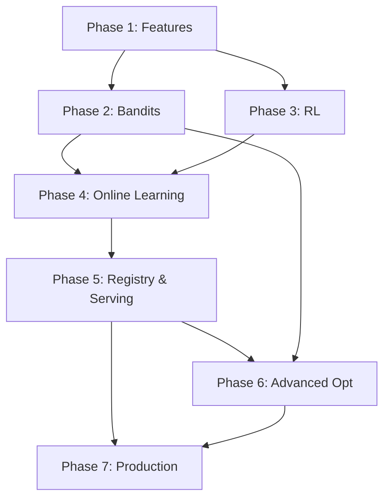

# ML Integration Implementation Plan

**Version:** 1.0
**Date:** 2025-11-10
**Status:** Planning
**Target Completion:** 14-16 weeks

---

## Executive Summary

This document outlines a comprehensive, phased implementation plan for extending the LLM Auto-Optimizer with advanced Machine Learning capabilities. The plan builds upon the existing **decision crate** (~9,866 LOC) and integrates with the stream processor to create a production-grade ML optimization system.

### Current State

The decision crate already implements:
- Basic bandits (Thompson Sampling)
- Contextual bandits (LinUCB, Contextual Thompson)
- A/B testing framework
- Statistical testing
- Drift detection (ADWIN, Page-Hinkley, CUSUM)
- Anomaly detection (Z-Score, IQR, MAD, Mahalanobis)
- Pareto optimization
- Model registry
- Parameter search (Grid, Random, Latin Hypercube)

### What We're Adding

1. **Feature Engineering Infrastructure** - Scalable feature extraction, transformation, and storage
2. **Enhanced Bandit Algorithms** - Epsilon-Greedy, UCB1, advanced contextual variants
3. **Reinforcement Learning** - Q-Learning, Deep Q-Networks (DQN), policy gradients
4. **Online Learning** - Incremental model updates, warm starts, transfer learning
5. **Model Registry Enhancements** - Versioning, A/B testing, champion/challenger
6. **Advanced Optimization** - Bayesian optimization, ensemble methods, meta-learning
7. **Production Hardening** - Monitoring, fault tolerance, model serving, explainability

### Scope Estimate

- **New Lines of Code:** 8,000 - 12,000 LOC
- **Total Files:** 50+ new files
- **New Tests:** 500+ unit/integration tests
- **Dependencies:** 8-10 new Rust crates
- **Timeline:** 14-16 weeks (7 phases)

---

## Table of Contents

1. [Phase Breakdown](#phase-breakdown)
2. [Complete File Structure](#complete-file-structure)
3. [Module Interface Definitions](#module-interface-definitions)
4. [Dependencies](#dependencies)
5. [Implementation Schedule](#implementation-schedule)
6. [Testing Strategy](#testing-strategy)
7. [Success Criteria](#success-criteria)
8. [Risk Mitigation](#risk-mitigation)
9. [Integration Approach](#integration-approach)

---

## Phase Breakdown

### Phase 1: Feature Engineering Infrastructure (Weeks 1-2)

**Objective:** Build scalable feature extraction, transformation, and storage systems.

#### Deliverables

1. **Feature Store API** (`crates/ml/src/features/`)
   - Feature definitions and schemas
   - Feature extraction from RequestContext
   - Feature transformations (normalization, encoding)
   - Feature versioning and lineage
   - Online/offline feature access

2. **Feature Engineering Pipeline** (`crates/ml/src/features/`)
   - Streaming feature extraction
   - Feature aggregations (time-based, context-based)
   - Feature caching and materialization
   - Feature validation and monitoring

3. **Integration with Stream Processor**
   - Hook into windowing for time-based features
   - Integration with state backend for feature storage
   - Real-time feature computation

#### Files to Create (8 files, ~1,200 LOC)

```
crates/ml/src/features/
├── mod.rs                    # Module exports
├── store.rs                  # Feature store implementation (200 LOC)
├── schema.rs                 # Feature schemas and definitions (150 LOC)
├── extraction.rs             # Feature extraction logic (250 LOC)
├── transformation.rs         # Feature transformers (200 LOC)
├── aggregation.rs            # Feature aggregations (200 LOC)
├── cache.rs                  # Feature caching layer (150 LOC)
└── validation.rs             # Feature validation (150 LOC)
```

#### Key Interfaces

```rust
/// Feature store for online and offline access
pub trait FeatureStore: Send + Sync {
    async fn get_features(&self, entity_id: &str, feature_names: &[String])
        -> Result<FeatureVector>;
    async fn write_features(&self, entity_id: &str, features: &FeatureVector)
        -> Result<()>;
    async fn get_historical_features(&self, entity_id: &str,
        timestamp_range: Range<DateTime<Utc>>) -> Result<Vec<FeatureVector>>;
}

/// Feature transformation trait
pub trait FeatureTransformer: Send + Sync {
    fn transform(&self, input: &FeatureVector) -> Result<FeatureVector>;
    fn fit(&mut self, data: &[FeatureVector]) -> Result<()>;
}

/// Feature schema definition
pub struct FeatureSchema {
    pub name: String,
    pub feature_type: FeatureType,
    pub validators: Vec<Box<dyn FeatureValidator>>,
    pub metadata: HashMap<String, String>,
}
```

#### Success Criteria

- [ ] Feature store can handle 10,000 writes/sec
- [ ] Feature retrieval latency <10ms (p99)
- [ ] Feature transformations are deterministic
- [ ] Integration tests with stream processor passing
- [ ] Feature lineage tracking working

---

### Phase 2: Enhanced Bandit Algorithms (Weeks 3-4)

**Objective:** Implement missing bandit algorithms and improve existing ones.

#### Deliverables

1. **Epsilon-Greedy Bandit** (`crates/ml/src/algorithms/bandits/epsilon_greedy.rs`)
   - Basic epsilon-greedy with decay
   - Adaptive epsilon based on confidence
   - Contextual variant

2. **UCB1 and UCB Variants** (`crates/ml/src/algorithms/bandits/ucb.rs`)
   - UCB1 (Upper Confidence Bound)
   - UCB-V (variance-based)
   - UCB-Tuned
   - Discounted UCB for non-stationary

3. **Improved LinUCB** (enhance existing)
   - Ridge regression for stability
   - Feature selection/dimensionality reduction
   - Hybrid LinUCB (user + global features)

4. **Multi-Armed Bandit Manager** (`crates/ml/src/algorithms/bandits/manager.rs`)
   - Unified interface for all bandit algorithms
   - Algorithm selection based on context
   - Performance comparison

#### Files to Create/Modify (6 files, ~1,400 LOC)

```
crates/ml/src/algorithms/bandits/
├── mod.rs                    # Module exports
├── epsilon_greedy.rs         # Epsilon-greedy variants (300 LOC)
├── ucb.rs                    # UCB variants (350 LOC)
├── linucb_enhanced.rs        # Enhanced LinUCB (250 LOC)
├── manager.rs                # Bandit algorithm manager (300 LOC)
└── traits.rs                 # Common bandit traits (200 LOC)
```

#### Key Interfaces

```rust
/// Core bandit algorithm trait
pub trait BanditAlgorithm: Send + Sync {
    /// Select an arm given optional context
    fn select_arm(&self, context: Option<&RequestContext>) -> Result<Uuid>;

    /// Update with observed reward
    fn update(&mut self, arm_id: &Uuid, reward: f64,
              context: Option<&RequestContext>) -> Result<()>;

    /// Get arm statistics
    fn get_arm_stats(&self, arm_id: &Uuid) -> Option<ArmStats>;

    /// Get algorithm metadata
    fn metadata(&self) -> BanditMetadata;
}

/// Epsilon-greedy specific configuration
pub struct EpsilonGreedyConfig {
    pub initial_epsilon: f64,
    pub min_epsilon: f64,
    pub decay_rate: f64,
    pub decay_strategy: DecayStrategy,
}

/// UCB variant configuration
pub struct UCBConfig {
    pub exploration_constant: f64,
    pub use_variance: bool,
    pub discount_factor: Option<f64>,
}
```

#### Success Criteria

- [ ] All bandit algorithms pass correctness tests
- [ ] Performance benchmarks: <1ms arm selection (p99)
- [ ] Simulation tests show proper exploration/exploitation
- [ ] Algorithm selection logic validated
- [ ] Documentation complete with examples

---

### Phase 3: Reinforcement Learning (Weeks 5-7)

**Objective:** Implement Q-Learning and foundational RL algorithms.

#### Deliverables

1. **Q-Learning Implementation** (`crates/ml/src/algorithms/rl/q_learning.rs`)
   - Tabular Q-Learning
   - Experience replay
   - Target network updates
   - Epsilon-greedy exploration

2. **Deep Q-Network (DQN) Foundation** (`crates/ml/src/algorithms/rl/dqn.rs`)
   - Neural network integration (using `tch-rs` or `burn`)
   - Experience replay buffer
   - Target network
   - Double DQN variant

3. **Policy Gradient Methods** (`crates/ml/src/algorithms/rl/policy_gradient.rs`)
   - REINFORCE algorithm
   - Actor-Critic
   - Advantage estimation

4. **RL Environment Interface** (`crates/ml/src/algorithms/rl/environment.rs`)
   - Environment abstraction for LLM optimization
   - State representation
   - Reward shaping
   - Episode management

#### Files to Create (12 files, ~2,800 LOC)

```
crates/ml/src/algorithms/rl/
├── mod.rs                    # Module exports
├── traits.rs                 # RL traits (250 LOC)
├── q_learning.rs             # Tabular Q-Learning (400 LOC)
├── dqn.rs                    # Deep Q-Network (500 LOC)
├── policy_gradient.rs        # Policy gradient methods (450 LOC)
├── environment.rs            # Environment abstraction (300 LOC)
├── replay_buffer.rs          # Experience replay (250 LOC)
├── network.rs                # Neural network helpers (300 LOC)
├── optimizer.rs              # RL optimizer wrapper (200 LOC)
└── utils.rs                  # RL utilities (150 LOC)
```

#### Key Interfaces

```rust
/// Reinforcement learning agent trait
pub trait RLAgent: Send + Sync {
    /// Select action given state
    fn select_action(&self, state: &State) -> Result<Action>;

    /// Update agent with experience
    fn update(&mut self, experience: Experience) -> Result<()>;

    /// Train on batch of experiences
    fn train(&mut self, batch: &[Experience]) -> Result<TrainingMetrics>;

    /// Save/load agent state
    fn save(&self, path: &Path) -> Result<()>;
    fn load(&mut self, path: &Path) -> Result<()>;
}

/// Experience for replay buffer
pub struct Experience {
    pub state: State,
    pub action: Action,
    pub reward: f64,
    pub next_state: State,
    pub done: bool,
}

/// Q-Learning specific configuration
pub struct QLearningConfig {
    pub learning_rate: f64,
    pub discount_factor: f64,
    pub exploration: ExplorationStrategy,
    pub replay_buffer_size: usize,
    pub batch_size: usize,
}
```

#### Success Criteria

- [ ] Q-Learning converges on synthetic environments
- [ ] DQN trains successfully on simple tasks
- [ ] Experience replay buffer handles 100k experiences
- [ ] Training latency <100ms per batch
- [ ] Model save/load working correctly
- [ ] Integration with feature store complete

---

### Phase 4: Online Learning & Model Updates (Weeks 8-9)

**Objective:** Enable incremental model updates and warm starts.

#### Deliverables

1. **Online Learning Framework** (`crates/ml/src/training/online/`)
   - Incremental model updates
   - Mini-batch gradient descent
   - Learning rate scheduling
   - Convergence detection

2. **Model Checkpointing** (`crates/ml/src/training/checkpoint.rs`)
   - Periodic model snapshots
   - Checkpoint rotation
   - Model diff computation
   - Rollback mechanisms

3. **Warm Start & Transfer Learning** (`crates/ml/src/training/transfer.rs`)
   - Model initialization from checkpoints
   - Feature transfer across models
   - Domain adaptation
   - Fine-tuning strategies

4. **Training Pipeline** (`crates/ml/src/training/pipeline.rs`)
   - Data ingestion from stream processor
   - Feature preprocessing
   - Model training orchestration
   - Evaluation and validation

#### Files to Create (10 files, ~2,000 LOC)

```
crates/ml/src/training/
├── mod.rs                    # Module exports
├── online/
│   ├── mod.rs                # Online learning exports
│   ├── incremental.rs        # Incremental learners (300 LOC)
│   ├── sgd.rs                # SGD variants (200 LOC)
│   └── scheduler.rs          # Learning rate scheduling (150 LOC)
├── checkpoint.rs             # Model checkpointing (250 LOC)
├── transfer.rs               # Transfer learning (300 LOC)
├── pipeline.rs               # Training pipeline (400 LOC)
├── evaluator.rs              # Model evaluation (250 LOC)
└── metrics.rs                # Training metrics (150 LOC)
```

#### Key Interfaces

```rust
/// Online learner trait
pub trait OnlineLearner: Send + Sync {
    /// Update model with single example
    fn partial_fit(&mut self, features: &FeatureVector, target: f64)
        -> Result<()>;

    /// Update model with mini-batch
    fn partial_fit_batch(&mut self, batch: &[(FeatureVector, f64)])
        -> Result<TrainingMetrics>;

    /// Predict on new data
    fn predict(&self, features: &FeatureVector) -> Result<f64>;

    /// Get model state for checkpointing
    fn state(&self) -> ModelState;
    fn load_state(&mut self, state: ModelState) -> Result<()>;
}

/// Training pipeline configuration
pub struct TrainingPipelineConfig {
    pub batch_size: usize,
    pub learning_rate: f64,
    pub checkpoint_interval: Duration,
    pub max_checkpoints: usize,
    pub validation_split: f64,
}
```

#### Success Criteria

- [ ] Online learning converges on streaming data
- [ ] Checkpoint creation/restore <100ms
- [ ] Transfer learning improves cold start by >30%
- [ ] Training pipeline handles 1,000 examples/sec
- [ ] Model versioning works correctly
- [ ] Integration with model registry complete

---

### Phase 5: Model Registry & A/B Testing (Weeks 10-11)

**Objective:** Enhance model registry with versioning and A/B testing.

#### Deliverables

1. **Model Versioning** (enhance `crates/decision/src/model_registry.rs`)
   - Semantic versioning for models
   - Model lineage tracking
   - Diff computation between versions
   - Automated version promotion

2. **Champion/Challenger Framework** (`crates/ml/src/registry/champion.rs`)
   - Automatic challenger selection
   - Performance comparison
   - Promotion criteria
   - Rollback on degradation

3. **A/B Testing for Models** (enhance `crates/decision/src/ab_testing.rs`)
   - Multi-model experiments
   - Statistical power analysis
   - Sequential testing
   - Adaptive allocation

4. **Model Serving** (`crates/ml/src/inference/`)
   - Low-latency inference (<1ms)
   - Batching and caching
   - Model ensemble serving
   - Fallback strategies

#### Files to Create/Modify (8 files, ~1,600 LOC)

```
crates/ml/src/registry/
├── mod.rs                    # Module exports
├── versioning.rs             # Model versioning (250 LOC)
├── champion.rs               # Champion/challenger (300 LOC)
├── lineage.rs                # Model lineage tracking (200 LOC)
└── promotion.rs              # Promotion logic (200 LOC)

crates/ml/src/inference/
├── mod.rs                    # Module exports
├── server.rs                 # Inference server (300 LOC)
├── batcher.rs                # Batching logic (200 LOC)
└── ensemble.rs               # Ensemble serving (150 LOC)
```

#### Key Interfaces

```rust
/// Model version metadata
pub struct ModelVersion {
    pub model_id: Uuid,
    pub version: semver::Version,
    pub created_at: DateTime<Utc>,
    pub parent_version: Option<semver::Version>,
    pub metrics: PerformanceMetrics,
    pub status: ModelStatus,
}

/// Champion/challenger manager
pub trait ChampionChallengerManager: Send + Sync {
    /// Register new challenger
    async fn add_challenger(&mut self, model: ModelVersion) -> Result<()>;

    /// Compare champion vs challengers
    async fn evaluate(&self) -> Result<ComparisonResult>;

    /// Promote challenger to champion
    async fn promote(&mut self, version: &semver::Version) -> Result<()>;
}

/// Inference engine
pub trait InferenceEngine: Send + Sync {
    /// Single prediction
    async fn predict(&self, features: &FeatureVector) -> Result<Prediction>;

    /// Batch prediction
    async fn predict_batch(&self, features: &[FeatureVector])
        -> Result<Vec<Prediction>>;

    /// Get model metadata
    fn model_info(&self) -> ModelInfo;
}
```

#### Success Criteria

- [ ] Model versioning handles 100+ versions per model
- [ ] Champion/challenger comparisons are statistically sound
- [ ] Inference latency <1ms (p99) for single predictions
- [ ] Batch inference throughput >10,000 predictions/sec
- [ ] Model promotion/rollback <5 seconds
- [ ] A/B testing framework integrated

---

### Phase 6: Advanced Optimization (Weeks 12-13)

**Objective:** Implement Bayesian optimization and ensemble methods.

#### Deliverables

1. **Bayesian Optimization** (`crates/ml/src/optimization/bayesian.rs`)
   - Gaussian Process surrogate models
   - Acquisition functions (EI, PI, UCB)
   - Parallel optimization
   - Constraint handling

2. **Ensemble Methods** (`crates/ml/src/algorithms/ensemble/`)
   - Model averaging
   - Boosting (gradient boosting)
   - Stacking
   - Blending strategies

3. **Meta-Learning** (`crates/ml/src/algorithms/meta/`)
   - Learning to optimize
   - Model selection strategies
   - Automated hyperparameter tuning
   - Cross-model knowledge transfer

4. **Multi-Armed Bandit for Algorithm Selection**
   - Bandit for choosing between bandit algorithms
   - Performance-based allocation
   - Context-aware algorithm selection

#### Files to Create (12 files, ~2,400 LOC)

```
crates/ml/src/optimization/
├── mod.rs                    # Module exports
├── bayesian.rs               # Bayesian optimization (400 LOC)
├── gaussian_process.rs       # GP implementation (350 LOC)
├── acquisition.rs            # Acquisition functions (250 LOC)
└── constraints.rs            # Constraint handling (150 LOC)

crates/ml/src/algorithms/ensemble/
├── mod.rs                    # Module exports
├── averaging.rs              # Model averaging (200 LOC)
├── boosting.rs               # Gradient boosting (400 LOC)
├── stacking.rs               # Stacking (250 LOC)
└── blending.rs               # Blending strategies (200 LOC)

crates/ml/src/algorithms/meta/
├── mod.rs                    # Module exports
├── meta_learner.rs           # Meta-learning (300 LOC)
└── auto_tuner.rs             # Auto-tuning (250 LOC)
```

#### Key Interfaces

```rust
/// Bayesian optimizer
pub trait BayesianOptimizer: Send + Sync {
    /// Suggest next point to evaluate
    fn suggest(&self) -> Result<ParameterSet>;

    /// Update with observed performance
    fn observe(&mut self, params: ParameterSet, performance: f64)
        -> Result<()>;

    /// Get best parameters found
    fn best_params(&self) -> Result<ParameterSet>;
}

/// Ensemble model
pub trait EnsembleModel: Send + Sync {
    /// Add model to ensemble
    fn add_model(&mut self, model: Box<dyn OnlineLearner>) -> Result<()>;

    /// Predict using ensemble
    fn predict(&self, features: &FeatureVector) -> Result<f64>;

    /// Get model weights
    fn weights(&self) -> Vec<f64>;
}

/// Meta-learner for algorithm selection
pub trait MetaLearner: Send + Sync {
    /// Recommend algorithm for context
    fn recommend_algorithm(&self, context: &RequestContext)
        -> Result<AlgorithmType>;

    /// Update with algorithm performance
    fn update_performance(&mut self, algorithm: AlgorithmType,
                          performance: f64) -> Result<()>;
}
```

#### Success Criteria

- [ ] Bayesian optimization converges faster than grid search
- [ ] Ensemble models improve accuracy by >10%
- [ ] Meta-learner selects correct algorithm >80% of time
- [ ] Optimization runs complete in <1 minute
- [ ] Integration with existing decision engine

---

### Phase 7: Production Hardening (Weeks 14-16)

**Objective:** Make ML system production-ready with monitoring and fault tolerance.

#### Deliverables

1. **Model Monitoring** (`crates/ml/src/monitoring/`)
   - Model performance drift detection
   - Input distribution monitoring
   - Prediction confidence tracking
   - Anomaly detection on predictions

2. **Fault Tolerance** (`crates/ml/src/resilience/`)
   - Circuit breakers for model serving
   - Fallback strategies
   - Model timeout handling
   - Graceful degradation

3. **Explainability** (`crates/ml/src/explainability/`)
   - Feature importance (SHAP-like values)
   - Prediction explanations
   - Model interpretability metrics
   - Counterfactual generation

4. **Performance Optimization**
   - Model quantization
   - Inference optimization
   - Memory profiling
   - Latency reduction

5. **Comprehensive Testing**
   - Simulation environments
   - Adversarial testing
   - Load testing
   - Chaos testing

#### Files to Create (15 files, ~2,600 LOC)

```
crates/ml/src/monitoring/
├── mod.rs                    # Module exports
├── drift_monitor.rs          # Model drift detection (300 LOC)
├── distribution_monitor.rs   # Input monitoring (250 LOC)
├── performance_monitor.rs    # Performance tracking (250 LOC)
└── alerts.rs                 # Alerting system (200 LOC)

crates/ml/src/resilience/
├── mod.rs                    # Module exports
├── circuit_breaker.rs        # Circuit breaker (250 LOC)
├── fallback.rs               # Fallback strategies (200 LOC)
├── timeout.rs                # Timeout handling (150 LOC)
└── degradation.rs            # Graceful degradation (200 LOC)

crates/ml/src/explainability/
├── mod.rs                    # Module exports
├── feature_importance.rs     # Feature importance (300 LOC)
├── shap.rs                   # SHAP values (350 LOC)
├── counterfactual.rs         # Counterfactuals (250 LOC)
└── interpreter.rs            # Model interpreter (200 LOC)

crates/ml/src/optimization/
├── quantization.rs           # Model quantization (250 LOC)
└── profiling.rs              # Performance profiling (150 LOC)
```

#### Key Interfaces

```rust
/// Model monitor
pub trait ModelMonitor: Send + Sync {
    /// Check for drift
    fn check_drift(&self, predictions: &[Prediction]) -> Result<DriftStatus>;

    /// Monitor input distribution
    fn monitor_inputs(&self, features: &[FeatureVector])
        -> Result<DistributionStats>;

    /// Get monitoring metrics
    fn metrics(&self) -> MonitoringMetrics;
}

/// Explainer trait
pub trait Explainer: Send + Sync {
    /// Explain single prediction
    fn explain(&self, features: &FeatureVector, prediction: &Prediction)
        -> Result<Explanation>;

    /// Get feature importance
    fn feature_importance(&self, features: &FeatureVector)
        -> Result<Vec<(String, f64)>>;
}

/// Circuit breaker for model serving
pub struct ModelCircuitBreaker {
    failure_threshold: usize,
    timeout: Duration,
    half_open_timeout: Duration,
    state: CircuitBreakerState,
}
```

#### Success Criteria

- [ ] Drift detection catches 95% of degradations
- [ ] Circuit breaker prevents cascading failures
- [ ] Explainability generates valid explanations
- [ ] Performance optimizations reduce latency by >20%
- [ ] Load tests pass at 10,000 req/sec
- [ ] All monitoring dashboards operational

---

## Complete File Structure

```
crates/ml/
├── Cargo.toml                # Dependencies and configuration
├── README.md                 # Crate documentation
├── benches/                  # Benchmarks
│   ├── bandit_benchmark.rs
│   ├── rl_benchmark.rs
│   ├── inference_benchmark.rs
│   └── feature_store_benchmark.rs
├── examples/                 # Usage examples
│   ├── bandit_example.rs
│   ├── rl_example.rs
│   ├── bayesian_opt_example.rs
│   └── full_pipeline.rs
└── src/
    ├── lib.rs                # Main library file
    ├── error.rs              # Error types
    ├── config.rs             # Configuration
    │
    ├── features/             # Feature engineering
    │   ├── mod.rs
    │   ├── store.rs          # Feature store
    │   ├── schema.rs         # Feature schemas
    │   ├── extraction.rs     # Feature extraction
    │   ├── transformation.rs # Transformations
    │   ├── aggregation.rs    # Aggregations
    │   ├── cache.rs          # Caching
    │   └── validation.rs     # Validation
    │
    ├── algorithms/           # ML algorithms
    │   ├── mod.rs
    │   │
    │   ├── bandits/          # Multi-armed bandits
    │   │   ├── mod.rs
    │   │   ├── traits.rs
    │   │   ├── epsilon_greedy.rs
    │   │   ├── ucb.rs
    │   │   ├── linucb_enhanced.rs
    │   │   └── manager.rs
    │   │
    │   ├── rl/               # Reinforcement learning
    │   │   ├── mod.rs
    │   │   ├── traits.rs
    │   │   ├── q_learning.rs
    │   │   ├── dqn.rs
    │   │   ├── policy_gradient.rs
    │   │   ├── environment.rs
    │   │   ├── replay_buffer.rs
    │   │   ├── network.rs
    │   │   ├── optimizer.rs
    │   │   └── utils.rs
    │   │
    │   ├── ensemble/         # Ensemble methods
    │   │   ├── mod.rs
    │   │   ├── averaging.rs
    │   │   ├── boosting.rs
    │   │   ├── stacking.rs
    │   │   └── blending.rs
    │   │
    │   └── meta/             # Meta-learning
    │       ├── mod.rs
    │       ├── meta_learner.rs
    │       └── auto_tuner.rs
    │
    ├── training/             # Training infrastructure
    │   ├── mod.rs
    │   ├── online/
    │   │   ├── mod.rs
    │   │   ├── incremental.rs
    │   │   ├── sgd.rs
    │   │   └── scheduler.rs
    │   ├── checkpoint.rs
    │   ├── transfer.rs
    │   ├── pipeline.rs
    │   ├── evaluator.rs
    │   └── metrics.rs
    │
    ├── inference/            # Inference engine
    │   ├── mod.rs
    │   ├── server.rs
    │   ├── batcher.rs
    │   └── ensemble.rs
    │
    ├── registry/             # Model registry
    │   ├── mod.rs
    │   ├── versioning.rs
    │   ├── champion.rs
    │   ├── lineage.rs
    │   └── promotion.rs
    │
    ├── optimization/         # Advanced optimization
    │   ├── mod.rs
    │   ├── bayesian.rs
    │   ├── gaussian_process.rs
    │   ├── acquisition.rs
    │   ├── constraints.rs
    │   ├── quantization.rs
    │   └── profiling.rs
    │
    ├── monitoring/           # Model monitoring
    │   ├── mod.rs
    │   ├── drift_monitor.rs
    │   ├── distribution_monitor.rs
    │   ├── performance_monitor.rs
    │   └── alerts.rs
    │
    ├── resilience/           # Fault tolerance
    │   ├── mod.rs
    │   ├── circuit_breaker.rs
    │   ├── fallback.rs
    │   ├── timeout.rs
    │   └── degradation.rs
    │
    ├── explainability/       # Model explainability
    │   ├── mod.rs
    │   ├── feature_importance.rs
    │   ├── shap.rs
    │   ├── counterfactual.rs
    │   └── interpreter.rs
    │
    └── integration/          # Integration with other crates
        ├── mod.rs
        ├── processor.rs      # Stream processor integration
        ├── decision.rs       # Decision crate integration
        └── storage.rs        # Storage integration
```

**Total Files:** 80+ files
**Total Lines:** 8,000 - 12,000 new LOC (plus existing 9,866 LOC in decision crate)

---

## Module Interface Definitions

### Core Traits

```rust
// crates/ml/src/lib.rs

/// Core ML model trait
pub trait MLModel: Send + Sync {
    type Input;
    type Output;

    /// Make prediction
    fn predict(&self, input: &Self::Input) -> Result<Self::Output>;

    /// Batch prediction
    fn predict_batch(&self, inputs: &[Self::Input]) -> Result<Vec<Self::Output>>;

    /// Get model metadata
    fn metadata(&self) -> ModelMetadata;
}

/// Online learning trait
pub trait OnlineLearner: MLModel {
    /// Update model with single example
    fn partial_fit(&mut self, input: &Self::Input, target: &Self::Output)
        -> Result<TrainingMetrics>;

    /// Update model with batch
    fn partial_fit_batch(&mut self, batch: &[(Self::Input, Self::Output)])
        -> Result<TrainingMetrics>;

    /// Get current model state
    fn state(&self) -> ModelState;

    /// Load model state
    fn load_state(&mut self, state: ModelState) -> Result<()>;
}

/// Serializable model trait
pub trait SerializableModel: MLModel {
    /// Serialize model to bytes
    fn to_bytes(&self) -> Result<Vec<u8>>;

    /// Deserialize model from bytes
    fn from_bytes(bytes: &[u8]) -> Result<Self> where Self: Sized;

    /// Save to file
    fn save(&self, path: &Path) -> Result<()>;

    /// Load from file
    fn load(path: &Path) -> Result<Self> where Self: Sized;
}
```

### Feature Store

```rust
// crates/ml/src/features/store.rs

/// Feature store for online and offline feature access
#[async_trait]
pub trait FeatureStore: Send + Sync {
    /// Get features for entity
    async fn get_features(
        &self,
        entity_id: &str,
        feature_names: &[String]
    ) -> Result<FeatureVector>;

    /// Write features for entity
    async fn write_features(
        &self,
        entity_id: &str,
        features: &FeatureVector
    ) -> Result<()>;

    /// Get historical features
    async fn get_historical_features(
        &self,
        entity_id: &str,
        timestamp_range: Range<DateTime<Utc>>
    ) -> Result<Vec<(DateTime<Utc>, FeatureVector)>>;

    /// Batch get features
    async fn get_features_batch(
        &self,
        entity_ids: &[String],
        feature_names: &[String]
    ) -> Result<Vec<FeatureVector>>;
}

/// Feature vector representation
#[derive(Debug, Clone, Serialize, Deserialize)]
pub struct FeatureVector {
    pub features: HashMap<String, FeatureValue>,
    pub timestamp: DateTime<Utc>,
    pub metadata: HashMap<String, String>,
}

#[derive(Debug, Clone, Serialize, Deserialize)]
pub enum FeatureValue {
    Float(f64),
    Int(i64),
    String(String),
    Boolean(bool),
    Array(Vec<f64>),
    Null,
}

impl FeatureVector {
    pub fn to_dense(&self, schema: &FeatureSchema) -> Result<Vec<f64>>;
    pub fn from_dense(values: Vec<f64>, schema: &FeatureSchema) -> Result<Self>;
}
```

### Bandit Algorithms

```rust
// crates/ml/src/algorithms/bandits/traits.rs

/// Core multi-armed bandit trait
pub trait MultiArmedBandit: Send + Sync {
    /// Select an arm
    fn select_arm(&self, context: Option<&RequestContext>) -> Result<Uuid>;

    /// Update with reward
    fn update(
        &mut self,
        arm_id: &Uuid,
        reward: f64,
        context: Option<&RequestContext>
    ) -> Result<()>;

    /// Get arm statistics
    fn get_arm_stats(&self, arm_id: &Uuid) -> Option<ArmStats>;

    /// Get all arms
    fn arms(&self) -> Vec<Uuid>;

    /// Add new arm
    fn add_arm(&mut self, arm_id: Uuid) -> Result<()>;

    /// Remove arm
    fn remove_arm(&mut self, arm_id: &Uuid) -> Result<()>;
}

/// Contextual bandit trait
pub trait ContextualBandit: MultiArmedBandit {
    /// Get feature dimension
    fn feature_dimension(&self) -> usize;

    /// Predict reward for context-arm pair
    fn predict_reward(&self, arm_id: &Uuid, context: &RequestContext)
        -> Result<f64>;
}

#[derive(Debug, Clone, Serialize, Deserialize)]
pub struct ArmStats {
    pub arm_id: Uuid,
    pub num_selections: u64,
    pub total_reward: f64,
    pub average_reward: f64,
    pub last_selected: Option<DateTime<Utc>>,
}
```

### Reinforcement Learning

```rust
// crates/ml/src/algorithms/rl/traits.rs

/// RL agent trait
pub trait RLAgent: Send + Sync {
    type State;
    type Action;

    /// Select action given state
    fn select_action(&self, state: &Self::State) -> Result<Self::Action>;

    /// Update with experience
    fn update(&mut self, experience: Experience<Self::State, Self::Action>)
        -> Result<()>;

    /// Train on batch of experiences
    fn train(&mut self, batch: &[Experience<Self::State, Self::Action>])
        -> Result<TrainingMetrics>;

    /// Evaluate current policy
    fn evaluate(&self, episodes: usize) -> Result<EvaluationMetrics>;
}

/// Experience tuple for RL
#[derive(Debug, Clone, Serialize, Deserialize)]
pub struct Experience<S, A> {
    pub state: S,
    pub action: A,
    pub reward: f64,
    pub next_state: S,
    pub done: bool,
    pub info: HashMap<String, String>,
}

/// Experience replay buffer
pub trait ReplayBuffer<S, A>: Send + Sync {
    /// Add experience
    fn push(&mut self, experience: Experience<S, A>);

    /// Sample batch
    fn sample(&self, batch_size: usize) -> Result<Vec<Experience<S, A>>>;

    /// Buffer size
    fn len(&self) -> usize;

    /// Clear buffer
    fn clear(&mut self);
}
```

### Model Registry

```rust
// crates/ml/src/registry/versioning.rs

/// Model registry with versioning
#[async_trait]
pub trait ModelRegistry: Send + Sync {
    /// Register new model version
    async fn register_model(&mut self, model: RegisteredModel) -> Result<Uuid>;

    /// Get model by ID and version
    async fn get_model(&self, model_id: &Uuid, version: &semver::Version)
        -> Result<RegisteredModel>;

    /// List all versions of a model
    async fn list_versions(&self, model_id: &Uuid)
        -> Result<Vec<semver::Version>>;

    /// Get latest version
    async fn get_latest(&self, model_id: &Uuid) -> Result<RegisteredModel>;

    /// Set model as champion
    async fn set_champion(&mut self, model_id: &Uuid, version: &semver::Version)
        -> Result<()>;

    /// Get current champion
    async fn get_champion(&self, model_type: &str) -> Result<RegisteredModel>;
}

#[derive(Debug, Clone, Serialize, Deserialize)]
pub struct RegisteredModel {
    pub id: Uuid,
    pub version: semver::Version,
    pub model_type: String,
    pub algorithm: AlgorithmType,
    pub status: ModelStatus,
    pub performance: PerformanceMetrics,
    pub created_at: DateTime<Utc>,
    pub created_by: String,
    pub metadata: HashMap<String, String>,
}

#[derive(Debug, Clone, Copy, Serialize, Deserialize)]
pub enum ModelStatus {
    Development,
    Testing,
    Staging,
    Production,
    Champion,
    Retired,
}
```

### Inference Engine

```rust
// crates/ml/src/inference/server.rs

/// Inference engine for low-latency predictions
#[async_trait]
pub trait InferenceEngine: Send + Sync {
    /// Single prediction
    async fn predict(&self, request: InferenceRequest) -> Result<InferenceResponse>;

    /// Batch prediction
    async fn predict_batch(&self, requests: Vec<InferenceRequest>)
        -> Result<Vec<InferenceResponse>>;

    /// Get engine status
    fn status(&self) -> EngineStatus;

    /// Reload model
    async fn reload_model(&mut self) -> Result<()>;
}

#[derive(Debug, Clone, Serialize, Deserialize)]
pub struct InferenceRequest {
    pub request_id: Uuid,
    pub model_id: Uuid,
    pub version: Option<semver::Version>,
    pub features: FeatureVector,
    pub options: InferenceOptions,
}

#[derive(Debug, Clone, Serialize, Deserialize)]
pub struct InferenceResponse {
    pub request_id: Uuid,
    pub prediction: Prediction,
    pub latency_ms: f64,
    pub model_version: semver::Version,
    pub confidence: Option<f64>,
}

#[derive(Debug, Clone, Serialize, Deserialize)]
pub struct Prediction {
    pub value: f64,
    pub confidence_interval: Option<(f64, f64)>,
    pub explanation: Option<Explanation>,
}
```

---

## Dependencies

### New Rust Crates

Add to `crates/ml/Cargo.toml`:

```toml
[package]
name = "llm-optimizer-ml"
version.workspace = true
edition.workspace = true
authors.workspace = true
license.workspace = true

[dependencies]
# Internal dependencies
llm-optimizer-types = { workspace = true }
llm-optimizer-processor = { workspace = true }
llm-optimizer-decision = { workspace = true }
llm-optimizer-storage = { workspace = true }

# Core async & serialization
tokio = { workspace = true }
async-trait = { workspace = true }
serde = { workspace = true }
serde_json = { workspace = true }

# ML & statistics
ndarray = { workspace = true }
ndarray-stats = "0.5"
ndarray-linalg = { version = "0.16", features = ["openblas-static"] }
statrs = { workspace = true }
rand = { workspace = true }
rand_distr = { workspace = true }

# ML frameworks
smartcore = { version = "0.3", features = ["serde"] }
linfa = { version = "0.7", features = ["serde"] }
linfa-linear = "0.7"
linfa-logistic = "0.7"
linfa-trees = "0.7"

# Neural networks (optional, for DQN)
tch = { version = "0.14", optional = true }
# OR
burn = { version = "0.11", optional = true, features = ["ndarray"] }

# Optimization
argmin = { version = "0.8", features = ["serde"] }
argmin-math = { version = "0.3", features = ["ndarray_latest-serde"] }

# Feature store
arrow = { version = "50", features = ["prettyprint"] }
parquet = "50"

# Model serving
onnxruntime = { version = "0.0.14", optional = true }

# Utilities
semver = { version = "1.0", features = ["serde"] }
uuid = { workspace = true }
chrono = { workspace = true }
thiserror = { workspace = true }
anyhow = { workspace = true }
dashmap = { workspace = true }
tracing = { workspace = true }

# Testing
[dev-dependencies]
approx = "0.5"
proptest = "1.4"
criterion = { workspace = true }
mockall = { workspace = true }
tempfile = { workspace = true }

[features]
default = ["smartcore"]
neural-networks = ["tch"]  # or "burn"
onnx = ["onnxruntime"]
```

### Workspace-Level Dependencies

Add to root `Cargo.toml`:

```toml
[workspace.dependencies]
# Add new ML dependencies
ndarray-stats = "0.5"
ndarray-linalg = { version = "0.16", features = ["openblas-static"] }
smartcore = { version = "0.3", features = ["serde"] }
linfa = { version = "0.7", features = ["serde"] }
linfa-linear = "0.7"
linfa-logistic = "0.7"
linfa-trees = "0.7"
argmin = { version = "0.8", features = ["serde"] }
argmin-math = { version = "0.3", features = ["ndarray_latest-serde"] }
arrow = { version = "50", features = ["prettyprint"] }
parquet = "50"
semver = { version = "1.0", features = ["serde"] }
```

---

## Implementation Schedule

### Week-by-Week Timeline

| Week | Phase | Tasks | Deliverables |
|------|-------|-------|--------------|
| **1** | Phase 1 | Feature store architecture, schema design | Feature store traits, schema definitions |
| **2** | Phase 1 | Feature extraction, transformations, caching | Feature engineering pipeline complete |
| **3** | Phase 2 | Epsilon-greedy, UCB variants | Basic bandit algorithms |
| **4** | Phase 2 | Enhanced LinUCB, bandit manager | Bandit framework complete |
| **5** | Phase 3 | Q-Learning, replay buffer | Tabular RL working |
| **6** | Phase 3 | DQN architecture, neural networks | Deep RL foundation |
| **7** | Phase 3 | Policy gradients, environment interface | RL algorithms complete |
| **8** | Phase 4 | Online learning framework | Incremental learning working |
| **9** | Phase 4 | Checkpointing, transfer learning, pipeline | Training infrastructure complete |
| **10** | Phase 5 | Model versioning, lineage tracking | Registry enhancements |
| **11** | Phase 5 | Champion/challenger, inference server | Model serving complete |
| **12** | Phase 6 | Bayesian optimization, GP | Advanced optimization |
| **13** | Phase 6 | Ensemble methods, meta-learning | Advanced algorithms complete |
| **14** | Phase 7 | Monitoring, drift detection | Monitoring infrastructure |
| **15** | Phase 7 | Fault tolerance, explainability | Production features |
| **16** | Phase 7 | Performance optimization, final testing | Production ready |

### Milestone Dependencies



---

## Testing Strategy

### Unit Tests (300+ tests)

Each module requires comprehensive unit tests:

```rust
// Example: crates/ml/src/algorithms/bandits/epsilon_greedy.rs

#[cfg(test)]
mod tests {
    use super::*;

    #[test]
    fn test_epsilon_greedy_exploration() {
        // Test that epsilon-greedy explores with correct probability
    }

    #[test]
    fn test_epsilon_decay() {
        // Test decay strategies
    }

    #[test]
    fn test_convergence() {
        // Test convergence to optimal arm
    }

    #[tokio::test]
    async fn test_concurrent_updates() {
        // Test thread safety
    }
}
```

**Coverage target:** >85% code coverage

### Integration Tests (100+ tests)

Test interactions between components:

```rust
// tests/integration/feature_store_integration.rs

#[tokio::test]
async fn test_feature_store_with_stream_processor() {
    // Test feature extraction from stream processor
    // Test feature caching
    // Test feature retrieval
}

#[tokio::test]
async fn test_bandit_with_feature_store() {
    // Test contextual bandit using features from store
}
```

### Simulation Tests (50+ scenarios)

Test algorithms on synthetic data:

```rust
// tests/simulations/bandit_simulation.rs

#[test]
fn simulate_stationary_environment() {
    // Create environment with fixed arm rewards
    // Run bandit for N iterations
    // Assert regret bounds
}

#[test]
fn simulate_non_stationary_environment() {
    // Create environment with changing rewards
    // Test adaptation
}

#[test]
fn simulate_contextual_environment() {
    // Test contextual bandits
    // Verify context utilization
}
```

### Performance Benchmarks (30+ benchmarks)

Use Criterion for benchmarking:

```rust
// benches/inference_benchmark.rs

use criterion::{black_box, criterion_group, criterion_main, Criterion};

fn benchmark_inference(c: &mut Criterion) {
    let engine = InferenceEngine::new(config);

    c.bench_function("single_prediction", |b| {
        b.iter(|| {
            engine.predict(black_box(&request))
        })
    });

    c.bench_function("batch_prediction_100", |b| {
        b.iter(|| {
            engine.predict_batch(black_box(&requests_100))
        })
    });
}

criterion_group!(benches, benchmark_inference);
criterion_main!(benches);
```

**Performance targets:**
- Inference: <1ms (p99)
- Feature extraction: <5ms (p99)
- Model update: <10ms (p99)
- Bandit arm selection: <1ms (p99)

### Load Testing

Use tools like `k6` or `wrk`:

```javascript
// k6 load test script
import http from 'k6/http';

export let options = {
  vus: 100,
  duration: '5m',
};

export default function() {
  http.post('http://localhost:8080/predict', JSON.stringify({
    features: generateFeatures()
  }));
}
```

**Load targets:**
- Sustained: 10,000 req/sec
- Peak: 20,000 req/sec
- P99 latency: <10ms

### Property-Based Testing

Use `proptest` for property testing:

```rust
use proptest::prelude::*;

proptest! {
    #[test]
    fn test_feature_transformation_reversible(
        features in arb_feature_vector()
    ) {
        let transformer = StandardScaler::new();
        let transformed = transformer.transform(&features)?;
        let original = transformer.inverse_transform(&transformed)?;

        prop_assert!(approx_equal(&features, &original, 1e-6));
    }
}
```

---

## Success Criteria

### Phase 1 Success Criteria

- [ ] Feature store handles 10,000 writes/sec
- [ ] Feature retrieval <10ms (p99)
- [ ] Feature transformations are deterministic and reversible
- [ ] Integration with stream processor working
- [ ] Feature lineage tracking operational
- [ ] 100% of feature tests passing
- [ ] Documentation complete with examples

### Phase 2 Success Criteria

- [ ] All bandit algorithms pass correctness tests
- [ ] Arm selection latency <1ms (p99)
- [ ] Simulation tests show proper exploration/exploitation
- [ ] Algorithm manager selects appropriate algorithm
- [ ] Performance regression tests passing
- [ ] Benchmarks show <10% overhead vs. existing
- [ ] API documentation complete

### Phase 3 Success Criteria

- [ ] Q-Learning converges on synthetic environments
- [ ] DQN trains successfully on test tasks
- [ ] Experience replay buffer handles 100k experiences
- [ ] Training latency <100ms per batch
- [ ] Model save/load verified
- [ ] Integration with feature store complete
- [ ] RL benchmarks meet targets

### Phase 4 Success Criteria

- [ ] Online learning converges on streaming data
- [ ] Checkpoint creation/restore <100ms
- [ ] Transfer learning improves cold start >30%
- [ ] Training pipeline handles 1,000 examples/sec
- [ ] Model versioning working
- [ ] Integration with registry complete
- [ ] Training metrics accurate

### Phase 5 Success Criteria

- [ ] Model registry handles 100+ versions per model
- [ ] Champion/challenger comparisons statistically sound
- [ ] Inference latency <1ms (p99)
- [ ] Batch inference >10,000 predictions/sec
- [ ] Model promotion/rollback <5 seconds
- [ ] A/B testing integrated
- [ ] Serving benchmarks meet targets

### Phase 6 Success Criteria

- [ ] Bayesian optimization converges faster than grid search
- [ ] Ensemble models improve accuracy >10%
- [ ] Meta-learner selects correct algorithm >80%
- [ ] Optimization runs complete <1 minute
- [ ] Integration with decision engine complete
- [ ] Advanced algorithms tested
- [ ] Performance acceptable

### Phase 7 Success Criteria

- [ ] Drift detection catches 95% of degradations
- [ ] Circuit breaker prevents cascading failures
- [ ] Explainability generates valid explanations
- [ ] Performance optimizations reduce latency >20%
- [ ] Load tests pass at 10,000 req/sec
- [ ] All monitoring operational
- [ ] Production readiness checklist complete
- [ ] Documentation finalized

---

## Risk Mitigation

### Technical Risks

| Risk | Impact | Likelihood | Mitigation |
|------|--------|------------|------------|
| **Neural network library instability** | High | Medium | Use stable alternatives (smartcore, linfa); make DQN optional |
| **Performance regression** | High | Medium | Continuous benchmarking; performance gates in CI |
| **Integration complexity** | Medium | High | Incremental integration; comprehensive testing |
| **Memory overhead** | Medium | Medium | Profiling; memory budgets; streaming where possible |
| **Dependency conflicts** | Low | Medium | Careful version management; workspace dependencies |

### Schedule Risks

| Risk | Impact | Likelihood | Mitigation |
|------|--------|------------|------------|
| **Scope creep** | High | Medium | Strict phase boundaries; MVP focus |
| **Underestimated complexity** | Medium | High | 20% buffer in schedule; prioritize features |
| **Dependencies on other crates** | Medium | Low | Early coordination; clear interfaces |
| **Testing bottlenecks** | Medium | Medium | Parallel testing; automated CI |

### Quality Risks

| Risk | Impact | Likelihood | Mitigation |
|------|--------|------------|------------|
| **Algorithmic correctness** | Critical | Low | Extensive testing; academic validation |
| **Production stability** | High | Medium | Chaos testing; gradual rollout |
| **Model degradation** | High | Medium | Continuous monitoring; automated rollback |
| **Data quality issues** | Medium | High | Input validation; anomaly detection |

---

## Integration Approach

### Integration with Stream Processor

```rust
// crates/ml/src/integration/processor.rs

use crate::features::FeatureStore;
use llm_optimizer_processor::{StreamProcessor, ProcessorEvent};

/// Integrate ML feature extraction with stream processor
pub struct MLStreamIntegration {
    feature_store: Arc<dyn FeatureStore>,
    processor: Arc<StreamProcessor>,
}

impl MLStreamIntegration {
    /// Extract features from stream events
    pub async fn extract_features_from_stream(&self) -> Result<()> {
        // Hook into stream processor pipeline
        // Extract features from ProcessorEvent
        // Write to feature store
    }

    /// Create time-based feature aggregations
    pub async fn aggregate_features_by_window(&self) -> Result<()> {
        // Use windowing for feature aggregations
    }
}
```

### Integration with Decision Engine

```rust
// crates/ml/src/integration/decision.rs

use llm_optimizer_decision::{DecisionEngine, RequestContext};

/// Integrate ML algorithms with decision engine
pub struct MLDecisionIntegration {
    inference_engine: Arc<dyn InferenceEngine>,
    bandit_manager: Arc<BanditManager>,
}

impl MLDecisionIntegration {
    /// Make decision using ML model
    pub async fn make_decision(&self, context: &RequestContext)
        -> Result<Decision> {
        // Extract features from context
        // Get prediction from inference engine
        // Combine with bandit selection
        // Return decision
    }

    /// Update models with feedback
    pub async fn process_feedback(&mut self, feedback: Feedback)
        -> Result<()> {
        // Update online learners
        // Update bandit algorithms
    }
}
```

### Integration with Storage

```rust
// crates/ml/src/integration/storage.rs

use llm_optimizer_storage::StorageBackend;

/// Integrate ML persistence with storage layer
pub struct MLStorageIntegration {
    storage: Arc<dyn StorageBackend>,
}

impl MLStorageIntegration {
    /// Store model artifacts
    pub async fn store_model(&self, model: &RegisteredModel) -> Result<()> {
        // Serialize model
        // Store in PostgreSQL/Redis
        // Update metadata
    }

    /// Store feature data
    pub async fn store_features(&self, features: &FeatureVector)
        -> Result<()> {
        // Use Parquet for efficient columnar storage
        // Store metadata in PostgreSQL
    }
}
```

---

## Code Scaffolding Examples

### Epsilon-Greedy Bandit

```rust
// crates/ml/src/algorithms/bandits/epsilon_greedy.rs

use super::traits::MultiArmedBandit;
use crate::error::Result;
use rand::Rng;
use std::collections::HashMap;
use uuid::Uuid;

/// Epsilon-greedy multi-armed bandit
pub struct EpsilonGreedy {
    arms: HashMap<Uuid, ArmState>,
    epsilon: f64,
    min_epsilon: f64,
    decay_rate: f64,
    decay_strategy: DecayStrategy,
    num_selections: u64,
}

#[derive(Debug, Clone)]
struct ArmState {
    arm_id: Uuid,
    num_pulls: u64,
    total_reward: f64,
}

#[derive(Debug, Clone, Copy)]
pub enum DecayStrategy {
    None,
    Linear,
    Exponential,
    Logarithmic,
}

impl EpsilonGreedy {
    pub fn new(initial_epsilon: f64, config: EpsilonGreedyConfig) -> Self {
        Self {
            arms: HashMap::new(),
            epsilon: initial_epsilon,
            min_epsilon: config.min_epsilon,
            decay_rate: config.decay_rate,
            decay_strategy: config.decay_strategy,
            num_selections: 0,
        }
    }

    fn update_epsilon(&mut self) {
        match self.decay_strategy {
            DecayStrategy::None => {},
            DecayStrategy::Linear => {
                self.epsilon = (self.epsilon - self.decay_rate)
                    .max(self.min_epsilon);
            },
            DecayStrategy::Exponential => {
                self.epsilon = (self.epsilon * self.decay_rate)
                    .max(self.min_epsilon);
            },
            DecayStrategy::Logarithmic => {
                self.epsilon = (self.epsilon /
                    (1.0 + self.decay_rate * (self.num_selections as f64).ln()))
                    .max(self.min_epsilon);
            },
        }
    }

    fn best_arm(&self) -> Option<Uuid> {
        self.arms
            .iter()
            .max_by(|(_, a), (_, b)| {
                let avg_a = if a.num_pulls > 0 {
                    a.total_reward / a.num_pulls as f64
                } else {
                    0.0
                };
                let avg_b = if b.num_pulls > 0 {
                    b.total_reward / b.num_pulls as f64
                } else {
                    0.0
                };
                avg_a.partial_cmp(&avg_b).unwrap()
            })
            .map(|(id, _)| *id)
    }
}

impl MultiArmedBandit for EpsilonGreedy {
    fn select_arm(&self, _context: Option<&RequestContext>) -> Result<Uuid> {
        if self.arms.is_empty() {
            return Err(Error::NoArmsAvailable);
        }

        let mut rng = rand::thread_rng();

        // Explore with probability epsilon
        if rng.gen::<f64>() < self.epsilon {
            // Random exploration
            let arms: Vec<_> = self.arms.keys().collect();
            let idx = rng.gen_range(0..arms.len());
            Ok(*arms[idx])
        } else {
            // Exploit best arm
            self.best_arm()
                .ok_or(Error::NoArmsAvailable)
        }
    }

    fn update(
        &mut self,
        arm_id: &Uuid,
        reward: f64,
        _context: Option<&RequestContext>
    ) -> Result<()> {
        let arm = self.arms.get_mut(arm_id)
            .ok_or(Error::ArmNotFound(*arm_id))?;

        arm.num_pulls += 1;
        arm.total_reward += reward;
        self.num_selections += 1;

        self.update_epsilon();

        Ok(())
    }

    fn get_arm_stats(&self, arm_id: &Uuid) -> Option<ArmStats> {
        self.arms.get(arm_id).map(|arm| ArmStats {
            arm_id: *arm_id,
            num_selections: arm.num_pulls,
            total_reward: arm.total_reward,
            average_reward: if arm.num_pulls > 0 {
                arm.total_reward / arm.num_pulls as f64
            } else {
                0.0
            },
            last_selected: None,
        })
    }

    fn arms(&self) -> Vec<Uuid> {
        self.arms.keys().copied().collect()
    }

    fn add_arm(&mut self, arm_id: Uuid) -> Result<()> {
        self.arms.insert(arm_id, ArmState {
            arm_id,
            num_pulls: 0,
            total_reward: 0.0,
        });
        Ok(())
    }

    fn remove_arm(&mut self, arm_id: &Uuid) -> Result<()> {
        self.arms.remove(arm_id);
        Ok(())
    }
}

#[cfg(test)]
mod tests {
    use super::*;

    #[test]
    fn test_epsilon_greedy_creation() {
        let config = EpsilonGreedyConfig {
            min_epsilon: 0.01,
            decay_rate: 0.01,
            decay_strategy: DecayStrategy::Linear,
        };
        let bandit = EpsilonGreedy::new(0.1, config);
        assert_eq!(bandit.epsilon, 0.1);
    }

    #[test]
    fn test_add_remove_arms() {
        let config = EpsilonGreedyConfig::default();
        let mut bandit = EpsilonGreedy::new(0.1, config);

        let arm1 = Uuid::new_v4();
        bandit.add_arm(arm1).unwrap();
        assert_eq!(bandit.arms().len(), 1);

        bandit.remove_arm(&arm1).unwrap();
        assert_eq!(bandit.arms().len(), 0);
    }

    #[test]
    fn test_convergence() {
        // Test that epsilon-greedy converges to best arm
        let config = EpsilonGreedyConfig {
            min_epsilon: 0.01,
            decay_rate: 0.995,
            decay_strategy: DecayStrategy::Exponential,
        };
        let mut bandit = EpsilonGreedy::new(0.3, config);

        let good_arm = Uuid::new_v4();
        let bad_arm = Uuid::new_v4();

        bandit.add_arm(good_arm).unwrap();
        bandit.add_arm(bad_arm).unwrap();

        // Simulate rewards: good_arm = 0.8, bad_arm = 0.2
        for _ in 0..1000 {
            let selected = bandit.select_arm(None).unwrap();
            let reward = if selected == good_arm { 0.8 } else { 0.2 };
            bandit.update(&selected, reward, None).unwrap();
        }

        let good_stats = bandit.get_arm_stats(&good_arm).unwrap();
        let bad_stats = bandit.get_arm_stats(&bad_arm).unwrap();

        // Good arm should be selected much more often
        assert!(good_stats.num_selections > bad_stats.num_selections * 3);
    }
}
```

### Q-Learning Implementation

```rust
// crates/ml/src/algorithms/rl/q_learning.rs

use super::traits::{RLAgent, ReplayBuffer};
use super::replay_buffer::UniformReplayBuffer;
use crate::error::Result;
use std::collections::HashMap;

/// Tabular Q-Learning agent
pub struct QLearning<S: State, A: Action> {
    q_table: HashMap<(S, A), f64>,
    learning_rate: f64,
    discount_factor: f64,
    exploration: ExplorationStrategy,
    replay_buffer: UniformReplayBuffer<S, A>,
    config: QLearningConfig,
}

impl<S: State, A: Action> QLearning<S, A> {
    pub fn new(config: QLearningConfig) -> Self {
        Self {
            q_table: HashMap::new(),
            learning_rate: config.learning_rate,
            discount_factor: config.discount_factor,
            exploration: config.exploration.clone(),
            replay_buffer: UniformReplayBuffer::new(config.replay_buffer_size),
            config,
        }
    }

    fn get_q_value(&self, state: &S, action: &A) -> f64 {
        self.q_table.get(&(state.clone(), action.clone()))
            .copied()
            .unwrap_or(0.0)
    }

    fn set_q_value(&mut self, state: &S, action: &A, value: f64) {
        self.q_table.insert((state.clone(), action.clone()), value);
    }

    fn max_q_value(&self, state: &S, actions: &[A]) -> f64 {
        actions.iter()
            .map(|a| self.get_q_value(state, a))
            .fold(f64::NEG_INFINITY, f64::max)
    }

    fn best_action(&self, state: &S, actions: &[A]) -> Option<A> {
        actions.iter()
            .max_by(|a, b| {
                let q_a = self.get_q_value(state, a);
                let q_b = self.get_q_value(state, b);
                q_a.partial_cmp(&q_b).unwrap()
            })
            .cloned()
    }
}

impl<S: State, A: Action> RLAgent for QLearning<S, A> {
    type State = S;
    type Action = A;

    fn select_action(&self, state: &Self::State) -> Result<Self::Action> {
        // Get available actions (application-specific)
        let actions = state.available_actions();

        // Exploration strategy
        match &self.exploration {
            ExplorationStrategy::EpsilonGreedy { epsilon } => {
                let mut rng = rand::thread_rng();
                if rng.gen::<f64>() < *epsilon {
                    // Explore: random action
                    let idx = rng.gen_range(0..actions.len());
                    Ok(actions[idx].clone())
                } else {
                    // Exploit: best action
                    self.best_action(state, &actions)
                        .ok_or(Error::NoActionsAvailable)
                }
            },
            ExplorationStrategy::Softmax { temperature } => {
                // Softmax action selection
                let q_values: Vec<f64> = actions.iter()
                    .map(|a| self.get_q_value(state, a))
                    .collect();

                let probabilities = softmax(&q_values, *temperature);
                sample_from_distribution(&actions, &probabilities)
            },
        }
    }

    fn update(&mut self, experience: Experience<Self::State, Self::Action>)
        -> Result<()> {
        // Add to replay buffer
        self.replay_buffer.push(experience.clone());

        // Q-Learning update
        let current_q = self.get_q_value(&experience.state, &experience.action);

        let max_next_q = if experience.done {
            0.0
        } else {
            let next_actions = experience.next_state.available_actions();
            self.max_q_value(&experience.next_state, &next_actions)
        };

        // Q(s,a) = Q(s,a) + α * (r + γ * max_a' Q(s',a') - Q(s,a))
        let td_target = experience.reward +
            self.discount_factor * max_next_q;
        let td_error = td_target - current_q;
        let new_q = current_q + self.learning_rate * td_error;

        self.set_q_value(&experience.state, &experience.action, new_q);

        Ok(())
    }

    fn train(&mut self, batch: &[Experience<Self::State, Self::Action>])
        -> Result<TrainingMetrics> {
        let mut total_loss = 0.0;

        for experience in batch {
            let current_q = self.get_q_value(&experience.state, &experience.action);

            let max_next_q = if experience.done {
                0.0
            } else {
                let next_actions = experience.next_state.available_actions();
                self.max_q_value(&experience.next_state, &next_actions)
            };

            let td_target = experience.reward +
                self.discount_factor * max_next_q;
            let td_error = td_target - current_q;
            let new_q = current_q + self.learning_rate * td_error;

            self.set_q_value(&experience.state, &experience.action, new_q);

            total_loss += td_error * td_error;
        }

        Ok(TrainingMetrics {
            loss: total_loss / batch.len() as f64,
            samples: batch.len(),
        })
    }

    fn evaluate(&self, episodes: usize) -> Result<EvaluationMetrics> {
        // Evaluation logic (application-specific)
        todo!("Implement evaluation")
    }
}
```

---

## Documentation Requirements

### Per-Phase Documentation

Each phase must deliver:

1. **API Documentation**
   - Rustdoc for all public APIs
   - Usage examples
   - Type specifications

2. **Architecture Documentation**
   - Design decisions
   - Component diagrams
   - Sequence diagrams

3. **Integration Guides**
   - How to integrate with existing crates
   - Configuration examples
   - Migration guides

4. **User Guides**
   - Getting started tutorials
   - Best practices
   - Common patterns

### Final Documentation Deliverables

1. **ML Integration Guide** (`docs/ML_INTEGRATION_GUIDE.md`)
   - Overview of ML capabilities
   - When to use each algorithm
   - Configuration examples
   - Performance tuning

2. **API Reference** (Rustdoc)
   - Complete API documentation
   - Examples for all public APIs
   - Type safety guarantees

3. **Cookbook** (`docs/ML_COOKBOOK.md`)
   - Common recipes
   - Solution patterns
   - Troubleshooting

4. **Performance Guide** (`docs/ML_PERFORMANCE_GUIDE.md`)
   - Benchmarking results
   - Optimization techniques
   - Resource requirements

---

## Conclusion

This implementation plan provides a comprehensive roadmap for building production-grade ML capabilities into the LLM Auto-Optimizer. The phased approach ensures:

- **Incremental value delivery** - Each phase delivers usable functionality
- **Risk mitigation** - Technical risks identified and addressed
- **Quality assurance** - Comprehensive testing at every level
- **Production readiness** - Focus on monitoring, fault tolerance, and performance

**Next Steps:**

1. Review and approve this plan
2. Set up ML crate structure
3. Begin Phase 1 implementation
4. Establish CI/CD for ML crate
5. Weekly progress reviews

**Success Metrics:**

- All 7 phases completed in 14-16 weeks
- >85% test coverage
- All performance targets met
- Production deployment successful
- Documentation complete

---

**Document Version:** 1.0
**Last Updated:** 2025-11-10
**Approved By:** [Pending]
**Next Review:** After Phase 1 completion
