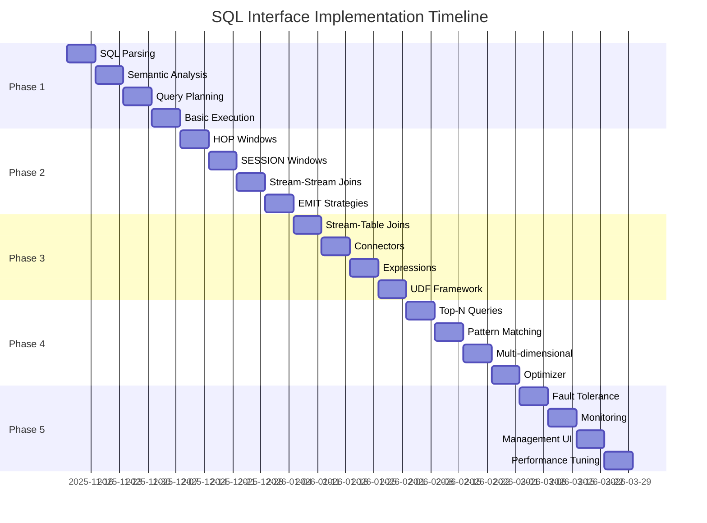

# SQL Interface Requirements for LLM Auto-Optimizer Stream Processing

**Version:** 1.0
**Date:** 2025-11-10
**Author:** SQL Interface Requirements Analyst
**Status:** Requirements Specification
**Target Release:** Phase 2 - Intelligence Layer

---

## Table of Contents

1. [Executive Summary](#1-executive-summary)
2. [Feature Requirements](#2-feature-requirements)
3. [SQL Grammar Specification](#3-sql-grammar-specification)
4. [Example Queries](#4-example-queries)
5. [Architecture and Integration](#5-architecture-and-integration)
6. [Implementation Roadmap](#6-implementation-roadmap)
7. [Risk Assessment](#7-risk-assessment)
8. [Testing Strategy](#8-testing-strategy)
9. [Performance Requirements](#9-performance-requirements)
10. [References and Standards](#10-references-and-standards)

---

## 1. Executive Summary

### 1.1 Overview

This document specifies a comprehensive SQL interface for the LLM Auto-Optimizer stream processing system. The SQL interface enables users to query and process streaming data using familiar SQL-like syntax, eliminating the need to write Rust code for common stream processing tasks.

### 1.2 Goals and Objectives

**Primary Goals:**
- Provide SQL-based interface for defining stream processing pipelines
- Support standard windowing operations (tumbling, sliding, session)
- Enable complex aggregations and joins on streaming data
- Maintain sub-100ms query execution latency
- Ensure production-grade reliability and fault tolerance

**Success Criteria:**
- 80% of common stream processing tasks achievable via SQL
- 95% compatibility with Apache Flink SQL syntax
- Zero-downtime query deployment and updates
- Comprehensive error handling and query validation

### 1.3 Strategic Value

**For Data Analysts:**
- Analyze LLM performance metrics without writing code
- Create dashboards and reports using familiar SQL syntax
- Iterate quickly on analytics queries

**For ML Engineers:**
- Define feature engineering pipelines declaratively
- Build real-time monitoring and alerting systems
- Experiment with different aggregation strategies

**For Operations Teams:**
- Monitor system health and performance
- Debug issues using ad-hoc queries
- Create operational dashboards

### 1.4 Scope

**In Scope:**
- DDL: CREATE STREAM, CREATE TABLE, CREATE VIEW
- DML: SELECT (with streaming semantics)
- Window functions: TUMBLE, HOP, SESSION
- Aggregations: COUNT, SUM, AVG, MIN, MAX, PERCENTILE, STDDEV
- Joins: Stream-Stream, Stream-Table
- Time semantics: Event time, processing time, watermarks

**Out of Scope (Phase 1):**
- INSERT, UPDATE, DELETE operations
- Complex UDFs (User-Defined Functions)
- Materialized views with compaction
- Cross-datacenter queries

---

## 2. Feature Requirements

### 2.1 Data Definition Language (DDL)

#### FR-DDL-001: CREATE STREAM
**Priority:** P0 (Critical)
**Description:** Define a stream from a Kafka topic or other event source

**Requirements:**
- Support column definitions with data types
- Allow specification of event time column
- Support watermark definitions
- Enable Kafka-specific properties (topic, partitions, format)

**Example:**
```sql
CREATE STREAM llm_requests (
    request_id VARCHAR,
    model_id VARCHAR,
    timestamp_ms BIGINT,
    latency_ms DOUBLE,
    tokens_used INT,
    cost DOUBLE,
    event_time AS TO_TIMESTAMP(timestamp_ms),
    WATERMARK FOR event_time AS event_time - INTERVAL '30' SECONDS
) WITH (
    'connector' = 'kafka',
    'topic' = 'llm-requests',
    'format' = 'json',
    'scan.startup.mode' = 'latest-offset'
);
```

#### FR-DDL-002: CREATE TABLE
**Priority:** P0 (Critical)
**Description:** Define a table for lookup/enrichment data

**Requirements:**
- Support PRIMARY KEY constraints
- Allow specification of backing store (Redis, PostgreSQL)
- Enable changelog mode for mutable tables
- Support TTL for entries

**Example:**
```sql
CREATE TABLE model_configs (
    model_id VARCHAR PRIMARY KEY,
    max_tokens INT,
    temperature DOUBLE,
    cost_per_token DOUBLE,
    updated_at TIMESTAMP
) WITH (
    'connector' = 'postgres',
    'table-name' = 'model_configs',
    'username' = '${POSTGRES_USER}',
    'password' = '${POSTGRES_PASSWORD}'
);
```

#### FR-DDL-003: CREATE VIEW
**Priority:** P1 (High)
**Description:** Create reusable query definitions

**Requirements:**
- Support for regular views (query reuse)
- Validation at creation time
- Dependency tracking for cascading updates

**Example:**
```sql
CREATE VIEW high_cost_requests AS
SELECT
    model_id,
    request_id,
    cost,
    latency_ms
FROM llm_requests
WHERE cost > 0.10;
```

#### FR-DDL-004: DROP Statements
**Priority:** P1 (High)
**Description:** Remove stream, table, or view definitions

**Requirements:**
- Graceful shutdown of active queries
- CASCADE option for dependent objects
- Validation to prevent dropping active resources

### 2.2 Data Query Language (DQL)

#### FR-DQL-001: Basic SELECT
**Priority:** P0 (Critical)
**Description:** Query streaming data with filtering and projection

**Requirements:**
- Standard SQL SELECT syntax
- WHERE clause for filtering
- Column aliases with AS
- DISTINCT for deduplication

**Example:**
```sql
SELECT
    model_id,
    latency_ms,
    cost
FROM llm_requests
WHERE latency_ms > 1000;
```

#### FR-DQL-002: Aggregations
**Priority:** P0 (Critical)
**Description:** Compute aggregates over streaming data

**Supported Functions:**
- COUNT(*), COUNT(column)
- SUM(column)
- AVG(column)
- MIN(column), MAX(column)
- PERCENTILE_CONT(0.95) WITHIN GROUP (ORDER BY column)
- STDDEV(column), VARIANCE(column)
- FIRST_VALUE(column), LAST_VALUE(column)

**Example:**
```sql
SELECT
    model_id,
    COUNT(*) as request_count,
    AVG(latency_ms) as avg_latency,
    PERCENTILE_CONT(0.95) WITHIN GROUP (ORDER BY latency_ms) as p95_latency,
    SUM(cost) as total_cost
FROM llm_requests
GROUP BY model_id;
```

#### FR-DQL-003: Window Functions - TUMBLE
**Priority:** P0 (Critical)
**Description:** Tumbling (non-overlapping) time windows

**Requirements:**
- Support for INTERVAL specifications
- Automatic window assignment based on event time
- window_start and window_end system columns

**Example:**
```sql
SELECT
    model_id,
    window_start,
    window_end,
    COUNT(*) as request_count,
    AVG(latency_ms) as avg_latency
FROM TABLE(
    TUMBLE(TABLE llm_requests, DESCRIPTOR(event_time), INTERVAL '5' MINUTES)
)
GROUP BY model_id, window_start, window_end;
```

#### FR-DQL-004: Window Functions - HOP (Sliding)
**Priority:** P0 (Critical)
**Description:** Hopping/sliding windows with overlap

**Requirements:**
- Separate slide and size parameters
- Efficient handling of overlapping windows
- State sharing across windows

**Example:**
```sql
SELECT
    model_id,
    window_start,
    window_end,
    AVG(latency_ms) as sliding_avg_latency
FROM TABLE(
    HOP(TABLE llm_requests,
        DESCRIPTOR(event_time),
        INTERVAL '1' MINUTE,    -- slide
        INTERVAL '10' MINUTES)  -- size
)
GROUP BY model_id, window_start, window_end;
```

#### FR-DQL-005: Window Functions - SESSION
**Priority:** P1 (High)
**Description:** Session windows based on inactivity gap

**Requirements:**
- Configurable session gap
- Automatic session merging
- Support for session-scoped aggregations

**Example:**
```sql
SELECT
    user_id,
    window_start,
    window_end,
    COUNT(*) as interactions,
    SUM(tokens_used) as session_tokens
FROM TABLE(
    SESSION(TABLE llm_requests,
            DESCRIPTOR(event_time),
            INTERVAL '30' MINUTES)
)
GROUP BY user_id, window_start, window_end;
```

#### FR-DQL-006: OVER Windows (Analytic Functions)
**Priority:** P2 (Medium)
**Description:** Row-level window functions

**Requirements:**
- ROW_NUMBER(), RANK(), DENSE_RANK()
- LAG(), LEAD()
- ROWS BETWEEN and RANGE BETWEEN

**Example:**
```sql
SELECT
    request_id,
    model_id,
    latency_ms,
    AVG(latency_ms) OVER (
        PARTITION BY model_id
        ORDER BY event_time
        ROWS BETWEEN 99 PRECEDING AND CURRENT ROW
    ) as moving_avg_100
FROM llm_requests;
```

#### FR-DQL-007: EMIT Strategies
**Priority:** P1 (High)
**Description:** Control when results are emitted

**Strategies:**
- EMIT CHANGES - Emit on every update
- EMIT AFTER WATERMARK - Emit complete windows only
- EMIT AFTER WATERMARK WITH DELAY - Allow late data

**Example:**
```sql
SELECT
    model_id,
    window_start,
    COUNT(*) as count
FROM TABLE(TUMBLE(TABLE llm_requests, DESCRIPTOR(event_time), INTERVAL '5' MINUTES))
GROUP BY model_id, window_start
EMIT AFTER WATERMARK WITH DELAY INTERVAL '2' MINUTES;
```

### 2.3 Join Operations

#### FR-JOIN-001: Stream-Table Join
**Priority:** P0 (Critical)
**Description:** Enrich streaming data with lookup table

**Requirements:**
- LEFT JOIN, INNER JOIN support
- Efficient lookup in backing store
- Caching for hot keys

**Example:**
```sql
SELECT
    r.request_id,
    r.model_id,
    r.latency_ms,
    c.max_tokens,
    c.cost_per_token,
    r.tokens_used * c.cost_per_token as calculated_cost
FROM llm_requests r
LEFT JOIN model_configs c
ON r.model_id = c.model_id;
```

#### FR-JOIN-002: Stream-Stream Join
**Priority:** P1 (High)
**Description:** Join two streams within a time window

**Requirements:**
- Temporal join with time constraints
- State management for join buffers
- Support for INNER, LEFT, RIGHT, FULL joins

**Example:**
```sql
SELECT
    req.request_id,
    req.model_id,
    req.latency_ms,
    fb.rating,
    fb.feedback_text
FROM llm_requests req
JOIN user_feedback fb
ON req.request_id = fb.request_id
WHERE fb.event_time BETWEEN req.event_time AND req.event_time + INTERVAL '5' MINUTES;
```

#### FR-JOIN-003: Interval Join
**Priority:** P2 (Medium)
**Description:** Join streams with time bounds

**Example:**
```sql
SELECT
    l.request_id,
    l.latency_ms,
    r.error_count
FROM llm_requests l
JOIN error_events r
ON l.request_id = r.request_id
AND r.event_time BETWEEN l.event_time - INTERVAL '10' SECONDS
                     AND l.event_time + INTERVAL '10' SECONDS;
```

### 2.4 Time Semantics

#### FR-TIME-001: Event Time Processing
**Priority:** P0 (Critical)
**Description:** Use event timestamps for windowing

**Requirements:**
- Event time extraction from data
- Watermark generation and propagation
- Late data handling

#### FR-TIME-002: Processing Time
**Priority:** P2 (Medium)
**Description:** Use system time for windowing

**Example:**
```sql
SELECT
    model_id,
    PROCTIME() as processing_time,
    COUNT(*) as count
FROM llm_requests
GROUP BY model_id, TUMBLE(PROCTIME(), INTERVAL '1' MINUTE);
```

#### FR-TIME-003: Watermark Definition
**Priority:** P0 (Critical)
**Description:** Define watermark strategies

**Strategies:**
- Bounded out-of-order: `event_time - INTERVAL '30' SECONDS`
- Ascending: `event_time`
- Custom expression

### 2.5 Advanced Features

#### FR-ADV-001: MATCH_RECOGNIZE (Pattern Matching)
**Priority:** P3 (Low)
**Description:** Complex event processing patterns

**Example:**
```sql
SELECT *
FROM llm_requests
MATCH_RECOGNIZE (
    PARTITION BY model_id
    ORDER BY event_time
    MEASURES
        A.request_id as first_request,
        LAST(B.request_id) as last_request,
        COUNT(*) as pattern_count
    PATTERN (A B+ C)
    DEFINE
        A AS A.latency_ms < 100,
        B AS B.latency_ms > 1000,
        C AS C.latency_ms < 100
);
```

#### FR-ADV-002: GROUPING SETS
**Priority:** P2 (Medium)
**Description:** Multiple grouping dimensions

**Example:**
```sql
SELECT
    model_id,
    region,
    COUNT(*) as count
FROM llm_requests
GROUP BY GROUPING SETS (
    (model_id, region),
    (model_id),
    ()
);
```

#### FR-ADV-003: Top-N Queries
**Priority:** P1 (High)
**Description:** Find top N elements per window

**Example:**
```sql
SELECT
    model_id,
    window_start,
    latency_ms,
    row_num
FROM (
    SELECT
        model_id,
        window_start,
        latency_ms,
        ROW_NUMBER() OVER (PARTITION BY window_start ORDER BY latency_ms DESC) as row_num
    FROM TABLE(TUMBLE(TABLE llm_requests, DESCRIPTOR(event_time), INTERVAL '5' MINUTES))
)
WHERE row_num <= 10;
```

### 2.6 System Catalog

#### FR-CAT-001: SHOW STREAMS
**Priority:** P1 (High)
**Description:** List all defined streams

**Example:**
```sql
SHOW STREAMS;
-- Returns: stream_name, topic, format, watermark_strategy
```

#### FR-CAT-002: SHOW TABLES
**Priority:** P1 (High)
**Description:** List all defined tables

#### FR-CAT-003: DESCRIBE
**Priority:** P1 (High)
**Description:** Show schema of stream or table

**Example:**
```sql
DESCRIBE llm_requests;
-- Returns: column_name, data_type, nullable, description
```

#### FR-CAT-004: EXPLAIN
**Priority:** P1 (High)
**Description:** Show query execution plan

**Example:**
```sql
EXPLAIN SELECT model_id, COUNT(*) FROM llm_requests GROUP BY model_id;
```

---

## 3. SQL Grammar Specification

### 3.1 EBNF Grammar

```ebnf
(* Top-level statements *)
statement ::= ddl_statement | dql_statement | utility_statement

ddl_statement ::= create_stream | create_table | create_view | drop_statement

dql_statement ::= select_statement

utility_statement ::= show_statement | describe_statement | explain_statement

(* CREATE STREAM *)
create_stream ::= "CREATE" "STREAM" [ "IF" "NOT" "EXISTS" ] stream_name
                  "(" column_definition_list ")"
                  [ "WITH" "(" property_list ")" ]

column_definition_list ::= column_definition { "," column_definition }

column_definition ::= column_name data_type [ column_constraint ]
                    | computed_column_definition
                    | watermark_definition

computed_column_definition ::= column_name "AS" expression

watermark_definition ::= "WATERMARK" "FOR" column_name "AS" expression

data_type ::= "VARCHAR" | "INTEGER" | "BIGINT" | "DOUBLE" | "BOOLEAN"
            | "TIMESTAMP" | "DATE" | "TIME" | "ARRAY" "<" data_type ">"
            | "MAP" "<" data_type "," data_type ">"

(* CREATE TABLE *)
create_table ::= "CREATE" "TABLE" [ "IF" "NOT" "EXISTS" ] table_name
                 "(" column_definition_list ")"
                 [ "WITH" "(" property_list ")" ]

(* CREATE VIEW *)
create_view ::= "CREATE" "VIEW" [ "IF" "NOT" "EXISTS" ] view_name "AS" select_statement

(* DROP *)
drop_statement ::= "DROP" ( "STREAM" | "TABLE" | "VIEW" ) [ "IF" "EXISTS" ] object_name [ "CASCADE" ]

(* SELECT *)
select_statement ::= "SELECT" [ "DISTINCT" ] select_list
                     "FROM" from_clause
                     [ "WHERE" where_clause ]
                     [ "GROUP" "BY" group_by_clause ]
                     [ "HAVING" having_clause ]
                     [ "ORDER" "BY" order_by_clause ]
                     [ "LIMIT" integer_literal ]
                     [ emit_clause ]

select_list ::= "*" | select_item { "," select_item }

select_item ::= expression [ [ "AS" ] column_alias ]

from_clause ::= table_reference { join_clause }

table_reference ::= table_name [ [ "AS" ] table_alias ]
                  | table_function [ [ "AS" ] table_alias ]
                  | "(" select_statement ")" [ "AS" ] table_alias

(* Window Table Functions *)
table_function ::= tumble_function | hop_function | session_function

tumble_function ::= "TABLE" "(" "TUMBLE" "(" "TABLE" table_name ","
                    "DESCRIPTOR" "(" column_name ")" "," interval_expression ")" ")"

hop_function ::= "TABLE" "(" "HOP" "(" "TABLE" table_name ","
                 "DESCRIPTOR" "(" column_name ")" ","
                 interval_expression "," interval_expression ")" ")"

session_function ::= "TABLE" "(" "SESSION" "(" "TABLE" table_name ","
                     "DESCRIPTOR" "(" column_name ")" "," interval_expression ")" ")"

(* JOIN *)
join_clause ::= [ join_type ] "JOIN" table_reference "ON" join_condition

join_type ::= "INNER" | "LEFT" [ "OUTER" ] | "RIGHT" [ "OUTER" ] | "FULL" [ "OUTER" ]

join_condition ::= expression

(* GROUP BY *)
group_by_clause ::= grouping_element { "," grouping_element }

grouping_element ::= expression
                   | "GROUPING" "SETS" "(" grouping_set_list ")"
                   | "ROLLUP" "(" expression_list ")"
                   | "CUBE" "(" expression_list ")"

(* EMIT *)
emit_clause ::= "EMIT" emit_strategy

emit_strategy ::= "CHANGES"
                | "AFTER" "WATERMARK" [ "WITH" "DELAY" interval_expression ]

(* Expressions *)
expression ::= literal
             | column_reference
             | function_call
             | "(" expression ")"
             | expression binary_operator expression
             | unary_operator expression
             | case_expression
             | window_function

function_call ::= function_name "(" [ "DISTINCT" ] [ expression_list ] ")"
                | aggregate_function
                | percentile_function

aggregate_function ::= ( "COUNT" | "SUM" | "AVG" | "MIN" | "MAX" | "STDDEV" )
                      "(" [ "*" | expression ] ")"

percentile_function ::= "PERCENTILE_CONT" "(" numeric_literal ")"
                       "WITHIN" "GROUP" "(" "ORDER" "BY" expression ")"

window_function ::= function_call "OVER" window_specification

window_specification ::= "(" [ "PARTITION" "BY" expression_list ]
                            [ "ORDER" "BY" order_by_list ]
                            [ frame_clause ] ")"

frame_clause ::= ( "ROWS" | "RANGE" ) frame_bound

frame_bound ::= "BETWEEN" frame_boundary "AND" frame_boundary
              | frame_boundary

frame_boundary ::= "UNBOUNDED" ( "PRECEDING" | "FOLLOWING" )
                 | integer_literal ( "PRECEDING" | "FOLLOWING" )
                 | "CURRENT" "ROW"

(* Literals and Identifiers *)
literal ::= string_literal | numeric_literal | boolean_literal | null_literal

interval_expression ::= "INTERVAL" string_literal time_unit

time_unit ::= "SECOND" | "MINUTE" | "HOUR" | "DAY" | "MONTH" | "YEAR"

column_reference ::= [ table_name "." ] column_name

property_list ::= property { "," property }

property ::= string_literal "=" string_literal

(* Utility Statements *)
show_statement ::= "SHOW" ( "STREAMS" | "TABLES" | "VIEWS" )

describe_statement ::= "DESCRIBE" object_name

explain_statement ::= "EXPLAIN" select_statement
```

### 3.2 Data Types

| Type | Description | Example | Storage Size |
|------|-------------|---------|--------------|
| **VARCHAR** | Variable-length string | 'claude-3-opus' | Variable |
| **INTEGER** | 32-bit signed integer | 42 | 4 bytes |
| **BIGINT** | 64-bit signed integer | 1234567890 | 8 bytes |
| **DOUBLE** | 64-bit floating point | 123.45 | 8 bytes |
| **BOOLEAN** | True/false | TRUE, FALSE | 1 byte |
| **TIMESTAMP** | Timestamp with timezone | TIMESTAMP '2025-11-10 10:30:00' | 8 bytes |
| **DATE** | Calendar date | DATE '2025-11-10' | 4 bytes |
| **TIME** | Time of day | TIME '10:30:00' | 8 bytes |
| **ARRAY<T>** | Array of type T | ARRAY[1, 2, 3] | Variable |
| **MAP<K,V>** | Key-value map | MAP['key', 'value'] | Variable |

### 3.3 Built-in Functions

#### Scalar Functions

| Category | Function | Description |
|----------|----------|-------------|
| **String** | UPPER(s), LOWER(s) | Case conversion |
| | SUBSTRING(s, start, len) | Extract substring |
| | CONCAT(s1, s2, ...) | Concatenate strings |
| | TRIM(s) | Remove whitespace |
| **Numeric** | ABS(n) | Absolute value |
| | ROUND(n, d) | Round to d decimals |
| | CEIL(n), FLOOR(n) | Ceiling/floor |
| | MOD(n, m) | Modulo |
| **Date/Time** | NOW() | Current timestamp |
| | CURRENT_DATE | Current date |
| | TO_TIMESTAMP(n) | Convert epoch to timestamp |
| | EXTRACT(part FROM ts) | Extract date part |
| **Conversion** | CAST(expr AS type) | Type conversion |
| | TRY_CAST(expr AS type) | Safe type conversion |

#### Aggregate Functions

| Function | Description | Example |
|----------|-------------|---------|
| **COUNT(*)** | Count rows | COUNT(*) |
| **COUNT(col)** | Count non-null values | COUNT(model_id) |
| **SUM(col)** | Sum values | SUM(tokens_used) |
| **AVG(col)** | Average | AVG(latency_ms) |
| **MIN(col)** | Minimum | MIN(cost) |
| **MAX(col)** | Maximum | MAX(latency_ms) |
| **STDDEV(col)** | Standard deviation | STDDEV(latency_ms) |
| **VARIANCE(col)** | Variance | VARIANCE(cost) |
| **PERCENTILE_CONT(p)** | Continuous percentile | PERCENTILE_CONT(0.95) WITHIN GROUP (ORDER BY latency_ms) |

#### Window Functions

| Function | Description |
|----------|-------------|
| **ROW_NUMBER()** | Assign unique row number |
| **RANK()** | Assign rank with gaps |
| **DENSE_RANK()** | Assign rank without gaps |
| **LAG(col, n)** | Access previous row |
| **LEAD(col, n)** | Access next row |
| **FIRST_VALUE(col)** | First value in window |
| **LAST_VALUE(col)** | Last value in window |

---

## 4. Example Queries

### 4.1 Basic Monitoring Queries

#### Query 1: Real-time Request Rate by Model
```sql
SELECT
    model_id,
    window_start,
    window_end,
    COUNT(*) as request_count,
    COUNT(*) / 60.0 as requests_per_second
FROM TABLE(
    TUMBLE(TABLE llm_requests, DESCRIPTOR(event_time), INTERVAL '1' MINUTE)
)
GROUP BY model_id, window_start, window_end
EMIT CHANGES;
```

**Use Case:** Monitor request throughput for each model in real-time.

**Output Schema:**
- `model_id`: VARCHAR
- `window_start`: TIMESTAMP
- `window_end`: TIMESTAMP
- `request_count`: BIGINT
- `requests_per_second`: DOUBLE

#### Query 2: P95 and P99 Latency Tracking
```sql
SELECT
    model_id,
    window_start,
    AVG(latency_ms) as avg_latency,
    PERCENTILE_CONT(0.50) WITHIN GROUP (ORDER BY latency_ms) as p50_latency,
    PERCENTILE_CONT(0.95) WITHIN GROUP (ORDER BY latency_ms) as p95_latency,
    PERCENTILE_CONT(0.99) WITHIN GROUP (ORDER BY latency_ms) as p99_latency,
    MAX(latency_ms) as max_latency
FROM TABLE(
    TUMBLE(TABLE llm_requests, DESCRIPTOR(event_time), INTERVAL '5' MINUTES)
)
GROUP BY model_id, window_start
EMIT AFTER WATERMARK;
```

**Use Case:** Track latency distribution for SLA monitoring.

#### Query 3: Error Rate Calculation
```sql
SELECT
    model_id,
    window_start,
    COUNT(*) as total_requests,
    SUM(CASE WHEN error_code IS NOT NULL THEN 1 ELSE 0 END) as error_count,
    SUM(CASE WHEN error_code IS NOT NULL THEN 1 ELSE 0 END) * 100.0 / COUNT(*) as error_rate_pct
FROM TABLE(
    TUMBLE(TABLE llm_requests, DESCRIPTOR(event_time), INTERVAL '5' MINUTES)
)
GROUP BY model_id, window_start
HAVING error_rate_pct > 1.0  -- Alert if error rate > 1%
EMIT CHANGES;
```

**Use Case:** Real-time error rate monitoring with alerting threshold.

### 4.2 Cost Analysis Queries

#### Query 4: Cost per Model per Hour
```sql
SELECT
    model_id,
    window_start,
    SUM(cost) as total_cost,
    SUM(tokens_used) as total_tokens,
    AVG(cost) as avg_cost_per_request
FROM TABLE(
    TUMBLE(TABLE llm_requests, DESCRIPTOR(event_time), INTERVAL '1' HOUR)
)
GROUP BY model_id, window_start
EMIT AFTER WATERMARK;
```

#### Query 5: Cost Anomaly Detection
```sql
SELECT
    model_id,
    window_start,
    SUM(cost) as current_cost,
    AVG(SUM(cost)) OVER (
        PARTITION BY model_id
        ORDER BY window_start
        ROWS BETWEEN 23 PRECEDING AND 1 PRECEDING
    ) as avg_historical_cost,
    CASE
        WHEN SUM(cost) > 1.5 * AVG(SUM(cost)) OVER (
            PARTITION BY model_id
            ORDER BY window_start
            ROWS BETWEEN 23 PRECEDING AND 1 PRECEDING
        ) THEN 'ANOMALY'
        ELSE 'NORMAL'
    END as status
FROM TABLE(
    TUMBLE(TABLE llm_requests, DESCRIPTOR(event_time), INTERVAL '1' HOUR)
)
GROUP BY model_id, window_start;
```

**Use Case:** Detect cost spikes by comparing to 24-hour moving average.

### 4.3 User Behavior Analysis

#### Query 6: Session Analytics
```sql
SELECT
    user_id,
    session_start,
    session_end,
    COUNT(*) as interactions,
    SUM(tokens_used) as total_tokens,
    AVG(latency_ms) as avg_latency,
    session_end - session_start as session_duration
FROM TABLE(
    SESSION(TABLE llm_requests, DESCRIPTOR(event_time), INTERVAL '30' MINUTES)
)
GROUP BY user_id, session_start, session_end;
```

**Use Case:** Analyze user session patterns and engagement.

#### Query 7: User Journey with Feedback
```sql
SELECT
    req.user_id,
    req.request_id,
    req.model_id,
    req.latency_ms,
    fb.rating,
    fb.feedback_text
FROM llm_requests req
LEFT JOIN user_feedback fb
ON req.request_id = fb.request_id
WHERE fb.event_time BETWEEN req.event_time AND req.event_time + INTERVAL '10' MINUTES
ORDER BY req.event_time;
```

**Use Case:** Correlate requests with user feedback for quality analysis.

### 4.4 Advanced Analytics

#### Query 8: Moving Average for Smoothing
```sql
SELECT
    model_id,
    event_time,
    latency_ms,
    AVG(latency_ms) OVER (
        PARTITION BY model_id
        ORDER BY event_time
        ROWS BETWEEN 99 PRECEDING AND CURRENT ROW
    ) as moving_avg_100,
    AVG(latency_ms) OVER (
        PARTITION BY model_id
        ORDER BY event_time
        RANGE BETWEEN INTERVAL '5' MINUTES PRECEDING AND CURRENT ROW
    ) as time_based_avg
FROM llm_requests;
```

**Use Case:** Smooth noisy metrics using moving averages.

#### Query 9: Top N Models by Cost
```sql
SELECT
    model_id,
    window_start,
    total_cost,
    rank
FROM (
    SELECT
        model_id,
        window_start,
        SUM(cost) as total_cost,
        ROW_NUMBER() OVER (PARTITION BY window_start ORDER BY SUM(cost) DESC) as rank
    FROM TABLE(
        TUMBLE(TABLE llm_requests, DESCRIPTOR(event_time), INTERVAL '1' HOUR)
    )
    GROUP BY model_id, window_start
)
WHERE rank <= 5;
```

**Use Case:** Identify top 5 most expensive models each hour.

#### Query 10: Multi-dimensional Aggregation
```sql
SELECT
    model_id,
    region,
    window_start,
    COUNT(*) as request_count,
    AVG(latency_ms) as avg_latency
FROM TABLE(
    TUMBLE(TABLE llm_requests, DESCRIPTOR(event_time), INTERVAL '15' MINUTES)
)
GROUP BY GROUPING SETS (
    (model_id, region, window_start),
    (model_id, window_start),
    (region, window_start),
    (window_start)
)
EMIT AFTER WATERMARK;
```

**Use Case:** Generate reports with different aggregation levels simultaneously.

### 4.5 Operational Queries

#### Query 11: Late Data Monitoring
```sql
SELECT
    model_id,
    window_start,
    COUNT(*) as late_event_count,
    AVG(CURRENT_TIMESTAMP - event_time) as avg_lateness
FROM llm_requests
WHERE event_time < (SELECT current_watermark FROM system.watermarks)
GROUP BY model_id, TUMBLE(PROCTIME(), INTERVAL '1' MINUTE), window_start;
```

**Use Case:** Monitor how much late data is arriving.

#### Query 12: Throughput vs Capacity
```sql
WITH current_load AS (
    SELECT
        model_id,
        COUNT(*) / 60.0 as current_qps
    FROM TABLE(
        TUMBLE(TABLE llm_requests, DESCRIPTOR(event_time), INTERVAL '1' MINUTE)
    )
    GROUP BY model_id, window_start
)
SELECT
    cl.model_id,
    cl.current_qps,
    mc.max_qps,
    (cl.current_qps / mc.max_qps) * 100.0 as capacity_pct
FROM current_load cl
JOIN model_configs mc
ON cl.model_id = mc.model_id
WHERE (cl.current_qps / mc.max_qps) > 0.8;  -- Alert at 80% capacity
```

**Use Case:** Monitor load vs capacity for scaling decisions.

### 4.6 Experimentation Queries

#### Query 13: A/B Test Analysis
```sql
SELECT
    experiment_id,
    variant,
    window_start,
    COUNT(*) as requests,
    AVG(latency_ms) as avg_latency,
    AVG(cost) as avg_cost,
    SUM(CASE WHEN rating >= 4 THEN 1 ELSE 0 END) * 100.0 / COUNT(*) as satisfaction_rate
FROM llm_requests r
LEFT JOIN user_feedback f ON r.request_id = f.request_id
WHERE experiment_id IS NOT NULL
GROUP BY experiment_id, variant, TUMBLE(event_time, INTERVAL '1' HOUR);
```

**Use Case:** Compare performance across A/B test variants.

#### Query 14: Cohort Analysis
```sql
SELECT
    first_request_date,
    days_since_first,
    COUNT(DISTINCT user_id) as active_users,
    AVG(daily_requests) as avg_requests_per_user
FROM (
    SELECT
        user_id,
        DATE_TRUNC('day', MIN(event_time) OVER (PARTITION BY user_id)) as first_request_date,
        DATE_TRUNC('day', event_time) as request_date,
        DATEDIFF(day, first_request_date, request_date) as days_since_first,
        COUNT(*) OVER (PARTITION BY user_id, DATE_TRUNC('day', event_time)) as daily_requests
    FROM llm_requests
)
GROUP BY first_request_date, days_since_first
ORDER BY first_request_date, days_since_first;
```

**Use Case:** Analyze user retention and engagement over time.

### 4.7 Quality Monitoring Queries

#### Query 15: Response Quality Correlation
```sql
SELECT
    model_id,
    window_start,
    AVG(latency_ms) as avg_latency,
    AVG(CAST(rating AS DOUBLE)) as avg_rating,
    CORR(latency_ms, CAST(rating AS DOUBLE)) as latency_rating_correlation
FROM llm_requests r
JOIN user_feedback f ON r.request_id = f.request_id
GROUP BY model_id, TUMBLE(r.event_time, INTERVAL '1' HOUR');
```

**Use Case:** Understand relationship between latency and user satisfaction.

#### Query 16: Token Efficiency
```sql
SELECT
    model_id,
    window_start,
    AVG(tokens_used) as avg_tokens,
    AVG(tokens_used / LENGTH(prompt_text)) as tokens_per_char,
    SUM(cost) / SUM(tokens_used) as cost_per_token
FROM llm_requests
GROUP BY model_id, TUMBLE(event_time, INTERVAL '1' HOUR);
```

**Use Case:** Monitor token usage efficiency and cost per token.

### 4.8 Enrichment and Complex Queries

#### Query 17: Enriched Request Stream
```sql
CREATE VIEW enriched_requests AS
SELECT
    r.request_id,
    r.model_id,
    r.latency_ms,
    r.tokens_used,
    r.cost,
    c.max_tokens,
    c.temperature,
    c.cost_per_token,
    CASE
        WHEN r.latency_ms < 500 THEN 'fast'
        WHEN r.latency_ms < 2000 THEN 'normal'
        ELSE 'slow'
    END as latency_category,
    CASE
        WHEN r.cost > c.cost_per_token * c.max_tokens * 0.8 THEN 'high'
        WHEN r.cost < c.cost_per_token * c.max_tokens * 0.2 THEN 'low'
        ELSE 'medium'
    END as cost_category
FROM llm_requests r
LEFT JOIN model_configs c ON r.model_id = c.model_id;
```

**Use Case:** Create reusable enriched view for downstream analytics.

#### Query 18: Drift Detection
```sql
SELECT
    model_id,
    current_window,
    current_avg_latency,
    baseline_avg_latency,
    ABS(current_avg_latency - baseline_avg_latency) / baseline_avg_latency * 100.0 as drift_pct,
    CASE
        WHEN ABS(current_avg_latency - baseline_avg_latency) / baseline_avg_latency > 0.2 THEN 'DRIFT'
        ELSE 'NORMAL'
    END as status
FROM (
    SELECT
        model_id,
        window_start as current_window,
        AVG(latency_ms) as current_avg_latency,
        AVG(AVG(latency_ms)) OVER (
            PARTITION BY model_id
            ORDER BY window_start
            ROWS BETWEEN 167 PRECEDING AND 1 PRECEDING
        ) as baseline_avg_latency
    FROM TABLE(
        TUMBLE(TABLE llm_requests, DESCRIPTOR(event_time), INTERVAL '1' HOUR)
    )
    GROUP BY model_id, window_start
)
WHERE baseline_avg_latency IS NOT NULL;
```

**Use Case:** Detect when model performance drifts from historical baseline.

#### Query 19: Sliding Window Trend Analysis
```sql
SELECT
    model_id,
    window_start,
    window_end,
    AVG(latency_ms) as avg_latency,
    COUNT(*) as request_count,
    LAG(AVG(latency_ms), 1) OVER (PARTITION BY model_id ORDER BY window_start) as prev_avg_latency,
    CASE
        WHEN AVG(latency_ms) > LAG(AVG(latency_ms), 1) OVER (PARTITION BY model_id ORDER BY window_start) * 1.2
        THEN 'INCREASING'
        WHEN AVG(latency_ms) < LAG(AVG(latency_ms), 1) OVER (PARTITION BY model_id ORDER BY window_start) * 0.8
        THEN 'DECREASING'
        ELSE 'STABLE'
    END as trend
FROM TABLE(
    HOP(TABLE llm_requests,
        DESCRIPTOR(event_time),
        INTERVAL '1' MINUTE,
        INTERVAL '10' MINUTES)
)
GROUP BY model_id, window_start, window_end;
```

**Use Case:** Identify latency trends using sliding windows.

#### Query 20: Multi-Stream Join with Timeout
```sql
SELECT
    req.request_id,
    req.model_id,
    req.latency_ms,
    err.error_code,
    err.error_message,
    fb.rating
FROM llm_requests req
LEFT JOIN error_events err
    ON req.request_id = err.request_id
    AND err.event_time BETWEEN req.event_time AND req.event_time + INTERVAL '5' SECONDS
LEFT JOIN user_feedback fb
    ON req.request_id = fb.request_id
    AND fb.event_time BETWEEN req.event_time AND req.event_time + INTERVAL '10' MINUTES
WHERE req.event_time > CURRENT_TIMESTAMP - INTERVAL '1' HOUR;
```

**Use Case:** Correlate requests with errors and feedback within time windows.

---

## 5. Architecture and Integration

### 5.1 High-Level Architecture

```
┌─────────────────────────────────────────────────────────────────────┐
│                     SQL Interface Layer                             │
├─────────────────────────────────────────────────────────────────────┤
│                                                                     │
│  ┌──────────────┐    ┌──────────────┐    ┌──────────────┐         │
│  │   SQL        │───▶│   Parser     │───▶│  Semantic    │         │
│  │   Client     │    │   (sqlparser)│    │  Analyzer    │         │
│  │              │    │              │    │              │         │
│  └──────────────┘    └──────────────┘    └──────────────┘         │
│                                                  │                  │
│                                                  ▼                  │
│  ┌──────────────┐    ┌──────────────┐    ┌──────────────┐         │
│  │   Catalog    │◀───│   Query      │───▶│  Logical     │         │
│  │   Manager    │    │   Planner    │    │  Plan        │         │
│  │              │    │              │    │              │         │
│  └──────────────┘    └──────────────┘    └──────────────┘         │
│                                                  │                  │
│                                                  ▼                  │
│                           ┌──────────────────────────┐             │
│                           │   Query Optimizer        │             │
│                           │   - Rule-based           │             │
│                           │   - Cost-based           │             │
│                           └──────────────────────────┘             │
│                                                  │                  │
│                                                  ▼                  │
│  ┌──────────────┐    ┌──────────────┐    ┌──────────────┐         │
│  │   Code       │◀───│  Physical    │◀───│  Physical    │         │
│  │   Generator  │    │  Plan        │    │  Planner     │         │
│  │              │    │              │    │              │         │
│  └──────────────┘    └──────────────┘    └──────────────┘         │
│         │                                                           │
│         ▼                                                           │
│  ┌──────────────────────────────────────────────────────┐          │
│  │         Stream Processor Runtime                      │          │
│  │   ┌────────┐  ┌────────┐  ┌────────┐  ┌────────┐   │          │
│  │   │ Source │─▶│ Window │─▶│  Agg   │─▶│  Sink  │   │          │
│  │   │Operator│  │Operator│  │Operator│  │Operator│   │          │
│  │   └────────┘  └────────┘  └────────┘  └────────┘   │          │
│  └──────────────────────────────────────────────────────┘          │
│                                                                     │
└─────────────────────────────────────────────────────────────────────┘
```

### 5.2 Component Responsibilities

#### 5.2.1 SQL Parser
**Purpose:** Parse SQL text into Abstract Syntax Tree (AST)

**Implementation:**
- Use `sqlparser-rs` crate for standard SQL parsing
- Extend grammar for streaming-specific keywords (WATERMARK, EMIT, etc.)
- Support for Table-Valued Functions (TUMBLE, HOP, SESSION)

**Rust Crate:**
```toml
sqlparser = "0.41"
```

**Example Integration:**
```rust
use sqlparser::parser::Parser;
use sqlparser::dialect::GenericDialect;

pub fn parse_sql(sql: &str) -> Result<Statement, ParserError> {
    let dialect = GenericDialect {};
    let ast = Parser::parse_sql(&dialect, sql)?;

    if ast.len() != 1 {
        return Err(ParserError::MultipleStat ements);
    }

    Ok(ast[0].clone())
}
```

#### 5.2.2 Semantic Analyzer
**Purpose:** Validate query semantics and resolve references

**Responsibilities:**
- Type checking
- Schema resolution
- Function validation
- Window specification validation
- Watermark definition validation

**Key Checks:**
- Column exists in referenced stream/table
- Data types are compatible
- Aggregate functions used correctly
- Window functions have proper PARTITION BY / ORDER BY

#### 5.2.3 Catalog Manager
**Purpose:** Manage metadata for streams, tables, views

**Storage:**
- In-memory cache (DashMap)
- Persistent storage (PostgreSQL or Sled)

**Schema:**
```rust
pub struct StreamMetadata {
    pub name: String,
    pub columns: Vec<ColumnSchema>,
    pub watermark: Option<WatermarkSpec>,
    pub properties: HashMap<String, String>,
    pub created_at: DateTime<Utc>,
}

pub struct TableMetadata {
    pub name: String,
    pub columns: Vec<ColumnSchema>,
    pub primary_key: Option<Vec<String>>,
    pub connector: ConnectorType,
    pub properties: HashMap<String, String>,
}

pub struct ViewMetadata {
    pub name: String,
    pub query: String,
    pub dependencies: Vec<String>,
}
```

#### 5.2.4 Query Planner
**Purpose:** Convert AST to logical plan

**Plan Nodes:**
- StreamScan: Read from stream
- TableScan: Read from table
- Filter: WHERE clause
- Project: SELECT list
- Aggregate: GROUP BY with aggregations
- Window: Window operations (Tumble, Hop, Session)
- Join: Stream-Stream or Stream-Table join
- Sink: Output results

**Logical Plan Example:**
```
Sink(kafka_topic)
└── Aggregate(model_id, window_start)
    ├── aggregates: [COUNT(*), AVG(latency_ms)]
    └── Window(Tumble, 5 minutes)
        └── Filter(latency_ms > 0)
            └── StreamScan(llm_requests)
```

#### 5.2.5 Query Optimizer
**Purpose:** Optimize logical plan for efficient execution

**Rule-Based Optimizations:**
- Filter pushdown: Move filters closer to source
- Projection pushdown: Only select needed columns
- Window fusion: Combine multiple windows
- Aggregate early: Pre-aggregate before joins

**Cost-Based Optimizations:**
- Join order selection
- Window type selection (tumbling vs sliding)
- State backend selection

#### 5.2.6 Physical Planner
**Purpose:** Convert logical plan to physical operators

**Operator Mapping:**
- LogicalStreamScan → KafkaSourceOperator
- LogicalFilter → FilterOperator
- LogicalAggregate → AggregateOperator
- LogicalWindow → WindowOperator
- LogicalJoin → JoinOperator

#### 5.2.7 Code Generator
**Purpose:** Generate executable Rust code or operator graph

**Options:**
1. **Interpreted Execution:** Execute operators directly
2. **Code Generation:** Generate and compile Rust code for performance

**For MVP, use interpreted execution for simplicity.**

### 5.3 Integration with Existing Components

#### 5.3.1 Stream Processor Integration

**Mapping SQL to Existing Components:**

| SQL Construct | Existing Component |
|---------------|-------------------|
| CREATE STREAM | KafkaSource |
| TUMBLE/HOP/SESSION | WindowAssigner, WindowManager |
| GROUP BY aggregation | CompositeAggregator |
| JOIN | JoinOperator (new) |
| WATERMARK | WatermarkGenerator |
| EMIT | Trigger policies |

**Example Integration:**
```rust
// SQL: SELECT model_id, COUNT(*) FROM llm_requests
//      GROUP BY model_id, TUMBLE(event_time, INTERVAL '5' MINUTES)

use processor::{
    StreamProcessorBuilder,
    TumblingWindowAssigner,
    OnWatermarkTrigger,
    CompositeAggregator,
};

let processor = StreamProcessorBuilder::new()
    .with_tumbling_window(Duration::minutes(5))
    .with_watermark_trigger()
    .with_aggregation(|key| {
        let mut agg = CompositeAggregator::new();
        agg.add_count("request_count");
        agg
    })
    .build();
```

#### 5.3.2 State Management Integration

**SQL State Requirements:**
- Window state: Aggregator state per window
- Join state: Buffered events for time-windowed joins
- Catalog state: Stream/table metadata

**Use Existing State Backends:**
- Redis for distributed state
- PostgreSQL for catalog persistence
- Sled for local caching

#### 5.3.3 Kafka Integration

**Source:**
- Use existing KafkaSource
- Configure from CREATE STREAM properties
- Support multiple topics and partitions

**Sink:**
- Use existing KafkaSink
- Configure output topic from query
- Support different serialization formats

### 5.4 Query Execution Model

#### 5.4.1 Continuous Query Execution

**Lifecycle:**
1. Parse SQL → AST
2. Semantic analysis → Validated AST
3. Logical planning → Logical Plan
4. Optimization → Optimized Logical Plan
5. Physical planning → Physical Plan
6. Execution → Running Query

**Query State:**
- SUBMITTED: Query received, not yet running
- RUNNING: Actively processing events
- PAUSED: Temporarily stopped
- FAILED: Encountered error
- CANCELLED: User cancelled
- COMPLETED: Finished (for bounded queries)

#### 5.4.2 Query Lifecycle Management

```rust
pub struct QueryManager {
    queries: DashMap<QueryId, Query>,
    catalog: Arc<CatalogManager>,
    executor: Arc<QueryExecutor>,
}

impl QueryManager {
    pub async fn submit_query(&self, sql: &str) -> Result<QueryId, QueryError> {
        // 1. Parse and validate
        let plan = self.parse_and_plan(sql).await?;

        // 2. Allocate resources
        let query_id = QueryId::new();

        // 3. Start execution
        self.executor.start(query_id, plan).await?;

        // 4. Register query
        self.queries.insert(query_id, Query {
            id: query_id,
            sql: sql.to_string(),
            state: QueryState::RUNNING,
            started_at: Utc::now(),
        });

        Ok(query_id)
    }

    pub async fn stop_query(&self, query_id: &QueryId) -> Result<(), QueryError> {
        self.executor.stop(query_id).await?;

        if let Some(mut query) = self.queries.get_mut(query_id) {
            query.state = QueryState::CANCELLED;
        }

        Ok(())
    }
}
```

### 5.5 Fault Tolerance

#### 5.5.1 Query Checkpoint and Recovery

**Checkpoint Strategy:**
- Periodic checkpoints (configurable interval)
- Consistent snapshots of all operator state
- Checkpoint coordinator manages across operators

**Recovery:**
- Restore from last successful checkpoint
- Replay events from Kafka offsets
- Rebuild window state incrementally

#### 5.5.2 Exactly-Once Semantics

**Approach:**
- Kafka transactions for source/sink coordination
- Two-phase commit for state updates
- Idempotent operators where possible

---

## 6. Implementation Roadmap

### 6.1 Phase 1: Foundation (Weeks 1-4)

**Goals:**
- Basic SQL parsing
- Simple SELECT queries
- Tumbling windows
- Basic aggregations

**Deliverables:**
- SQL parser with streaming extensions
- Logical plan representation
- Basic query executor
- Integration with existing StreamProcessor

**Tasks:**
```
Week 1:
- Set up sqlparser-rs integration
- Define AST extensions for streaming
- Implement basic parser tests

Week 2:
- Build semantic analyzer
- Implement catalog manager
- Create stream/table metadata storage

Week 3:
- Implement logical planner
- Create basic physical operators
- Wire up to StreamProcessor

Week 4:
- Integration testing
- Performance benchmarking
- Documentation
```

**Success Criteria:**
- Parse and execute basic SELECT with GROUP BY
- TUMBLE window with COUNT, AVG, SUM
- Query throughput: 1000+ events/sec
- E2E latency: <100ms (p99)

### 6.2 Phase 2: Advanced Windows (Weeks 5-8)

**Goals:**
- HOP (sliding) windows
- SESSION windows
- Window joins
- EMIT strategies

**Deliverables:**
- All window types supported
- Stream-Stream joins
- Late data handling
- Early/late firing

**Tasks:**
```
Week 5:
- Implement HOP window operator
- Add window overlap handling
- State management for sliding windows

Week 6:
- Implement SESSION window operator
- Add window merging logic
- Session expiration

Week 7:
- Stream-Stream join operator
- Join buffer management
- Temporal join constraints

Week 8:
- EMIT strategies
- Late data policies
- Integration testing
```

**Success Criteria:**
- All window types working correctly
- Stream-Stream joins with <500ms latency
- Handle late data with <5% duplicates

### 6.3 Phase 3: Enrichment (Weeks 9-12)

**Goals:**
- Stream-Table joins
- Lookup tables
- Complex expressions
- User-defined functions

**Deliverables:**
- Stream-Table join operator
- Redis/PostgreSQL connectors for tables
- Expression evaluator
- UDF framework

**Tasks:**
```
Week 9:
- Implement Stream-Table join
- Redis connector for lookup tables
- Cache management

Week 10:
- PostgreSQL connector for tables
- Change data capture (CDC) integration
- Table refresh strategies

Week 11:
- Expression evaluator
- Built-in function library
- Type system

Week 12:
- UDF framework design
- Scalar UDF support
- Aggregate UDF support
```

**Success Criteria:**
- Stream-Table joins with <10ms lookup latency
- Support 50+ built-in functions
- UDF execution overhead <1ms

### 6.4 Phase 4: Advanced Features (Weeks 13-16)

**Goals:**
- Top-N queries
- Pattern matching (MATCH_RECOGNIZE)
- Multi-dimensional aggregations
- Query optimization

**Deliverables:**
- Window Top-N operator
- CEP (Complex Event Processing) support
- GROUPING SETS, ROLLUP, CUBE
- Cost-based optimizer

**Tasks:**
```
Week 13:
- Top-N operator implementation
- State management for rankings
- Efficient updates

Week 14:
- MATCH_RECOGNIZE parser
- Pattern matching engine
- State machines

Week 15:
- GROUPING SETS implementation
- Multi-dimensional aggregation
- Efficient state management

Week 16:
- Cost-based optimizer
- Statistics collection
- Join order optimization
```

**Success Criteria:**
- Top-N queries with <50ms latency
- Pattern matching for 10+ event patterns
- Query optimization reduces cost by 30%+

### 6.5 Phase 5: Production Hardening (Weeks 17-20)

**Goals:**
- Fault tolerance
- Monitoring and metrics
- Query management UI
- Performance tuning

**Deliverables:**
- Checkpoint/recovery system
- Query monitoring dashboard
- Query catalog UI
- Performance profiling tools

**Tasks:**
```
Week 17:
- Checkpoint coordinator
- State snapshots
- Recovery procedures

Week 18:
- Query metrics collection
- Prometheus integration
- Grafana dashboards

Week 19:
- Query management API
- Web UI for query submission
- Query catalog browser

Week 20:
- Performance profiling
- Bottleneck identification
- Optimization tuning
```

**Success Criteria:**
- Recovery time <30 seconds
- Query success rate >99.9%
- Comprehensive monitoring dashboard
- Performance meets SLAs

### 6.6 Milestones and Dependencies



---

## 7. Risk Assessment

### 7.1 Technical Risks

#### RISK-001: Complex State Management
**Severity:** HIGH
**Probability:** MEDIUM
**Impact:** Could cause incorrect query results or performance degradation

**Mitigation:**
- Use existing state backend infrastructure
- Comprehensive testing of state transitions
- Regular state validation checks
- Checkpoint/restore testing

#### RISK-002: Query Optimization Complexity
**Severity:** MEDIUM
**Probability:** HIGH
**Impact:** Suboptimal query performance

**Mitigation:**
- Start with rule-based optimization (simpler)
- Add cost-based optimization incrementally
- Benchmark against known workloads
- Provide EXPLAIN for query inspection

#### RISK-003: Memory Management for Large Windows
**Severity:** HIGH
**Probability:** MEDIUM
**Impact:** OOM errors or degraded performance

**Mitigation:**
- Implement memory budgeting per query
- Use tiered state storage (hot/warm/cold)
- Automatic window pruning
- Memory pressure monitoring

#### RISK-004: Late Data Handling
**Severity:** MEDIUM
**Probability:** MEDIUM
**Impact:** Missed events or duplicate processing

**Mitigation:**
- Configurable lateness policies
- Retraction support for updates
- Late data metrics and alerting
- User control over late data behavior

### 7.2 Performance Risks

#### RISK-005: Parsing Overhead
**Severity:** LOW
**Probability:** LOW
**Impact:** Query compilation latency

**Mitigation:**
- Parse query once at submission
- Cache compiled plans
- Precompile common patterns

#### RISK-006: Join Performance
**Severity:** HIGH
**Probability:** MEDIUM
**Impact:** High latency for join-heavy queries

**Mitigation:**
- Index join keys in state backend
- Implement efficient join algorithms (hash join, index join)
- Limit join buffer size
- Provide join performance metrics

### 7.3 Integration Risks

#### RISK-007: Backward Compatibility
**Severity:** MEDIUM
**Probability:** MEDIUM
**Impact:** Breaking existing pipelines

**Mitigation:**
- Maintain existing Rust API
- SQL interface as optional layer
- Versioned catalog schema
- Migration tools for existing queries

#### RISK-008: Connector Reliability
**Severity:** HIGH
**Probability:** LOW
**Impact:** Data loss or query failures

**Mitigation:**
- Use battle-tested connectors (Kafka, PostgreSQL, Redis)
- Implement retry logic with exponential backoff
- Circuit breakers for external systems
- Health checks and monitoring

### 7.4 Operational Risks

#### RISK-009: Query Management Complexity
**Severity:** MEDIUM
**Probability:** HIGH
**Impact:** Operational overhead

**Mitigation:**
- Comprehensive query lifecycle management
- Clear query state transitions
- Automated cleanup of failed queries
- Query resource quotas

#### RISK-010: Schema Evolution
**Severity:** MEDIUM
**Probability:** HIGH
**Impact:** Query incompatibility after schema changes

**Mitigation:**
- Schema versioning
- Backward-compatible changes only
- Schema validation at query submission
- Clear error messages for incompatibilities

### 7.5 Risk Matrix

| Risk ID | Risk | Severity | Probability | Priority |
|---------|------|----------|-------------|----------|
| RISK-001 | State Management | HIGH | MEDIUM | P0 |
| RISK-003 | Memory Management | HIGH | MEDIUM | P0 |
| RISK-006 | Join Performance | HIGH | MEDIUM | P0 |
| RISK-008 | Connector Reliability | HIGH | LOW | P1 |
| RISK-002 | Query Optimization | MEDIUM | HIGH | P1 |
| RISK-004 | Late Data Handling | MEDIUM | MEDIUM | P1 |
| RISK-007 | Backward Compatibility | MEDIUM | MEDIUM | P1 |
| RISK-009 | Query Management | MEDIUM | HIGH | P2 |
| RISK-010 | Schema Evolution | MEDIUM | HIGH | P2 |
| RISK-005 | Parsing Overhead | LOW | LOW | P3 |

---

## 8. Testing Strategy

### 8.1 Unit Testing

**Components to Test:**
- SQL Parser
- Semantic Analyzer
- Query Planner
- Individual Operators
- Expression Evaluator

**Test Cases:**
```rust
#[test]
fn test_parse_create_stream() {
    let sql = r#"
        CREATE STREAM requests (
            id VARCHAR,
            timestamp_ms BIGINT,
            event_time AS TO_TIMESTAMP(timestamp_ms),
            WATERMARK FOR event_time AS event_time - INTERVAL '30' SECONDS
        ) WITH ('connector' = 'kafka', 'topic' = 'requests')
    "#;

    let ast = parse_sql(sql).unwrap();
    assert!(matches!(ast, Statement::CreateStream(_)));
}

#[test]
fn test_tumbling_window_aggregation() {
    let sql = r#"
        SELECT
            model_id,
            window_start,
            COUNT(*) as count
        FROM TABLE(TUMBLE(TABLE requests, DESCRIPTOR(event_time), INTERVAL '5' MINUTES))
        GROUP BY model_id, window_start
    "#;

    let plan = plan_query(sql).unwrap();
    assert_contains_operator(&plan, OperatorType::TumblingWindow);
    assert_contains_operator(&plan, OperatorType::Aggregate);
}
```

### 8.2 Integration Testing

**Test Scenarios:**
1. End-to-end query execution
2. Kafka source/sink integration
3. State backend persistence
4. Checkpoint/recovery
5. Multi-query interactions

**Example Test:**
```rust
#[tokio::test]
async fn test_e2e_tumbling_window() {
    // 1. Setup test Kafka topic
    let topic = create_test_topic("test-requests").await;

    // 2. Submit query
    let sql = r#"
        SELECT model_id, COUNT(*) as count
        FROM requests
        GROUP BY model_id, TUMBLE(event_time, INTERVAL '1' MINUTE)
    "#;
    let query_id = query_manager.submit(sql).await.unwrap();

    // 3. Send test events
    send_test_events(&topic, 100).await;

    // 4. Wait for results
    let results = collect_results(query_id, Duration::from_secs(10)).await;

    // 5. Validate
    assert_eq!(results.len(), 2); // 2 models
    assert!(results.iter().all(|r| r.get_i64("count").unwrap() > 0));
}
```

### 8.3 Performance Testing

**Benchmarks:**
- Query compilation time
- Event processing throughput
- End-to-end latency
- Memory usage
- State size growth

**Benchmark Framework:**
```rust
use criterion::{black_box, criterion_group, criterion_main, Criterion};

fn benchmark_query_execution(c: &mut Criterion) {
    c.bench_function("tumbling_window_aggregation", |b| {
        b.iter(|| {
            // Execute query with 1000 events
            execute_query(black_box(test_query), black_box(test_events))
        });
    });
}

criterion_group!(benches, benchmark_query_execution);
criterion_main!(benches);
```

**Performance Targets:**
- Query compilation: <100ms
- Event throughput: >10,000 events/sec
- End-to-end latency (p99): <100ms
- Memory usage: <1GB for 1M events
- State backend I/O: <10ms (p99)

### 8.4 Correctness Testing

**Property-Based Testing:**
```rust
use proptest::prelude::*;

proptest! {
    #[test]
    fn test_aggregation_correctness(events in vec(arb_event(), 1..1000)) {
        // SQL query
        let sql_result = execute_sql_query("SELECT COUNT(*) FROM stream", events.clone());

        // Manual calculation
        let expected = events.len();

        // Compare
        assert_eq!(sql_result, expected);
    }
}
```

**Test Coverage Goals:**
- Line coverage: >80%
- Branch coverage: >70%
- Critical path coverage: 100%

### 8.5 Chaos Testing

**Failure Scenarios:**
- Kafka broker failures
- State backend failures
- Network partitions
- High memory pressure
- CPU saturation

**Chaos Framework:**
```rust
#[tokio::test]
async fn test_kafka_broker_failure() {
    // 1. Start query
    let query_id = start_test_query().await;

    // 2. Kill Kafka broker
    chaos.kill_kafka_broker(0).await;

    // 3. Verify failover
    tokio::time::sleep(Duration::from_secs(10)).await;
    assert_eq!(query_state(query_id).await, QueryState::RUNNING);

    // 4. Verify data consistency
    verify_no_data_loss(query_id).await;
}
```

---

## 9. Performance Requirements

### 9.1 Throughput Requirements

| Metric | Target | Measurement |
|--------|--------|-------------|
| **Events/Second (Single Query)** | 10,000+ | Sustained rate |
| **Events/Second (10 Concurrent Queries)** | 50,000+ | Aggregate |
| **Queries/Second (Query Submission)** | 100+ | Compilation rate |

### 9.2 Latency Requirements

| Operation | P50 | P95 | P99 |
|-----------|-----|-----|-----|
| **Query Compilation** | 20ms | 50ms | 100ms |
| **Event Processing (Simple Filter)** | 1ms | 5ms | 10ms |
| **Window Aggregation** | 10ms | 50ms | 100ms |
| **Stream-Table Join** | 5ms | 20ms | 50ms |
| **End-to-End (Source to Sink)** | 50ms | 150ms | 300ms |

### 9.3 Resource Requirements

| Resource | Limit | Notes |
|----------|-------|-------|
| **Memory per Query** | 500MB | For active windows |
| **CPU per Query** | 1 core | Average utilization |
| **State Size per Window** | 10MB | For 10K events |
| **Kafka Connections** | 100 | Reusable pool |
| **Redis Connections** | 50 | For lookups |

### 9.4 Scalability Requirements

| Dimension | Target |
|-----------|--------|
| **Concurrent Queries** | 100+ |
| **Active Windows per Query** | 1,000+ |
| **Events per Window** | 100,000+ |
| **State Size** | 10GB+ |
| **Historical Retention** | 90 days |

### 9.5 Reliability Requirements

| Metric | Target |
|--------|--------|
| **Query Success Rate** | 99.9% |
| **Recovery Time Objective (RTO)** | <60 seconds |
| **Recovery Point Objective (RPO)** | <1 minute |
| **Data Loss on Failure** | 0% (exactly-once) |

---

## 10. References and Standards

### 10.1 SQL Standards

- **SQL:2016** - ISO/IEC 9075:2016 SQL Standard
- **SQL:2011** - Temporal data extensions
- **SQL:2023** - Latest SQL standard (property graphs)

### 10.2 Streaming SQL References

- **Apache Calcite Streaming SQL**
  - Documentation: https://calcite.apache.org/docs/stream.html
  - Paper: "One SQL to Rule Them All" (SIGMOD 2019)

- **Apache Flink SQL**
  - Documentation: https://nightlies.apache.org/flink/flink-docs-master/docs/dev/table/sql/
  - Window TVF: https://nightlies.apache.org/flink/flink-docs-master/docs/dev/table/sql/queries/window-tvf/

- **ksqlDB (Kafka Streams SQL)**
  - Documentation: https://docs.ksqldb.io/
  - Syntax Reference: https://docs.ksqldb.io/en/latest/developer-guide/syntax-reference/

### 10.3 Implementation References

- **sqlparser-rs**: Rust SQL parser
  - GitHub: https://github.com/sqlparser-rs/sqlparser-rs
  - Documentation: https://docs.rs/sqlparser/

- **DataFusion**: Apache Arrow query engine
  - GitHub: https://github.com/apache/arrow-datafusion
  - Can be used for inspiration on query planning

### 10.4 Research Papers

1. **"The Dataflow Model: A Practical Approach to Balancing Correctness, Latency, and Cost in Massive-Scale, Unbounded, Out-of-Order Data Processing"** - Tyler Akidau et al. (VLDB 2015)

2. **"One SQL to Rule Them All: An Efficient and Syntactically Idiomatic Approach to Management of Streams and Tables"** - Julian Hyde et al. (SIGMOD 2019)

3. **"Consistent Regions: Guaranteed Tuple Processing in IBM Streams"** - Bugra Gedik et al. (VLDB 2014)

4. **"MillWheel: Fault-Tolerant Stream Processing at Internet Scale"** - Tyler Akidau et al. (VLDB 2013)

### 10.5 Industry Standards

- **CloudEvents** - Event format standard
- **OpenTelemetry** - Observability standard
- **Apache Kafka Protocol** - Streaming platform standard

---

## Appendix A: SQL Syntax Quick Reference

### Stream Definition
```sql
CREATE STREAM stream_name (
    column_name data_type [NOT NULL],
    ...
    computed_column AS expression,
    WATERMARK FOR time_column AS time_column - INTERVAL 'duration'
) WITH (
    'connector' = 'kafka',
    'topic' = 'topic_name',
    'format' = 'json'
);
```

### Table Definition
```sql
CREATE TABLE table_name (
    column_name data_type [NOT NULL],
    ...
    PRIMARY KEY (column_list) NOT ENFORCED
) WITH (
    'connector' = 'postgres',
    'table-name' = 'table_name'
);
```

### Tumbling Window Query
```sql
SELECT
    key_column,
    window_start,
    window_end,
    AGG_FUNCTION(column) as result
FROM TABLE(
    TUMBLE(TABLE stream_name, DESCRIPTOR(time_column), INTERVAL 'duration')
)
GROUP BY key_column, window_start, window_end;
```

### Hopping Window Query
```sql
SELECT
    key_column,
    window_start,
    AGG_FUNCTION(column) as result
FROM TABLE(
    HOP(TABLE stream_name,
        DESCRIPTOR(time_column),
        INTERVAL 'slide',
        INTERVAL 'size')
)
GROUP BY key_column, window_start;
```

### Session Window Query
```sql
SELECT
    key_column,
    window_start,
    window_end,
    AGG_FUNCTION(column) as result
FROM TABLE(
    SESSION(TABLE stream_name,
            DESCRIPTOR(time_column),
            INTERVAL 'gap')
)
GROUP BY key_column, window_start, window_end;
```

### Stream-Table Join
```sql
SELECT
    s.column1,
    t.column2,
    ...
FROM stream_name s
LEFT JOIN table_name t
ON s.key = t.key;
```

### Stream-Stream Join
```sql
SELECT
    l.column1,
    r.column2
FROM left_stream l
JOIN right_stream r
ON l.key = r.key
AND r.event_time BETWEEN l.event_time AND l.event_time + INTERVAL 'duration';
```

---

## Appendix B: Implementation Estimate

### Lines of Code Estimate

| Component | Estimated LOC | Complexity |
|-----------|---------------|------------|
| SQL Parser Extensions | 2,000 | Medium |
| Semantic Analyzer | 3,000 | High |
| Catalog Manager | 2,000 | Medium |
| Query Planner | 4,000 | High |
| Query Optimizer | 3,000 | High |
| Physical Operators | 5,000 | High |
| Expression Evaluator | 2,000 | Medium |
| UDF Framework | 2,000 | Medium |
| Query Executor | 3,000 | High |
| Fault Tolerance | 2,000 | High |
| Testing | 5,000 | Medium |
| Documentation | 1,000 | Low |
| **TOTAL** | **34,000** | **High** |

### Resource Requirements

| Phase | Engineers | Duration | Effort (Person-Months) |
|-------|-----------|----------|------------------------|
| Phase 1: Foundation | 2 | 4 weeks | 2.0 |
| Phase 2: Advanced Windows | 2 | 4 weeks | 2.0 |
| Phase 3: Enrichment | 2 | 4 weeks | 2.0 |
| Phase 4: Advanced Features | 3 | 4 weeks | 3.0 |
| Phase 5: Production | 2 | 4 weeks | 2.0 |
| **TOTAL** | **2-3** | **20 weeks** | **11.0** |

### Dependencies (Rust Crates)

```toml
[dependencies]
# SQL Parsing
sqlparser = "0.41"

# Query Processing
arrow = "50.0"  # For data representation
datafusion = "35.0"  # Optional, for query planning inspiration

# Existing dependencies
tokio = { version = "1.40", features = ["full"] }
serde = { version = "1.0", features = ["derive"] }
chrono = "0.4"
dashmap = "6.0"

# Expression evaluation
evalexpr = "11.3"  # Or build custom evaluator

# Catalog storage
sqlx = { version = "0.8", features = ["postgres", "runtime-tokio"] }
sled = "0.34"

# Monitoring
prometheus-client = "0.22"
tracing = "0.1"
```

---

## Appendix C: Glossary

| Term | Definition |
|------|------------|
| **Watermark** | A timestamp indicating that all events with timestamps ≤ watermark have been received |
| **Late Data** | Events arriving after the watermark has passed their event time |
| **Event Time** | The timestamp when the event actually occurred |
| **Processing Time** | The timestamp when the event is processed by the system |
| **Ingestion Time** | The timestamp when the event enters the system |
| **Window** | A bounded interval of time used for aggregations |
| **Tumbling Window** | Non-overlapping, fixed-size time windows |
| **Hopping Window** | Overlapping, fixed-size windows that advance by a fixed interval |
| **Session Window** | Variable-size windows defined by periods of inactivity |
| **TVF** | Table-Valued Function - A function that returns a table |
| **CEP** | Complex Event Processing - Pattern matching on event streams |
| **UDF** | User-Defined Function - Custom function logic |
| **Exactly-Once** | Processing semantics ensuring each event affects results exactly once |
| **Changelog** | Stream of changes (inserts, updates, deletes) to a table |
| **Retraction** | A message withdrawing a previously emitted result |

---

## Document Control

**Version History:**

| Version | Date | Author | Changes |
|---------|------|--------|---------|
| 1.0 | 2025-11-10 | SQL Requirements Analyst | Initial version |

**Approval:**

| Role | Name | Date | Signature |
|------|------|------|-----------|
| Technical Lead | TBD | TBD | |
| Product Manager | TBD | TBD | |
| Architecture Review | TBD | TBD | |

**Distribution:**

- Engineering Team
- Product Management
- Technical Documentation
- QA Team

---

**END OF DOCUMENT**
